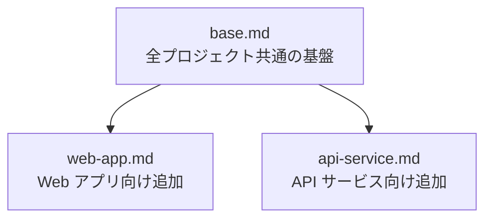

:::message
本記事はシリーズ「**J-SIX：Japanese SI Transformation**」の #4 です。シリーズ全体は[概要編](/seckeyjp/articles/j-six-00-overview)をご覧ください。
:::

## はじめに

Claude Code（以下CC）で安定した品質のコードを出力させるために、最も効果が大きく、最も手軽に始められる施策があります。**CLAUDE.md を書くこと**です。

Anthropic 社内の調査でも、CLAUDE.md の充実度と CC の出力品質は直接相関すると報告されています[^anthropic-teams]。逆に言えば、CLAUDE.md が貧弱なプロジェクトでは、CC は毎回異なるスタイルでコードを生成し、品質が安定しません。

本記事では、J-SIX で公開している CLAUDE.md テンプレートの全セクションを解説し、「明日からすぐ使える」実践的なガイドを提供します。テンプレートは GitHub で配布しています。

https://github.com/SeckeyJP/j-six/tree/main/templates/claude-md

## CLAUDE.md とは何か

CLAUDE.md は、CC がセッション開始時に自動で読み込む**プロジェクト固有の設定ファイル**です。J-SIX ではこれを「**プロジェクト憲法**」と呼んでいます。

従来のSI開発では、「開発標準書」「コーディング規約」「プロジェクト計画書」といったドキュメントが開発者の行動を規定していました。CLAUDE.md はこれらに相当する情報を、CC が理解・実行可能な形式で記述したものです。

```
従来のSI開発              J-SIX
─────────────────────    ─────────────────────
開発標準書         ─┐
コーディング規約   ─┼──→  CLAUDE.md
プロジェクト計画書 ─┘      （CC が自動読込）
```

プロジェクトルートに `CLAUDE.md` を置くだけで、CC はセッション開始時にこれを読み込み、全出力をこの文書のルールに従わせます。設定は不要です。

### なぜ重要か

CLAUDE.md がない状態でCCを使うと、以下のような問題が起きます。

- **コーディングスタイルが毎回異なる** — キャメルケースとスネークケースが混在する
- **ディレクトリ構成を無視する** — 勝手な場所にファイルを作成する
- **禁止ライブラリを使う** — moment.js など非推奨パッケージを選択する
- **テストを書かない** — 指示しない限りテストを省略する

CLAUDE.md に明記するだけで、これらの問題は解消します。CC は「ルールがなければ自分で判断する」性質を持つため、人間が明文化したルールを与えることが品質安定の第一歩です。

## CLAUDE.md vs Skills — 使い分けの原則

CC には CLAUDE.md の他に **Skills**（スキル）という仕組みもあります。両者の使い分けは明確です。

| | CLAUDE.md | Skills |
|---|---|---|
| 読み込みタイミング | **毎セッション自動** | 必要時にオンデマンド |
| 適切な内容 | 常に守るべきルール | 特定ワークフローの手順 |
| 例 | コーディング規約、ビルドコマンド | 設計書逆生成の手順、TDDサイクル |
| サイズの目安 | 25KB / 200行以内 | 制限なし（必要時のみ読込） |

**原則は単純です。全セッションで適用すべきルールは CLAUDE.md に、特定タスクでのみ必要な手順は Skills に分離する。**

たとえば「関数は30行以内」というルールは全セッションで守るべきなので CLAUDE.md に書きます。一方、「設計書をExcel形式で逆生成する手順」は特定タスクでしか使わないので Skills に切り出します。

この分離を怠ると、CLAUDE.md が膨大になり、CC のコンテキストウィンドウを圧迫して性能が低下します。

## テンプレートの構成

J-SIX では CLAUDE.md テンプレートを3種類用意しています。



| テンプレート | 対象 | 主な内容 |
|---|---|---|
| **base.md** | 全プロジェクト共通 | コーディング規約、Git運用、品質基準、ADRルール |
| **web-app.md** | Webアプリケーション | 画面設計、コンポーネント設計、アクセシビリティ |
| **api-service.md** | API / バックエンド | API設計、DB設計、外部連携、ロギング |

使い方は、`base.md` をベースにプロジェクト種別のテンプレートをマージして1つの CLAUDE.md を作ります。

```bash
# Step 1: base テンプレートをコピー
cp templates/claude-md/base.md ./CLAUDE.md

# Step 2: プロジェクト種別のセクションを追記
# Web アプリの場合:
cat templates/claude-md/web-app.md >> ./CLAUDE.md
```

## base テンプレートの全セクション解説

base テンプレートは7つのセクションで構成されています。それぞれの役割と、記入のポイントを解説します。

### 1. プロジェクト概要

```markdown
## プロジェクト概要

- **システム名**: 受注管理システム
- **目的**: 手作業の受注処理を自動化し、処理時間を50%短縮
- **主要ステークホルダー**: A社 営業部
- **開発体制**: 5名（PL1 + SE3 + PG1）
- **J-SIX Stage**: Stage 1

### 技術スタック

- **言語**: TypeScript
- **フレームワーク**: Next.js 15
- **DB**: PostgreSQL 16
- **インフラ**: AWS（ECS + RDS）
- **CI/CD**: GitHub Actions
```

**ポイント**: CC はここを読んでプロジェクトの文脈を理解します。「目的」は1-2文で簡潔に書くと、CC が機能の優先度を正しく判断できるようになります。技術スタックはバージョンまで記載してください。CC がバージョン固有の API を使い分ける根拠になります。

### 2. ビルド・テスト・実行コマンド

```markdown
## ビルド・テスト・実行コマンド

​```bash
# 依存インストール
npm install

# ビルド
npm run build

# 全テスト実行
npm test

# 単一テスト実行
npm test -- --testPathPattern=ファイル名

# Lint
npm run lint

# 開発サーバー起動
npm run dev
​```

> **重要**: テストは必ず実行して通ることを確認してからコミットすること。
```

**ポイント**: CC が自律実行する際に、ここのコマンドを使ってビルド・テスト・Lintを実行します。**単一テスト実行のコマンドは必ず書いてください。** CC が TDD サイクルで1ファイルずつテストを回す際に使います。全テスト実行しか書いていないと、毎回全テストを走らせて時間を浪費します。

### 3. コーディング規約

```markdown
## コーディング規約

### 命名規則

- **ファイル名**: kebab-case（例: user-service.ts）
- **クラス名**: PascalCase
- **関数名**: camelCase
- **定数名**: UPPER_SNAKE_CASE
- **DB テーブル名**: snake_case（複数形: users）
- **DB カラム名**: snake_case

### コードスタイル

- インデント: スペース2
- 1関数の最大行数: 30行を目安。超える場合は分割を検討
- 1関数の最大引数: 4つまで。超える場合はオブジェクトにまとめる
- コメント:「何をしているか」ではなく「なぜそうしているか」を書く
```

**ポイント**: 曖昧な表現は避け、定量的に書きます。「良いコードを書け」ではなく「関数は30行以内、引数は4つ以内」です。CC は具体的な数値や形式を明示すると、それに忠実に従います。

### 4. Git 運用ルール

```markdown
## Git 運用ルール

### コミットメッセージ

Conventional Commits に準拠する。

​```
<type>(<scope>): <description>
​```

type: feat / fix / docs / style / refactor / test / chore

例:
​```
feat(auth): Google OAuth ログインを追加
fix(api): ユーザー検索の N+1 クエリを修正
​```

### コミット粒度

- 1タスク = 1コミット を基本とする
- TDD サイクルでは Red→Green→Refactor でそれぞれコミット
```

**ポイント**: コミットメッセージのフォーマットと具体例を示すと、CC は一貫した形式でコミットします。例がないと、毎回異なるスタイルのメッセージを生成します。

### 5. 品質基準

```markdown
## 品質基準

### テスト

- 単体テストカバレッジ目標: 85%
- 新規コードには必ずテストを書く（TDD を推奨）
- テストファイルの配置: src/__tests__/
- テストの命名: [対象]_[条件]_[期待結果] 形式

### パフォーマンス基準

- API レスポンスタイム: 200ms以内
- ページ読込時間: 3秒以内
```

**ポイント**: カバレッジ目標を明記すると、CC がテスト不足のコードを生成した際に自ら追加テストを書く判断材料になります。パフォーマンス基準も、CC が実装方式を選択する際の判断に影響します。

### 6. ADR ルール

```markdown
## ADR（Architecture Decision Records）ルール

### ADR が必須のケース

- 技術スタック / ライブラリの選定・変更
- DB 設計の重要な判断
- API 設計方針の決定
- セキュリティ方針の決定
- 代替案を検討して却下した場合

### ADR の作成手順

1. docs/adr/NNNN-タイトル.md に作成
2. 内容: コンテキスト、判断、理由、検討した代替案、影響
```

**ポイント**: ADR は J-SIX の3層ドキュメント戦略の第2層にあたります[^adr-github]。「ADR が必須のケース」を明記することで、CC が設計判断を行った際に自動的に ADR を作成するようになります。

### 7. セキュリティ・禁止事項

```markdown
## セキュリティ・禁止事項

### 禁止事項

- 本番環境のデータベースへの直接接続・操作
- 機密情報（API キー、パスワード）のハードコーディング
- .env ファイルの Git コミット

### 使用禁止ライブラリ

- moment.js は禁止。代わりに dayjs を使用

### 変更禁止ファイル

- docker-compose.prod.yml
- .github/workflows/deploy.yml
- infrastructure/ 配下
```

**ポイント**: 禁止事項には**必ず代替案を示してください**。「moment.js は禁止」だけでは CC が行き詰まります。「代わりに dayjs を使用」まで書くことで、CC は適切な代替を選択できます。

### CC 自律実行の範囲

base テンプレートには、J-SIX の自律度設定に関するセクションもあります。

```markdown
## CC 自律実行の範囲

### Phase 4（TDD 実装）での自律実行ルール

- テストを先に書き、失敗を確認してからコミットすること
- テストが通る最小の実装を行うこと。過剰な先回り実装は禁止
- テスト3回連続失敗した場合は、人間に相談すること
- 要求 Spec に記載のない要件が必要と判明した場合は、人間に確認を求めること

### エスカレーション条件

以下の場合は自律実行を中断し、人間に判断を仰ぐこと。

- 要求 Spec のスコープ外の機能が必要になった場合
- セキュリティに関わる設計判断が必要な場合
- 外部 IF の仕様変更が必要な場合
- アーキテクチャに影響する判断
```

**ポイント**: CC の自律実行範囲を明確にすることで、「やりすぎ」を防ぎます。特にエスカレーション条件は重要です。CC は指示がなければ自分で判断して突き進む傾向があるため、「ここで止まれ」を明示する必要があります。「テスト3回連続失敗で相談」などの閾値は著者推奨値であり、プロジェクト特性に応じて調整してください。

## プロジェクト種別の追加セクション

### Web アプリ向け追加（web-app.md）

Web アプリケーションでは、以下のセクションを base に追加します。

```markdown
## 画面設計ルール

### コンポーネント設計

- コンポーネントの分類:
  - components/ui/: 汎用UIコンポーネント（ボタン、モーダル等）
  - components/features/: 機能固有コンポーネント
  - components/layouts/: レイアウトコンポーネント
- 1コンポーネント = 1ファイル。150行を超える場合は分割を検討
- Props は型定義を必須とする

### アクセシビリティ

- セマンティック HTML を優先（div の乱用を避ける）
- フォーム要素には label を必ず紐付ける
- キーボード操作に対応する
```

CC はアクセシビリティを指示しない限り省略しがちです。CLAUDE.md に明記することで、生成されるHTMLが最初からセマンティックになります。

### API サービス向け追加（api-service.md）

API / バックエンドサービスでは、以下のセクションを追加します。

```markdown
## API 設計ルール

### エンドポイント命名

- リソース名は複数形（/users, /orders）
- ネストは2階層まで（/users/{id}/orders は OK）
- アクションは HTTP メソッドで表現

### エラーレスポンス形式

​```json
{
  "error": {
    "code": "VALIDATION_ERROR",
    "message": "ユーザー向けメッセージ",
    "details": [
      { "field": "email", "message": "メールアドレスの形式が不正です" }
    ]
  }
}
​```

## DB 設計ルール

- 共通カラム: 全テーブルに created_at, updated_at を付与
- 外部キーには必ずインデックスを張る
- インデックス追加は ADR に記録する（パフォーマンス影響のため）
```

エラーレスポンスの具体的な JSON フォーマットを示すと、CC は全エンドポイントで一貫した形式のエラーを返すようになります。「適切にエラーハンドリングせよ」という曖昧な指示とは結果が大きく異なります。

## アンチパターン5選

CLAUDE.md の運用で陥りやすいアンチパターンを5つ紹介します。

### 1. 巨大すぎる CLAUDE.md

**問題**: CLAUDE.md が数百行に膨れ上がり、CC のコンテキストウィンドウを圧迫する。結果として CC の応答品質が低下する。コンテキスト使用率が70%を超えると精度が低下し、85%を超えると幻覚（ハルシネーション）が増加するとの報告もあります[^florian-guide]。

**対策**: 25KB / 200行以内を目安にする。特定タスク用の手順は Skills に分離し、詳細な仕様は `docs/xxx.md` に外出しして「詳細は docs/xxx.md 参照」と記述する。

### 2. 曖昧な指示

**問題**: 「良いコードを書け」「適切にエラーハンドリングせよ」のような曖昧な指示では、CC は毎回異なる解釈をする。

**対策**: 定量的・具体的に書く。「関数は30行以内」「引数は4つまで」「エラーレスポンスは以下のJSON形式」のように、CC が一意に解釈できる表現にする。

### 3. 禁止だけで代替案なし

**問題**: 「moment.js は禁止」「any 型は禁止」と書くだけでは、CC が行き詰まるか、さらに悪い選択をする可能性がある。

**対策**: 「X は禁止。代わりに Y を使え」と必ず代替案をセットで記載する。CC は代替案があれば、スムーズにそちらを採用する。

### 4. 更新されない CLAUDE.md

**問題**: プロジェクト初期に書いたまま更新しない。技術スタックが変わり、新しいルールが増えても CLAUDE.md は古いまま。実態と乖離して CC が混乱する。

**対策**: Sprint ごと / Phase ごとに CLAUDE.md をレビュー・更新する。特に「CC が規約に反するコードを生成した」場合は、そのルールが CLAUDE.md に書かれているか確認し、不足していれば追記する。

### 5. 全てを CLAUDE.md に詰め込む

**問題**: TDD の手順、設計書逆生成のフロー、デプロイ手順など、あらゆるワークフローを CLAUDE.md に書く。結果としてアンチパターン1（巨大すぎる）に陥る。

**対策**: CLAUDE.md には「常に守るべきルール」だけを書く。特定タスクのワークフローは Skills に、詳細な仕様はドキュメントファイルに分離する。

## CLAUDE.md を「育てる」運用のコツ

CLAUDE.md は一度書いて終わりではなく、**生きたドキュメント**として育てていくものです。

### 更新すべきタイミング

| トリガー | 対応 |
|---|---|
| CC が規約に反するコードを生成した | そのルールを CLAUDE.md に追記 |
| CC が同じ質問を繰り返す | 回答を CLAUDE.md に記載 |
| 新しいライブラリやツールを導入した | 技術スタック・コマンドを更新 |
| 設計判断が確定した | ADR を作成し、CLAUDE.md から参照 |
| CC が不要なファイルを変更した | 変更禁止ファイルに追加 |

### 育て方の実践例

プロジェクト開始時の CLAUDE.md は、テンプレートの `[TODO: ...]` を埋めただけのシンプルなものです。実際にCCを使い始めると、「ここが足りない」「ここが曖昧」という気づきが出てきます。

```
Week 1: テンプレートの TODO を埋める（30分）
Week 2: CC が ESLint ルールを無視 → Lint設定の詳細を追記
Week 3: CC が不要な console.log を残す → 「本番コードに console.log 禁止」追記
Week 4: 認証ライブラリ導入 → 技術スタックと認証方針を更新
  ...以降、気づきのたびに追記
```

CC 自身に CLAUDE.md の更新を提案させることもできます。「このセッションで気づいた CLAUDE.md に追記すべきルールはあるか？」と尋ねると、CC がセッション中の経験に基づいて改善提案を出します。

### J-SIX Stage との連動

CLAUDE.md の充実度は、J-SIX の Stage 進行と連動させると効果的です。

- **Stage 1**（V字+CC補助）: base テンプレートの基本項目を埋める。コーディング規約とビルドコマンドが最優先
- **Stage 2**（SDD要素導入）: ADR ルール、品質基準、エスカレーション条件を追加
- **Stage 3**（J-SIX全面適用）: 自律実行の範囲を拡大。プロジェクト固有ルールが十分に蓄積された状態

## まとめ

CLAUDE.md は、CC を活用するプロジェクトにおける最もコストパフォーマンスの高い投資です。テンプレートの `[TODO: ...]` を埋めるだけなら30分で完了し、それだけで CC の出力品質が大きく安定します。

**明日からの3ステップ**:

1. **テンプレートをコピーする** — `base.md` + プロジェクト種別のテンプレート
2. **`[TODO: ...]` を埋める** — 技術スタック、ビルドコマンド、命名規則から
3. **CC を使いながら育てる** — 不足に気づいたら追記。Sprint ごとにレビュー

完璧な CLAUDE.md を最初から書く必要はありません。まずは最低限の項目を埋め、使いながら育てていくのが最も効果的です。

## シリーズ記事

| # | タイトル | 状態 |
|---|---|---|
| #0 | [J-SIX 概論 — なぜ今、日本のSI開発プロセスを再設計するのか](/seckeyjp/articles/j-six-00-overview) | 公開済 |
| #1 | [V字モデルの前提崩壊と SDD の台頭](/seckeyjp/articles/j-six-01-sdd) | 公開済 |
| #2 | [3層ドキュメント戦略 — 設計書は「逆生成」の時代へ](/seckeyjp/articles/j-six-02-3layer-doc) | 公開済 |
| #3 | [TDD × Claude Code — 自律実行で生産性を最大化する](/seckeyjp/articles/j-six-03-tdd-cc) | 公開済 |
| **#4** | **本記事（CLAUDE.md 実践ガイド）** | ✅ |
| #5 | [V字モデルからの段階的移行 — 既存案件を止めずに J-SIX へ](/seckeyjp/articles/j-six-05-migration) | 公開済 |

## 参考文献・リンク

### J-SIX プロジェクト

https://github.com/SeckeyJP/j-six

### CLAUDE.md テンプレート配布

https://github.com/SeckeyJP/j-six/tree/main/templates/claude-md

### 引用した調査・データ

[^anthropic-teams]: Anthropic. "How Anthropic teams use Claude Code" (2025.07). https://claude.com/blog/how-anthropic-teams-use-claude-code — Codingscape による解説記事も参照: https://codingscape.com/blog/how-anthropic-engineering-teams-use-claude-code-every-day
[^florian-guide]: FlorianBruniaux. "claude-code-ultimate-guide". https://github.com/FlorianBruniaux/claude-code-ultimate-guide
[^adr-github]: adr.github.io. "Architectural Decision Records". https://adr.github.io/

### CC ベストプラクティス

- Anthropic. "Best Practices for Claude Code". https://code.claude.com/docs/en/best-practices
