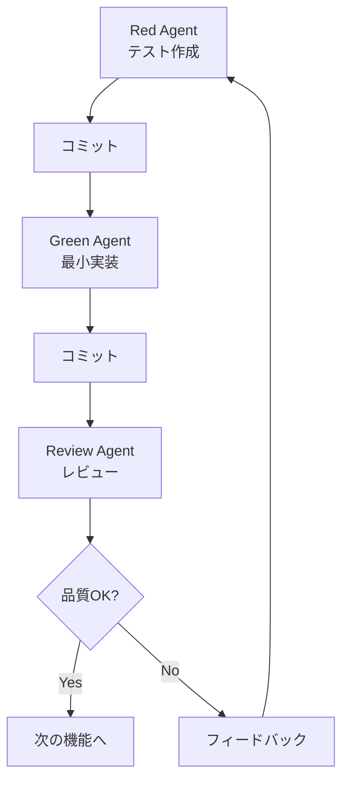
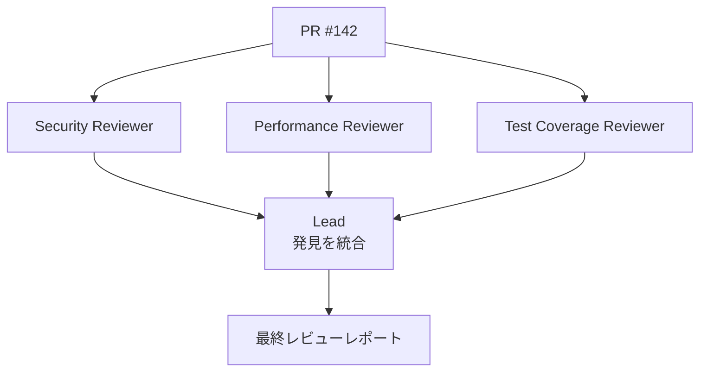
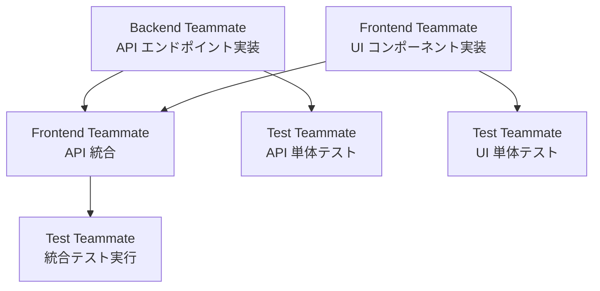

:::message
本記事はシリーズ「**J-SIX：Japanese SI Transformation**」の番外編です。シリーズ全体の概要は [#0 概要編](https://zenn.dev/seckeyjp/articles/j-six-00-overview)、TDD のアンチパターンは [TDD × AI の10のアンチパターン](https://zenn.dev/seckeyjp/articles/j-six-tdd-antipatterns) をご覧ください。
:::

## はじめに

1つの Claude Code（以下 CC）セッションで開発を進めていると、いくつかの壁にぶつかります。コンテキストウィンドウの使用率が上がるにつれて精度が劣化する[^florian-guide]。生成とレビューを同じインスタンスが行うため自己レビューバイアスが生じる[^anthropic-bp]。タスクが順次実行されるため、並列化できる作業もボトルネックになる。

Opus 4.6 と同時にリリースされた **Agent Teams** は、複数の CC セッションを協調させてこれらの課題を解決する実験的機能です[^agent-teams]。本記事では Agent Teams のセットアップから実践パターンまでを解説します。

## 1. Agent Teams とは何か

Agent Teams は 2026年2月、Opus 4.6 と同時にリリースされた実験的機能です[^agent-teams]。1人の **Lead**（チームリーダー）と複数の **Teammates** で構成され、各メンバーが独立したコンテキストウィンドウ（1M tokens）を持ちます。Teammates 同士は **共有タスクリスト** と **メールボックス** を通じて協調し、Lead が全体の進捗を管理します[^agent-teams][^sean-kim]。

既存のサブエージェント（Subagents）との違いを整理します。

| | Subagents | Agent Teams |
|---|---|---|
| コンテキスト | 独立。結果を呼び出し元に返す | 独立。完全に独立して動作 |
| 通信 | 親エージェントへの報告のみ | Teammates 同士が直接メッセージ |
| 協調 | 親が全作業を管理 | 共有タスクリストで自己協調 |
| 適用場面 | 結果だけ必要な集中タスク | 議論・協調が必要な複雑な作業 |
| トークンコスト | 低（結果を要約して返す） | 高（各 Teammate が独立セッション） |

Subagents は「仕事を投げて結果だけ受け取る」モデルです。Agent Teams は「チームメンバーが互いに議論しながら作業を進める」モデルであり、複数の観点が必要な作業や、ファイル分割が明確な並列開発に適しています[^addy-osmani][^alexop-swarms]。

## 2. セットアップ

### 有効化

Agent Teams は実験的機能のため、明示的な有効化が必要です。settings.json に以下を追加します[^agent-teams]。

```json
{
  "env": {
    "CLAUDE_CODE_EXPERIMENTAL_AGENT_TEAMS": "1"
  }
}
```

バージョン要件は Claude Code **v2.1.32 以上**です。`claude --version` で確認してください。

### 表示モード

Teammates の表示方法は2種類あります[^agent-teams][^claudefast]。

- **in-process**（デフォルト）: 全 Teammates が1つのターミナル内で動作。`Shift+Down` で表示を切り替え
- **split panes**: tmux または iTerm2 で各 Teammate が独立ペインに展開

`~/.claude.json` で設定します。

```json
{
  "teammateMode": "in-process"
}
```

tmux を使う場合は `"tmux"` に変更します。なお、split panes モードは VS Code 統合ターミナルでは動作しません（tmux / iTerm2 が必要です）。

## 3. 実践パターン 4選

Agent Teams の効果が出やすい4つのパターンを紹介します。

### パターン1: TDD の Writer/Reviewer パターン

[TDD × AI の10のアンチパターン](https://zenn.dev/seckeyjp/articles/j-six-tdd-antipatterns)で取り上げた3つの問題——②コンテキスト汚染、④トートロジカルテスト、⑩自己レビューバイアス——は、いずれも「同一コンテキスト内でテストと実装を行う」ことが根本原因でした。Agent Teams はこれを構造的に解決します。

Red Agent（テスト作成）/ Green Agent（実装）/ Review Agent（レビュー）の3チーム構成で、各エージェントが完全に独立したコンテキストで動作します。テスト作成と実装を同一コンテキストで行った場合の TDD スキル発動率が約20%だったのに対し、分離したところ約84%に向上したという報告があり[^alexop-tdd]、分離の効果は顕著です。

```
Create an agent team for TDD development of the user registration API.
Spawn 3 teammates:
- Red Agent: Write failing tests based on the spec. Do NOT write implementation.
- Green Agent: Write minimal implementation to pass the tests. Do NOT modify test files.
- Review Agent: Review both test and implementation code for security, edge cases, and code quality.

Red Agent works first, commits tests, then Green Agent implements.
Review Agent reviews after Green Agent commits.
```

タスクの流れは以下のようになります。



このパターンの利点は、各エージェントの役割を `.claude/agents/` にサブエージェント定義として保存し、再利用できることです[^30tips]。プロジェクトごとにロールを微調整するだけで、TDD の品質ゲートを繰り返し適用できます。

[#3 TDD × CC](https://zenn.dev/seckeyjp/articles/j-six-03-tdd-cc) で紹介した Red/Green/Refactor サイクルを、Agent Teams で物理的に分離する——これが「サブエージェント分離」の具体的な実装手段です。

### パターン2: 並列コードレビュー

1人のレビュアー（人間でも AI でも）は、特定の種類の問題に偏りがちです。AI コードレビューの29-45%がセキュリティ脆弱性を見逃すとの報告もあります[^diffray]。Agent Teams では、異なる観点を持つ Teammates を同時に走らせることで、この偏りを緩和します。

```
Create an agent team to review PR #142. Spawn three reviewers:
- One focused on security implications
- One checking performance impact
- One validating test coverage
Have them each review and report findings.
```

各 Teammate が独立してレビューした後、Lead が3人の発見を統合して最終レポートを作成します。Anthropic 公式もこの Writer/Reviewer パターンを推奨しており[^anthropic-bp]、CC Code Review 機能ではレビュー深度が16%から54%に向上したとの報告があります[^code-review]。



### パターン3: 競合仮説デバッグ

1つの CC セッションでデバッグすると、最初に見つけた仮説に固執する傾向があります（確証バイアス）[^addy-osmani]。Agent Teams では複数の Teammates に異なる仮説を検証させ、互いに反証させることで、この問題を回避します。

```
Users report the app exits after one message instead of staying connected.
Spawn 5 agent teammates to investigate different hypotheses.
Have them talk to each other to try to disprove each other's theories,
like a scientific debate.
```

このアプローチのポイントは「互いに反証させる」指示です。各 Teammate はメールボックスを通じて他の Teammate の仮説に反論し、証拠を突きつけ合います[^addy-osmani][^sean-kim]。科学的な議論と同じで、反証に耐えた仮説が真の原因である確率が高くなります。

5 Teammates は多めですが、デバッグのように「広く仮説を探索してから絞り込む」タスクでは、初期の探索幅を広く取ることに価値があります。

### パターン4: 新機能の並列実装

フロントエンド / バックエンド / テストを3チームに分担し、並列に開発するパターンです。ここで最も重要なのは **ファイル競合の回避** です[^30tips][^alexop-swarms]。

```
Create an agent team to implement the new notification feature.
- Frontend teammate: implement UI components in src/components/notifications/
- Backend teammate: implement API endpoints in src/api/notifications/
- Test teammate: write integration tests in tests/notifications/

Each teammate owns their directory exclusively. Do not edit files
outside your assigned directory.
```

各 Teammate にディレクトリを排他的に割り当てることで、git のコンフリクトを防止します。さらに git worktree を使って各 Teammate を独立ブランチに配置すれば、より安全です[^30tips]。

タスク間の依存関係は、共有タスクリストで管理します。



Backend API の完成を待ってから Frontend が統合し、最後に Test Teammate が統合テストを実行する——この依存関係を明示することで、手戻りを最小限に抑えられます。

## 4. ベストプラクティス

Agent Teams を効果的に運用するための知見を整理します[^30tips][^addy-osmani][^alexop-swarms]。

### チームサイズ

**3-5人が最適** です。それ以上はメッセージングのオーバーヘッドが増大し、協調コストが並列化の利益を超えます[^30tips]。2人でも効果はありますが、Writer/Reviewer の最小構成と考えてください。

### タスク粒度

1 Teammate あたり **5-6 タスク** が目安です（著者推定）。タスクが少なすぎると Agent Teams のセットアップコストに見合わず、多すぎるとコンテキスト劣化のリスクが高まります。

### ファイル競合の回避

各 Teammate にディレクトリやファイルを **排他的に割り当て** てください[^30tips]。同一ファイルを複数の Teammate が編集すると、git コンフリクトが発生し、解決コストが並列化の利益を打ち消します。

### Hook で品質ゲート

Agent Teams と Hook を組み合わせることで、品質を自動的に担保できます[^agent-teams]。

- **TeammateIdle**: Teammate がアイドル状態になったら、追加タスクを振る
- **TaskCompleted**: タスク完了時にテスト実行を強制

### Plan Approval

リスクの高いタスク（データベーススキーマ変更、認証ロジック等）では、Lead の承認を要求する設定が有効です。Teammate が勝手に危険な変更を進めることを防止します[^agent-teams]。

### コスト意識

3人チームの場合、トークン消費は単独セッションの **約3-4倍** になります（著者推定）。すべてのタスクに Agent Teams を使う必要はありません。以下のような場面で費用対効果が高くなります。

- 複数の観点が必要なレビュー・デバッグ
- ファイル分割が明確な新機能開発
- TDD の Red/Green/Review 分離

逆に、単一ファイルの修正や小規模なバグ修正には、通常のセッションで十分です。

## 5. 制限事項と注意点

Agent Teams は実験的機能（`EXPERIMENTAL` フラグ付き）であり、以下の制限があります[^agent-teams][^claudefast]。正直に共有しておきます。

- **セッション再開不可**: `/resume` や `/rewind` で Teammates は復元されない。セッションが切れたら再構成が必要
- **タスク状態のラグ**: 共有タスクリストの更新にラグが生じる場合がある。手動で状態を更新する必要があることも
- **ネスト不可**: Teammate が自分のチームを作ることはできない。チーム構造はフラット
- **split panes の環境制約**: tmux / iTerm2 が必須。VS Code 統合ターミナルでは動作しない
- **Lead が作業を始めてしまう**: Lead が自ら実装を始めてしまうことがある。「Wait for your teammates to complete their tasks before proceeding」と明示的に指示することで回避可能[^30tips]

これらの制限は今後のアップデートで改善される可能性がありますが、現時点では把握した上で使う必要があります。

## まとめ

Agent Teams は、1つの CC セッションの限界——コンテキスト劣化、自己レビューバイアス、順次実行のボトルネック——を構造的に突破するツールです。

[TDD × AI の10のアンチパターン](https://zenn.dev/seckeyjp/articles/j-six-tdd-antipatterns)で挙げた「サブエージェント分離」「Writer/Reviewer パターン」を実装する具体的な手段であり、[#3 TDD × CC](https://zenn.dev/seckeyjp/articles/j-six-03-tdd-cc) の TDD サイクルをチームとして運用するための仕組みです。

コストは単独セッションの数倍になりますが、並列化による時間短縮と品質向上を考えれば、見合うケースは多いでしょう。まずは2-3人の小さなチームから試してみてください。

---

J-SIX の全ドキュメント・テンプレートは GitHub で公開しています。

https://github.com/SeckeyJP/j-six

[^agent-teams]: Anthropic. "Orchestrate teams of Claude Code sessions". https://code.claude.com/docs/en/agent-teams
[^addy-osmani]: Addy Osmani. "Claude Code Swarms". https://addyosmani.com/blog/claude-code-agent-teams/
[^alexop-swarms]: alexop.dev. "From Tasks to Swarms: Agent Teams in Claude Code". https://alexop.dev/posts/from-tasks-to-swarms-agent-teams-in-claude-code/
[^claudefast]: ClaudeFast. "Claude Code Agent Teams: Setup & Usage Guide 2026". https://claudefa.st/blog/guide/agents/agent-teams
[^sean-kim]: Sean Kim. "Claude Code Agent Teams: How TeammateTool and Swarm Mode Are Redefining AI Coding" (2026.03). https://blog.imseankim.com/claude-code-team-mode-multi-agent-orchestration-march-2026/
[^30tips]: John Kim. "30 Tips for Claude Code Agent Teams". https://getpushtoprod.substack.com/p/30-tips-for-claude-code-agent-teams
[^anthropic-bp]: Anthropic. "Best Practices for Claude Code". https://code.claude.com/docs/en/best-practices
[^alexop-tdd]: alexop.dev. "Forcing Claude Code to TDD" (2025.11). https://alexop.dev/posts/custom-tdd-workflow-claude-code-vue/
[^diffray]: diffray.ai. "LLM Hallucinations in AI Code Review". https://diffray.ai/blog/llm-hallucinations-code-review/
[^code-review]: Anthropic. "Code Review for Claude Code" (2026.03). https://claude.com/blog/code-review
[^florian-guide]: FlorianBruniaux. "claude-code-ultimate-guide". https://github.com/FlorianBruniaux/claude-code-ultimate-guide
