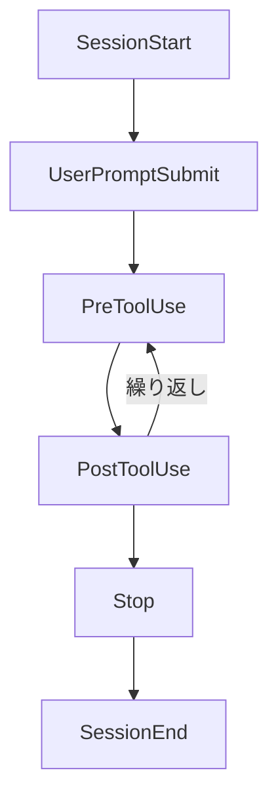
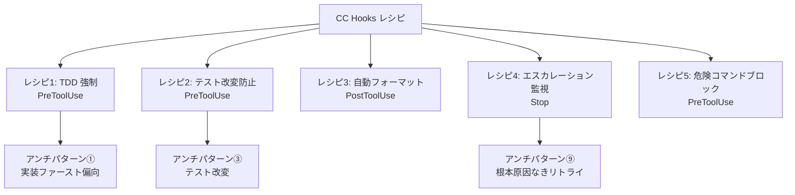

:::message
本記事はシリーズ「**J-SIX：Japanese SI Transformation**」の番外編です。シリーズ全体の概要は [#0 概要編](https://zenn.dev/seckeyjp/articles/j-six-00-overview)、TDD のアンチパターンは [TDD × AI の10のアンチパターン](https://zenn.dev/seckeyjp/articles/j-six-tdd-antipatterns) をご覧ください。
:::

## はじめに

J-SIX シリーズや [TDD アンチパターン記事](https://zenn.dev/seckeyjp/articles/j-six-tdd-antipatterns)で、「Hook で対策」「Hook でブロック」と繰り返し述べてきました。しかし Hook の具体的な実装——どのファイルに何を書いて、スクリプトはどう構成するのか——は一度も示していませんでした。

本記事では Claude Code（以下 CC）の **Hooks** 機能の仕組みから、コピペして使える実践的なレシピ5選まで解説します。CLAUDE.md のルールだけでは防ぎきれない問題を、コードで自動化するための具体的な手段です。

## 1. Hooks とは何か

Hooks は、CC のライフサイクルの特定ポイントで **自動実行されるユーザー定義処理** です[^hooks-guide]。

CLAUDE.md に書くルールは「助言」です。CC はルールを尊重しますが、コンテキストが膨らんだり、最適化圧力が強まったりすると逸脱することがあります。一方、Hooks は「強制」です。条件に合致すれば必ず実行され、exit code によってツール実行をブロックできます。この違いが重要です。

**CLAUDE.md = 助言（ソフトガードレール）、Hooks = 強制（ハードガードレール）。** 両方を組み合わせることで、品質のガードレールが完成します。

### ライフサイクルイベント

CC には全25のライフサイクルイベントが定義されていますが[^hooks-ref]、実践で特に重要なのは以下の6つです。



| イベント | タイミング | 典型的な用途 |
|---|---|---|
| SessionStart | セッション開始時 | 環境チェック、状態初期化 |
| UserPromptSubmit | ユーザー入力の送信前 | 入力の検証・変換 |
| PreToolUse | ツール実行の直前 | **危険操作のブロック、TDD 強制** |
| PostToolUse | ツール実行の直後 | **自動フォーマット、ログ記録** |
| Stop | CC が応答を完了した時 | **テスト失敗カウント、品質チェック** |
| SessionEnd | セッション終了時 | レポート生成、クリーンアップ |

### 4つのハンドラータイプ

Hooks では4種類のハンドラーが使えます[^hooks-ref]。

| タイプ | 用途 |
|---|---|
| command | シェルスクリプト実行。最も汎用的で、本記事のレシピはすべてこれを使う |
| http | 外部サービスに POST。CI/CD 連携やチャット通知に |
| prompt | Claude モデルで単ターン評価。安全性やコンプライアンスの判定に |
| agent | サブエージェントで検証。複雑な判定ロジックに |

### exit code の意味

command ハンドラーの exit code は、CC の動作を制御します[^hooks-guide]。

| exit code | 意味 | CC の動作 |
|---|---|---|
| 0 | 成功 | 続行 |
| 2 | ブロック | ツール実行を阻止（PreToolUse のみ） |
| その他 | エラー | 続行するが、verbose モードで表示 |

ただし、PreToolUse で `permissionDecision` を JSON 出力する場合は、exit code 0 で `deny` を返すことでもブロックできます。本記事のレシピではこの方式を採用します（理由は後述）。

## 2. 設定方法

### スコープ

Hooks は settings.json に記述します。3つのスコープがあり、用途に応じて使い分けます[^hooks-guide]。

| スコープ | ファイル | 共有 |
|---|---|---|
| グローバル | `~/.claude/settings.json` | 個人（全プロジェクト共通） |
| プロジェクト | `.claude/settings.json` | チーム（git 管理） |
| ローカル | `.claude/settings.local.json` | 個人（git 管理外） |

チームで共有すべき Hook（TDD 強制、危険コマンドブロック等）は **プロジェクトスコープ** に、個人の好みに依存する Hook（フォーマッタ等）は **ローカルスコープ** に置くのが推奨です。

### 基本構造

```json
{
  "hooks": {
    "PreToolUse": [
      {
        "matcher": "Bash",
        "hooks": [
          {
            "type": "command",
            "command": ".claude/hooks/validate.sh",
            "timeout": 10
          }
        ]
      }
    ]
  }
}
```

- `matcher` は正規表現です。`Edit|Write` で編集系ツールをまとめてキャッチできます
- `if` フィールドで追加フィルタが可能です。`"if": "Bash(git *)"` とすれば git コマンドのみに限定できます[^hooks-ref]
- `timeout` はデフォルト60秒。テスト実行を含む Hook は長めに設定してください
- `/hooks` コマンドで設定済み Hook を一覧確認できます

### stdin で渡される入力

command ハンドラーには、stdin 経由で JSON が渡されます[^hooks-ref]。PreToolUse の場合:

```json
{
  "tool_name": "Edit",
  "tool_input": {
    "file_path": "src/user.ts",
    "old_string": "...",
    "new_string": "..."
  }
}
```

この JSON を `jq` でパースしてファイルパスやコマンド内容を取得し、検証ロジックを組み立てます。

## 3. 実践レシピ 5選

### レシピ 1: TDD 強制 — 実装前にテスト失敗を確認する（PreToolUse）

[TDD アンチパターン](https://zenn.dev/seckeyjp/articles/j-six-tdd-antipatterns)の「①実装ファースト偏向（Vibe TDD）」への対策です。CC はテストを後回しにして実装ファーストに自然回帰しやすいため[^hooks-guide]、**実装ファイルを編集する前に「テストが失敗していること」を機械的に確認** します。

#### settings.json

```json
{
  "hooks": {
    "PreToolUse": [
      {
        "matcher": "Edit|Write",
        "hooks": [
          {
            "type": "command",
            "command": ".claude/hooks/tdd-enforce.sh",
            "timeout": 30
          }
        ]
      }
    ]
  }
}
```

#### .claude/hooks/tdd-enforce.sh

```bash
#!/bin/bash
# TDD 強制 Hook: 実装ファイル編集前にテスト失敗を確認する
# - テストファイルへの書き込みは常に許可
# - 実装ファイルへの書き込み → テストが失敗中（Red Phase）でなければブロック

INPUT=$(cat)
TOOL=$(echo "$INPUT" | jq -r '.tool_name')
FILE=$(echo "$INPUT" | jq -r '.tool_input.file_path // empty')

# ファイルパスが取得できない場合はスキップ
if [ -z "$FILE" ]; then
  exit 0
fi

# テストファイルへの書き込みは常に許可
if echo "$FILE" | grep -qE '\.(test|spec)\.(ts|tsx|js|jsx)$'; then
  exit 0
fi

# 設定ファイル・ドキュメント等は TDD 対象外
if echo "$FILE" | grep -qE '\.(json|md|yml|yaml|toml|css|scss)$'; then
  exit 0
fi

# 実装ファイルへの書き込み → テストが失敗していることを確認
if echo "$FILE" | grep -qE '\.(ts|tsx|js|jsx)$'; then
  RESULT=$(npm test 2>&1)
  if echo "$RESULT" | grep -q "FAIL"; then
    # テスト失敗中 = Red Phase → 実装を許可
    exit 0
  else
    # テスト全パス or テストなし → Red Phase ではない → ブロック
    echo '{"hookSpecificOutput":{"hookEventName":"PreToolUse","permissionDecision":"deny","permissionDecisionReason":"Red Phase のテスト失敗が確認できません。先にテストを書いて、失敗することを確認してから実装に移ってください。"}}'
    exit 0
  fi
fi

exit 0
```

```bash
chmod +x .claude/hooks/tdd-enforce.sh
```

**ポイント**: `permissionDecision: deny` を使うと、CC に「なぜブロックされたか」の理由を伝えられます。exit code 2 でもブロックはできますが、理由が伝わらないため CC が同じ操作を繰り返すリスクがあります[^hooks-guide]。

**制限**: このスクリプトは `npm test` を毎回実行するため、テストスイートが大きいプロジェクトではオーバーヘッドが気になります。その場合は、変更対象ファイルに対応するテストファイルだけを実行する（例: `src/user.ts` → `src/user.test.ts`）ように改良するか、後述の tdd-guard を検討してください。

### レシピ 2: テスト改変防止 — Green Phase でテストファイルを守る（PreToolUse）

[TDD アンチパターン](https://zenn.dev/seckeyjp/articles/j-six-tdd-antipatterns)の「③テスト改変（Gaming the Green）」への対策です。CC は実装を修正するよりテストのアサーションを変更する方が「効率的」と判断することがあります。**Green Phase 中にテストファイルを編集しようとしたらブロック** します。

#### フェーズ管理の仕組み

`.claude/tdd-phase` ファイルに現在のフェーズを記録します。

```bash
# Red Phase に入る（テスト作成フェーズ）
echo "red" > .claude/tdd-phase

# Green Phase に入る（実装フェーズ）
echo "green" > .claude/tdd-phase

# Refactor Phase に入る
echo "refactor" > .claude/tdd-phase
```

CLAUDE.md に以下を追記し、CC がフェーズ遷移時にファイルを更新するよう指示します。

```markdown
## TDD フェーズ管理
- テスト作成を始めるとき: `echo "red" > .claude/tdd-phase`
- テストが失敗することを確認したら: `echo "green" > .claude/tdd-phase`
- テストが通ったら: `echo "refactor" > .claude/tdd-phase`
```

#### .claude/hooks/protect-tests.sh

```bash
#!/bin/bash
# テスト改変防止 Hook: Green Phase 中のテストファイル編集をブロックする

INPUT=$(cat)
FILE=$(echo "$INPUT" | jq -r '.tool_input.file_path // empty')

if [ -z "$FILE" ]; then
  exit 0
fi

# テストファイルでなければスキップ
if ! echo "$FILE" | grep -qE '\.(test|spec)\.(ts|tsx|js|jsx)$'; then
  exit 0
fi

# フェーズファイルが存在しない場合はスキップ（Hook 未導入プロジェクト）
PHASE_FILE=".claude/tdd-phase"
if [ ! -f "$PHASE_FILE" ]; then
  exit 0
fi

PHASE=$(cat "$PHASE_FILE" | tr -d '[:space:]')

if [ "$PHASE" = "green" ]; then
  echo '{"hookSpecificOutput":{"hookEventName":"PreToolUse","permissionDecision":"deny","permissionDecisionReason":"現在 Green Phase です。テストファイルの編集は禁止されています。テストのアサーションを変更するのではなく、実装を修正してテストを通してください。"}}'
  exit 0
fi

exit 0
```

#### settings.json への追加

```json
{
  "hooks": {
    "PreToolUse": [
      {
        "matcher": "Edit|Write",
        "hooks": [
          {
            "type": "command",
            "command": ".claude/hooks/protect-tests.sh",
            "timeout": 5
          }
        ]
      }
    ]
  }
}
```

**ポイント**: フェーズ管理をファイルベースにしているのは、シェルスクリプトから簡単に読み取れるためです。環境変数だとプロセス間で共有できません。

### レシピ 3: 自動フォーマット — ファイル保存後に Prettier を実行する（PostToolUse）

CC が生成するコードのフォーマットは概ね良好ですが、プロジェクトの Prettier 設定と微妙にずれることがあります。**PostToolUse で編集後のファイルに自動的に Prettier を実行** することで、フォーマットの一貫性を保ちます。

#### settings.json

```json
{
  "hooks": {
    "PostToolUse": [
      {
        "matcher": "Edit|Write",
        "hooks": [
          {
            "type": "command",
            "command": ".claude/hooks/auto-format.sh",
            "timeout": 10
          }
        ]
      }
    ]
  }
}
```

#### .claude/hooks/auto-format.sh

```bash
#!/bin/bash
# 自動フォーマット Hook: ファイル編集後に Prettier を実行する

INPUT=$(cat)
FILE=$(echo "$INPUT" | jq -r '.tool_input.file_path // empty')

# ファイルパスが取得できない場合はスキップ
if [ -z "$FILE" ]; then
  exit 0
fi

# ファイルが存在しない場合はスキップ（削除操作の場合）
if [ ! -f "$FILE" ]; then
  exit 0
fi

# Prettier がサポートする拡張子のみ対象
if echo "$FILE" | grep -qE '\.(ts|tsx|js|jsx|json|css|scss|md|html|yaml|yml)$'; then
  npx prettier --write "$FILE" 2>/dev/null
fi

exit 0
```

**ポイント**: PostToolUse Hook はツール実行の結果に影響を与えません（ブロック機能はありません）。失敗しても CC の動作は継続するため、安心して導入できます[^hooks-guide]。

**ワンライナー版**: スクリプトファイルを作るほどでもない場合、settings.json に直接書くこともできます。

```json
{
  "type": "command",
  "command": "FILE=$(cat | jq -r '.tool_input.file_path // empty'); [ -n \"$FILE\" ] && [ -f \"$FILE\" ] && npx prettier --write \"$FILE\" 2>/dev/null; exit 0"
}
```

### レシピ 4: エスカレーション監視 — テスト3回連続失敗で停止する（Stop）

[TDD アンチパターン](https://zenn.dev/seckeyjp/articles/j-six-tdd-antipatterns)の「⑨根本原因なきリトライ（Infinite Green Thrashing）」への対策です。CC はテスト失敗に対して局所的な修正を繰り返し、根本原因を分析しないことがあります。**3回連続でテストが失敗したら CC を停止させ、人間に判断を委ねます**。

#### settings.json

```json
{
  "hooks": {
    "Stop": [
      {
        "hooks": [
          {
            "type": "command",
            "command": ".claude/hooks/retry-monitor.sh",
            "timeout": 30
          }
        ]
      }
    ]
  }
}
```

#### .claude/hooks/retry-monitor.sh

```bash
#!/bin/bash
# エスカレーション監視 Hook: テスト3回連続失敗で停止する
# Stop イベントで実行し、テスト結果を記録・判定する

FAIL_COUNT_FILE=".claude/test-fail-count"

# テスト実行
RESULT=$(npm test 2>&1)
EXIT_CODE=$?

if [ $EXIT_CODE -ne 0 ]; then
  # テスト失敗: カウントを増加
  if [ -f "$FAIL_COUNT_FILE" ]; then
    COUNT=$(cat "$FAIL_COUNT_FILE")
  else
    COUNT=0
  fi
  COUNT=$((COUNT + 1))
  echo "$COUNT" > "$FAIL_COUNT_FILE"

  if [ $COUNT -ge 3 ]; then
    # 3回連続失敗: 停止を要求
    echo "テストが${COUNT}回連続で失敗しています。"
    echo "局所的な修正ではなく、設計レベルの問題の可能性があります。"
    echo "人間にエスカレーションしてください。"
    echo ""
    echo "直近のエラー:"
    echo "$RESULT" | tail -20
    # カウントをリセット
    echo "0" > "$FAIL_COUNT_FILE"
    exit 2
  fi
else
  # テスト成功: カウントをリセット
  echo "0" > "$FAIL_COUNT_FILE"
fi

exit 0
```

**ポイント**: Stop イベントは CC が応答を完了するたびに発火します。テスト実行を毎回行うため、テストスイートの実行時間が長いプロジェクトでは `timeout` を十分に確保してください。

**制限**: この方法はテスト全体の成功/失敗で判定しています。特定のテストケースが3回連続失敗したかどうかは追跡していません。より精密な監視が必要な場合は、テスト結果の JSON 出力を解析する拡張が必要です。

### レシピ 5: 危険コマンドのブロック — rm -rf, git push --force を防ぐ（PreToolUse）

CC が Bash ツールで実行しようとするコマンドを検査し、**危険なパターンをブロック** します。CC のパーミッション設定でもある程度は防げますが、Hook でより細かく制御できます[^blake-hooks]。

#### settings.json

```json
{
  "hooks": {
    "PreToolUse": [
      {
        "matcher": "Bash",
        "hooks": [
          {
            "type": "command",
            "command": ".claude/hooks/block-dangerous.sh",
            "timeout": 5
          }
        ]
      }
    ]
  }
}
```

#### .claude/hooks/block-dangerous.sh

```bash
#!/bin/bash
# 危険コマンドブロック Hook: 破壊的なコマンドの実行を防ぐ

INPUT=$(cat)
COMMAND=$(echo "$INPUT" | jq -r '.tool_input.command // empty')

if [ -z "$COMMAND" ]; then
  exit 0
fi

# 危険なパターンのリスト
DANGEROUS_PATTERNS=(
  "rm -rf /"
  "rm -rf ~"
  "rm -rf \."
  "git push.*--force"
  "git push.*-f"
  "git reset --hard"
  "git clean -fd"
  "git checkout \."
  "git restore \."
  "> /dev/sda"
  "mkfs\."
  "dd if="
  "chmod -R 777"
  "curl.*| *sh"
  "curl.*| *bash"
  "wget.*| *sh"
  "wget.*| *bash"
)

for PATTERN in "${DANGEROUS_PATTERNS[@]}"; do
  if echo "$COMMAND" | grep -qE "$PATTERN"; then
    echo "{\"hookSpecificOutput\":{\"hookEventName\":\"PreToolUse\",\"permissionDecision\":\"deny\",\"permissionDecisionReason\":\"危険なコマンドが検出されました: パターン '$PATTERN' にマッチしました。このコマンドは実行できません。\"}}"
    exit 0
  fi
done

exit 0
```

**ポイント**: パターンリストはプロジェクトに応じてカスタマイズしてください。例えば本番 DB への接続コマンドや、特定のブランチへの直接 push を追加することもできます。

**制限**: パターンマッチは完璧ではありません。コマンドのエイリアスや変数展開で回避される可能性があります。あくまで「うっかり」の防止であり、悪意ある操作への対策ではない点に留意してください。

## 4. tdd-guard — OSS の TDD 強制 Hook

レシピ 1 と 2 の機能を統合した OSS ツールとして **tdd-guard** があります[^tdd-guard]。

https://github.com/nizos/tdd-guard

tdd-guard は以下の機能を提供します。

- 実装ファイル編集前のテスト失敗強制（レシピ 1 相当）
- Green Phase でのテスト改変ブロック（レシピ 2 相当）
- 複数テストの同時追加ブロック（1つずつテストを追加する TDD リズムの強制）

インストールは npm で行います。

```bash
npm install -g tdd-guard
tdd-guard init
```

`tdd-guard init` で `.claude/settings.json` に Hook 設定が自動追加されます。レシピ 1 と 2 を自前で書く代わりに tdd-guard を使う選択肢は、特に TDD を始めたばかりのチームにとって手軽です。ただし、プロジェクト固有のカスタマイズが必要な場合は、自前スクリプトの方が柔軟性があります。

## 5. Agent Teams × Hooks

[Agent Teams](https://zenn.dev/seckeyjp/articles/j-six-agent-teams) と Hooks を組み合わせることで、マルチエージェント環境でも品質ゲートを自動化できます[^hooks-ref]。

Agent Teams 固有のイベントとして、以下の2つが特に有用です。

| イベント | タイミング | 用途 |
|---|---|---|
| TeammateIdle | Teammate がアイドルになった時 | 追加タスクの振り分け、進捗フィードバック |
| TaskCompleted | タスク完了時 | テスト実行の強制、品質チェック |

例えば、TaskCompleted で自動テスト実行を強制する設定:

```json
{
  "hooks": {
    "TaskCompleted": [
      {
        "hooks": [
          {
            "type": "command",
            "command": "npm test || exit 2",
            "timeout": 60
          }
        ]
      }
    ]
  }
}
```

Teammate がタスク完了を報告するたびにテストが自動実行され、失敗していれば exit code 2 でブロックされます。[Agent Teams 記事](https://zenn.dev/seckeyjp/articles/j-six-agent-teams)で紹介した Writer/Reviewer パターンと組み合わせれば、品質ゲートの自動化がより強固になります。

## レシピの全体像

5つのレシピがどのアンチパターンに対応するかを整理します。



導入の優先順位は以下をお勧めします。

1. **レシピ 5（危険コマンドブロック）**: リスクが低く、すぐ導入できる。副作用もほぼない
2. **レシピ 3（自動フォーマット）**: PostToolUse なのでブロックが発生しない。安心して試せる
3. **レシピ 1 + 2（TDD 強制 + テスト改変防止）**: TDD を実践しているプロジェクトに。tdd-guard でも可
4. **レシピ 4（エスカレーション監視）**: テスト実行を毎回行うため、オーバーヘッドを許容できるなら

## まとめ

CLAUDE.md は助言、Hooks は強制。両方を揃えることで、ガードレールが完成します。

CLAUDE.md に「テストを先に書くこと」と書いても CC が従わないことはあります。しかし Hook で「テストが失敗していなければ実装ファイルの編集をブロックする」と設定すれば、物理的に回避できません。この「強制力の差」が、品質の自動化において決定的です[^hooks-guide]。

まずはレシピ 5（危険コマンドブロック）から始めてみてください。最も簡単で、効果がすぐ実感できます。品質に厳しいプロジェクトなら、レシピ 1 + 2 または tdd-guard の導入を検討してください。

Hook は万能ではありません。パターンマッチの限界、テスト実行のオーバーヘッド、フェーズ管理の手間——トレードオフは存在します。しかし、「何も自動化しない」よりは確実に品質が向上します。プロジェクトの状況に合わせて、必要なレシピを選んで導入してみてください。

---

J-SIX の全ドキュメント・テンプレートは GitHub で公開しています。

https://github.com/SeckeyJP/j-six

[^hooks-guide]: Anthropic. "Automate workflows with hooks". https://code.claude.com/docs/en/hooks-guide
[^hooks-ref]: Anthropic. "Hooks reference". https://code.claude.com/docs/en/hooks
[^tdd-guard]: nizos/tdd-guard. https://github.com/nizos/tdd-guard
[^datacamp-hooks]: DataCamp. "Claude Code Hooks: A Practical Guide to Workflow Automation". https://www.datacamp.com/tutorial/claude-code-hooks
[^blake-hooks]: Blake Crosley. "Claude Code Hooks Tutorial: 5 Production Hooks From Scratch". https://blakecrosley.com/blog/claude-code-hooks-tutorial
[^hooks-mastery]: disler/claude-code-hooks-mastery. https://github.com/disler/claude-code-hooks-mastery
[^anthropic-bp]: Anthropic. "Best Practices for Claude Code". https://code.claude.com/docs/en/best-practices
