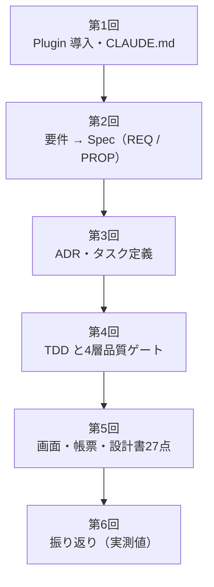

:::message
本記事はシリーズ「**J-SIX：Japanese SI Transformation**」の実践編（全6回）の第1回です。シリーズ全体の概要は [#0 概要編](https://zenn.dev/seckeyjp/articles/j-six-00-overview) をご覧ください。
:::

## この連載でやること

J-SIX は、Claude Code（以下 CC）を前提にした開発プロセスの提案です。これまでの記事では、考え方（なぜ設計書を逆生成するのか、なぜ品質ゲートを4層にするのか）を説明してきました。

この連載では、**実際に1つの要件を最後まで通します**。要件を決めるところから、Spec・テスト・実装・品質ゲート・設計書の納品物まで、6回に分けて実物をお見せします。

| 回 | 内容 |
|---|---|
| **1（本記事）** | **Plugin を入れて、プロジェクトを立ち上げる** |
| 2 | 要件を Spec にする（ここが一番の山場です） |
| 3 | 判断を ADR に残し、タスクに分解する |
| 4 | TDD と4層品質ゲート |
| 5 | 画面・帳票と、27点の設計書 |
| 6 | 振り返り（何がうまくいき、何が面倒だったか） |



題材は **月次請求書発行システム**です。売上データを取り込み、取引先ごとに月次で締めて、請求書を発行します。日本の SI で最も頻出する業務の一つで、画面・帳票・バッチ・外部インタフェースをすべて含みます。

このシステムに、**「請求書に振込先口座を印字する」** という要件を1つ追加します。小さな要件ですが、マスタ・画面・帳票・設計書のすべてに波及するので、プロセスを一周するのにちょうどよい大きさです。

完成形を先にお見せします。これが、この連載の最後に出てくる請求書です。


下部の「お振込先」が今回追加する部分です。ちなみに、消費税額の 410 円にも仕掛けがあります（10% 対象の対価 4,108 円に対して1回だけ切り捨てています）。この話は第4回で扱います。

:::message
**この連載の画像について**
アプリの画面とコマンドの実行結果は、実際に動かして取得した**実物**です。Claude Code の対話画面だけは、**再現イメージ**（実機のキャプチャではなく、実際のやり取りをもとに再構成したもの）です。画像内にもその旨を記載しています。
:::

## 1. 前提を揃える

必要なものは3つだけです。

| 必要なもの | 用途 |
|---|---|
| Claude Code | 本体 |
| Python 3.9 以上 | 品質ゲートの判定スクリプトの実行。**開発対象の言語とは無関係**です |
| Git | 品質ゲートが差分を見るため |

判定スクリプトが Python なのは実装上の都合で、Java の案件でも Node の案件でも同じように使えます。判定スクリプトは言語ごとのツールを呼ばず、標準的な形式のファイル（JUnit XML、Cobertura、SARIF など）を読むだけだからです。

## 2. Plugin を入れる

J-SIX は Claude Code の Plugin として配布しています。


```bash
git clone https://github.com/SeckeyJP/j-six.git
cd j-six
claude plugin add ./plugin
```

インストールしたら、**読み込まれたことを必ず確認してください**。

```bash
claude plugin validate ./plugin
```

この確認を勧めるのには理由があります。J-SIX の Plugin は以前、マニフェスト（`plugin.json`）の書き方が1か所違っていたために、**Skill も Agent も Hook も一つも動かない状態で公開されていました**。しかもエラーは起動時のメッセージに出るだけで、普通に使っていると気づきません。この経緯は[Plugin 実動検証の記事](https://zenn.dev/seckeyjp/articles/j-six-plugin-field-test)に書きました。

## 3. 何が使えるようになるのか

Plugin を入れると、7つの Skill が使えるようになります。


| Skill | Phase | 役割 |
|---|---|---|
| `spec-create` | 1-2 | 要求 Spec / Design Spec を作る |
| `design-review` | 2 | Design Spec と実装の整合をレビューする |
| `tdd-cycle` | 4 | Hold-out → Red → Green → Refactor → 品質ゲート |
| `evidence-pack` | 4 | 証跡パッケージに要約を付ける |
| `quality-metrics` | 5 | プロセスの健全性を集計する |
| `traceability` | 全般 | 要件 ⇔ テスト ⇔ 実装の追跡表を作る |
| `doc-reverse-gen` | 6 | 工程成果物の逆生成 → 設計書の組立 → 品質系納品物 |

あわせて、7つの Agent（テストを書く役、実装する役、判定する役など）と Hook が入ります。Hook は2種類で、**PostToolUse**（編集したファイルの整形・lint）と **Stop**（品質ゲートの実行と、ADR を残すべき判断をしていないかの確認）です。Agent は Skill の中から呼ばれるので、普段は意識しません。

**重要なのは、Skill が J-SIX の Phase に対応していることです。** どれを使うか迷ったら、いま自分がどの工程にいるかを考えれば決まります。

## 4. Phase 0：CLAUDE.md を書く

J-SIX の Phase 0 は「プロジェクト憲法」を書く工程です。CC が全ての作業で参照するルールを、`CLAUDE.md` に書きます。

テンプレート（`templates/claude-md/`）を下敷きにして、プロジェクトの事情を埋めます。今回の題材では、このように書きました（抜粋）。

```markdown
## 技術スタック

- **言語**: Python 3.9+
- **フレームワーク**: FastAPI
- **画面**: Jinja2（サーバサイドレンダリング）
- **テスト**: pytest / pytest-cov / Hypothesis

## 命名規則

- **ID 体系**: 要件 `REQ-nnn` / 性質 `PROP-nnn` / ユースケース `UC-nnn` /
  画面 `SCR-nnn` / 帳票 `RPT-nnn` / バッチ `BATCH-nnn` / 外部IF `EIF-nnn`

## コーディング規約

- **業務ルールは `app/billing.py` に集約する**。画面・帳票・バッチ・会計連携はそれを呼ぶだけ
```

このうち、後の工程に効いてくるのは次の2つです。

**ID 体系**：品質ゲートは要件 ID を正規表現で走査して、「要件にテストがあるか」を機械的に検証します。ID の付け方が決まっていないと、この検証が成立しません。

**業務ルールの集約先**：「業務ルールは `app/billing.py` に集約する」と書いておくと、CC が画面やバッチの層に業務ロジックを散らかしにくくなります。**書かなければ、たいてい散らかります。**

:::message
CLAUDE.md は最初から完璧である必要はありません。J-SIX では Phase 0 を「月次で見直すループ」として定義しています。品質ゲートが落ちた理由を集計して、CLAUDE.md や Hook に還元する、という運用です。
:::

## 5. 品質ゲートの設定を置く

J-SIX の品質ゲートは**オプトイン**です。プロジェクト直下に `.jsix-checks.json` が無ければ、Plugin は何もしません。

以下は抜粋です（実際の設定にはセキュリティ検査やトレーサビリティの宣言も含みます）。

```json
{
  "gates": {
    "g1": {
      "build":  { "cmd": "make build" },
      "lint":   { "cmd": "make lint" },
      "sast":   { "cmd": "make sast", "sarif": "reports/sast.sarif", "max_severity": "error" },
      "scope":  { "allow": ["app/**", "tests/**", "docs/**"],
                  "deny":  ["tests/acceptance/**"] }
    },
    "g2": {
      "tests":    { "cmd": "make test", "junit": "reports/junit.xml", "max_skipped": 0 },
      "holdout":  { "cmd": "make test-acceptance", "junit": "reports/junit-acceptance.xml" },
      "coverage": { "file": "coverage.xml", "min": 95 },
      "mutation": { "cmd": "make mutation", "report": "reports/mutation.json", "min_score": 90 }
    }
  }
}
```

書いているのは「コマンド」と「成果物のパスと閾値」だけです。判定スクリプトはこの宣言を読み、出力されたファイルを解析して合否を出します。**特定の言語やツールに依存しません。**

`scope` の `deny` に `tests/acceptance/**` が入っているのは、後の回で効いてきます。ここは実装者が触ってはいけないテスト（hold-out 受入テスト）の置き場所です。

## 6. 動くことを確かめる

ここまでできたら、ゲートを空打ちして動作を確認します。

```bash
make gate
```


G1（決定論的検証）から G4（証跡パッケージ）まで、順に判定されます。この時点ではまだ何も作っていないので、確認したいのは「設定が読まれて、判定が動いた」ことだけです。

出力の `⏭` は「未実行」を表します。ローカルでは、ビルドやテストのコマンドを毎回は実行せず、**既にある成果物（テスト結果やカバレッジのファイル）を読んで判定するだけ**にしています。ターンが終わるたびに数分待たされると、人は Hook そのものを無効にしてしまうからです。コマンドを実際に実行するのは CI の役割です。

:::message
ゲートは Stop Hook（CC が応答を終えるたびに動く Hook）としても実行されます。つまり、CC が「できました」と言った直後に自動で判定が走ります。詳しくは[4層品質ゲートの記事](https://zenn.dev/seckeyjp/articles/j-six-quality-gates)をご覧ください。
:::

## ここまでのまとめ

準備でやったことは4つだけです。

1. Plugin を入れて、**読み込まれたことを確認する**
2. CLAUDE.md にプロジェクトのルールを書く（特に **ID 体系**と**業務ルールの置き場所**）
3. `.jsix-checks.json` に品質ゲートの宣言を置く
4. ゲートを空打ちして、動くことを確かめる

ここまでは、特別なことは何もしていません。J-SIX の本番は次回からです。

次回は、**「請求書に振込先口座を印字したい」という一言を、実装できる Spec にするまで**を扱います。ここが、人間が最も頭を使う工程です。AI に丸投げすると、業務上の判断を勝手に決められてしまう場所でもあります。実際に AI が何を聞いてきて、人間が何を決めたのかを、そのままお見せします。

---

本連載で使っているサンプル・テンプレート・Plugin は GitHub で公開しています。

https://github.com/SeckeyJP/j-six

題材のサンプル（月次請求書発行）:

https://github.com/SeckeyJP/j-six/tree/main/examples/monthly-billing
