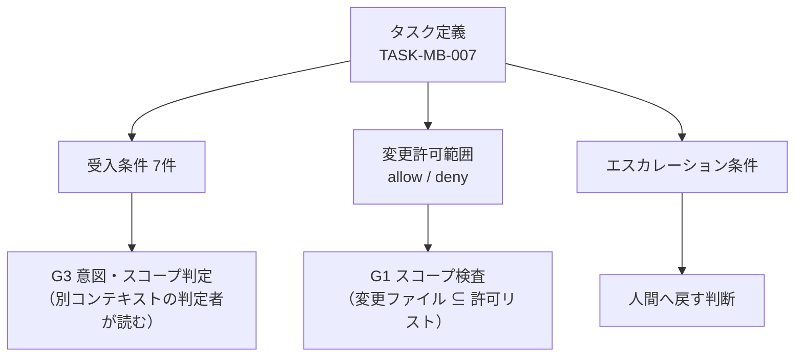

:::message
本記事はシリーズ「**J-SIX：Japanese SI Transformation**」の実践編（全6回）の第3回です。[第2回：「振込先を印字したい」を実装できる Spec にする](https://zenn.dev/seckeyjp/articles/j-six-walkthrough-02-spec)の続きです。
:::

## 今回やること

前回、要望の一言を REQ-011〜013 と PROP-007・008 にしました。今回は実装の直前までを扱います。

1. 設計の判断を **ADR** に残す
2. 実装を **タスク**に分解し、受入条件と**変更してよいファイルの範囲**を決める
3. Phase 2 のゲートで、顧客に何を出せるかを整理する

地味な工程ですが、ここで決めたことが第4回の品質ゲートの判定基準になります。

## 1. ADR — 却下した案を残す

ADR（Architecture Decision Record）は設計判断の記録です。J-SIX の3層ドキュメント戦略では、**第2層「Why Not（なぜ他の方法を採らなかったか）」**を担当します。

今回のサンプルで最も重要な ADR は、振込先ではなく**消費税の端数処理**のものです。実物を見てみます。

```markdown
# ADR-0001: 消費税の端数処理を「請求単位・税率ごとに1回」で行う

## 判断（Decision）

消費税額の端数処理は、**一の請求につき、税率ごとに1回**だけ行う。
明細ごとの消費税額は計算も保持もしない。

## 理由（Rationale）

適格請求書等保存方式（インボイス制度）の要件による。国税庁のQ&A（問57）は、
1円未満の端数が生じる場合は「一の適格請求書につき、税率ごとに1回の端数処理を行う」と
定めており、「個々の商品ごとに消費税額等を計算し、端数処理を行い、その合計額を記載する
ことは認められない」と明記している。
```

そして、この ADR の価値は次の表にあります。

| 代替案 | メリット | デメリット | 却下理由 |
|---|---|---|---|
| 明細ごとに端数処理して合計 | 明細の税額をそのまま足せて実装が素直 | 制度上認められない。合計が請求単位の計算と1〜数円ずれる | 法令要件に反する |
| 請求単位で1回だけ（税率を区分しない） | 端数処理が1回で済む | 税率ごとの対価の額と消費税額を区分記載できない（REQ-006 違反） | 記載事項を満たせない |

**却下した案こそが、後から読む人にとって価値があります。** 「なぜ明細ごとに計算しないのか」は、コードを読んでも分かりません。素朴に実装すると明細ごとに計算したくなるので、数か月後の自分や、引き継いだ別の担当者が「こっちのほうが素直では」と書き換えてしまいます。

:::message
J-SIX の Plugin には、ADR を残すべき判断をしたのに記録していない場合に指摘する Hook があります。「ライブラリ・フレームワークの選択」「アーキテクチャパターンの選択」「セキュリティに関する判断」「性能のトレードオフ」のいずれかを新たに行ったとき、作業を終えようとすると確認が入ります。
:::

### 今回の要件で ADR は増えたか

増えませんでした。第2回で決めた5つの論点は、**いずれも既存の方針に揃える判断**だったためです（口座を取引先ごとにする点だけが新しい判断ですが、これは REQ-011 として Spec に書けば足ります）。

ADR を書くべきかどうかの判断基準は、**「他の選択肢があり、選ばなかった理由が後から分からなくなるか」**です。今回はどれも Spec の記述で説明がつくため、ADR は作りませんでした。

一方、実装中に ADR が1つ増えることになります（ADR-0004）。その経緯は第4回で扱います。

## 2. タスクに分解する

J-SIX の Phase 3 は、Design Spec を実装可能なタスクに分解する工程です。ここで作るのが**タスク定義**です。今回のタスクはこうなりました。

```markdown
# TASK-MB-007: 請求書に振込先口座を印字する

**対象 UC**: UC-002（月次締め）, UC-004（請求書の出力）
**対象 REQ**: REQ-011, REQ-012, REQ-013 ／ **対象 PROP**: PROP-007, PROP-008
```

タスク定義には3つのものを書きます。

### (1) 受入条件

```markdown
| # | 受入条件 |
|---|---|
| 1 | 取引先に振込先口座（金融機関名・支店名・預金種別・口座番号・口座名義）を登録できる |
| 2 | 月次締めで作成した請求に、**締め時点の**振込先口座が保存される |
| 3 | 請求書に振込先口座が印字される |
| 4 | 締め後に取引先マスタの口座を変更しても、作成済みの請求の振込先は変わらない |
| 5 | 振込先が未登録の取引先でも締めは成功し、その請求書には「振込先未登録」と表示される |
| 6 | 振込先が未登録の請求があった締めは、監査記録に警告として残る |
| 7 | 会計連携ファイル（EIF-001）の列構成は変更しない |
```

7番に注目してください。**「変えないこと」も受入条件です。** 今回の変更で会計連携の列が増えると、連携先の会計システム側の改修が必要になります。これを明示的に書いておかないと、AI は「口座も出したほうが親切では」と判断するかもしれません。

### (2) 変更を許可するファイルの範囲

```markdown
**allow**
- `app/models.py`（BankAccount の追加、Customer / Invoice への項目追加）
- `app/billing.py`（口座の登録、締め時点のスナップショット、警告の記録）
- `app/reports.py`、`app/templates/report_invoice.html`、`app/templates/invoice_detail.html`
- `tests/**`（`tests/acceptance/**` は hold-out 作成時のみ）
- `docs/**`

**deny**
- `app/accounting.py`（EIF-001 の列構成を変更しない。受入条件 7）
- `app/importer.py`（EIF-002 は変更しない）
- `app/batch.py`（バッチの入出力は変えない）
```

これが J-SIX の特徴的な部分です。**実装を始める前に、触ってよいファイルを人間が承認します。**

品質ゲートの G1 は、変更されたファイルがこの許可リストに収まっているかを機械的に判定します。範囲外のファイルが変更されていれば、そこで止まります。

なぜ先に決めるのか。**実行中に AI 自身が許可範囲を広げられるなら、検査の意味がないから**です。「ついでにこのモジュールも整理しておきました」を防ぎます。

### (3) エスカレーション条件

```markdown
- 会計連携ファイルの列構成を変えたくなった場合（受入条件 7 と矛盾するため、要件の再確認が必要）
- 確定済み請求の振込先を変更する要求が出た場合（REQ-012 と矛盾する）
```

「困ったら聞く」ではなく、**どういう状況になったら人間に戻すか**を具体的に書きます。曖昧にしておくと、AI は自分で判断して進みます。



## 3. タスク定義が後で効く場面

タスク定義は、書いて終わりではありません。第4回で、**品質ゲートの G3（意図・スコープ判定）がこのファイルを読みます**。

G3 は、実装したのとは別のコンテキストで起動する判定者です。diff とタスク定義と Spec だけを見て、「頼んだものと違うものが出ていないか」を判定します。このときタスク定義が無いと、判定者は受入条件を確認できません。J-SIX では、**タスク定義が無い場合は推測せずに REJECT** と決めています。

つまり、タスク定義は「AI への指示書」であると同時に「**後から検証するための基準**」でもあります。

## 4. Phase 2 のゲート — 顧客に何を出せるか

実装に入る前に、顧客との合意が必要なプロジェクトも多いはずです。J-SIX の Phase 2 のゲートでは、次のように整理します。

| 出せるもの | 出せないもの |
|---|---|
| 要求 Spec（REQ・PROP・受入条件・非機能要件） | 画面レイアウト（実装前） |
| Design Spec（アーキテクチャ方針） | エンティティ定義・CRUD図 |
| ADR（設計判断と却下理由） | 帳票項目の詳細 |
| 実動プロトタイプ | バッチ処理フロー・定義 |
| タスク一覧（受入条件・変更許可範囲つき） | |

右側は、実装から逆生成する成果物です。実装前に書いても、実装後に書き直すことになります。

J-SIX では、**これらを事前に書きません**。代わりに、実動プロトタイプや Spec の記述を「代替物」として提出し、納品時に逆生成版へ差し替えることを、顧客と先に合意します。この進め方の詳細は[IPA の工程成果物27点で合意を分解する記事](https://zenn.dev/seckeyjp/articles/j-six-ipa-deliverables)に書きました。

そして、**詳細設計書も実装前には書きません**。Phase 3 の成果物であるタスク一覧（受入条件・PROP・変更許可範囲つき）を、詳細設計書の代替として合意します。関数単位の処理を日本語で書いても、実装後にコードと二重管理になるだけだからです。

## ここまでのまとめ

今回やったことは3つです。

1. **ADR は「却下した案」に価値がある。** 今回は新しい ADR は増えなかった（既存方針に揃えたため）
2. **タスク定義に、受入条件・変更許可範囲・エスカレーション条件を書く。** 変更許可範囲は人間が先に承認する
3. **実装前に顧客へ出せるものと出せないものを分ける。** 出せないものは代替物で合意し、納品時に差し替える

準備はこれで終わりです。次回はいよいよ実装ですが、**まず書くのはテストではありません。実装者が読めないテスト（hold-out 受入テスト）**から始めます。そして品質ゲートが、私の手順違反を実際に弾きます。

---

本連載で使っているサンプル・テンプレート・Plugin は GitHub で公開しています。

https://github.com/SeckeyJP/j-six

今回のタスク定義の実物:

https://github.com/SeckeyJP/j-six/blob/main/examples/monthly-billing/docs/tasks/TASK-MB-007.md
