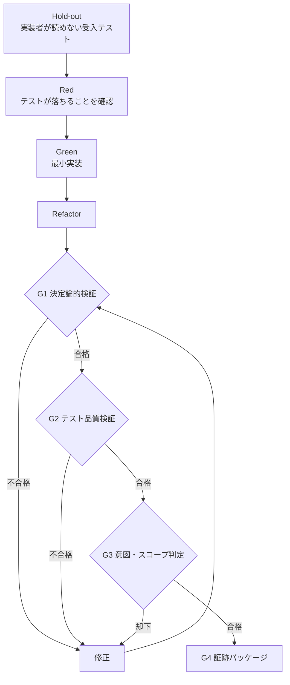

:::message
本記事はシリーズ「**J-SIX：Japanese SI Transformation**」の実践編（全6回）の第4回です。[第3回：判断を ADR に残し、タスクに分解する](https://zenn.dev/seckeyjp/articles/j-six-walkthrough-03-design)の続きです。
:::

## 今回やること

前回までに、要件は REQ-011〜013・PROP-007/008 になり、タスク定義（受入条件7件・変更許可範囲）もできました。今回は実装です。

ただし、この記事の主役は実装ではありません。**品質ゲートが実際に何を捕まえたか**です。今回の作業で、ゲートは5種類の問題を検出しました。

| # | 捕まえたもの | 捕まえた層 |
|---|---|---|
| 1 | hold-out を実装と同時にコミットした（手順違反） | G1 スコープ検査 |
| 2 | 書いたばかりのコードのテストの穴 | G2 mutation testing |
| 3 | 設計書が実装に追いついていない | G3 意図・スコープ判定 |
| 4 | 古い判定の使い回し | 判定の鮮度チェック |
| 5 | 整形漏れ | CI（外側ループ） |

**そして、コードの誤りは1件も指摘されませんでした。** この非対称性が、今回いちばん面白いところです。



## 1. まず、実装者が読めないテストを書く

TDD というと「テストを書いてから実装する」ですが、J-SIX ではその前にもう1段あります。**hold-out 受入テスト**です。

これは Spec の受入条件だけを見て書くテストで、**実装を書く工程からは読むことも変更することもできません**。J-SIX の Plugin では、実装担当のサブエージェント（green-agent）に Hook を仕込んで、`tests/acceptance/` の読み取りと `tests/` への書き込みを機械的に拒否しています。

今回書いた hold-out 受入テストは4件です。1つを抜粋します。

```python
def test_uc002_bank_account_is_snapshot_at_closing(imported, client):
    """REQ-012 / PROP-007: 締め後にマスタを変えても請求書の記載は変わらない。"""
    imported.set_bank_account("C001", **BANK)
    batch.run_month_close(imported, "2026-08", actor="keiri01")
    invoice = invoice_of(client, "C001")

    changed = dict(BANK, bank_name="別銀行", account_number="9999999")
    imported.set_bank_account("C001", **changed)

    body = client.get(f"/invoices/{invoice['invoice_no']}/report").text
    assert "ジェイシックス銀行" in body
    assert "1234567" in body
    assert "別銀行" not in body
    assert "9999999" not in body
```

書き方には決まりがあります。**公開インタフェース（HTTP API とバッチのエントリポイント）だけを使う**ことです。ドメイン層の内部構造に触れると、実装の詳細に依存したテストになり、監督面として弱くなります。

## 2. Red — 落ちることを確認する

テストを書いたら、まず落ちることを確認します。


4件とも `AttributeError`（`set_bank_account` が存在しない）で落ちました。当然です。まだ何も実装していません。

この「落ちること」の確認には意味があります。テストが最初から通ってしまうなら、そのテストは何も検証していない可能性があります。

このあと、単体テスト8件と性質テスト2件を追加し、同じように落ちることを確認しました。Red の完了時点で、Git にタグ（`jsix/red-TASK-MB-007`）を打ちます。このタグが、後の「テストを弱める変更」の検出の基準点になります。

## 3. Green — 実装する

実装の要点は2つでした。

**(1) 値オブジェクトを不変にする**

```python
@dataclass(frozen=True)
class BankAccount:
    """振込先口座（REQ-011）。

    **不変**にしてある。請求は締め時点の口座を保存し（REQ-012）、後からマスタを
    変更しても作成済みの請求書の記載が変わってはならない。可変にすると、
    同じインスタンスを共有した時点でスナップショットが崩れる。
    """
```

REQ-012（締め時点のスナップショット）は、テストで検証するだけでなく、**型で守っています**。`frozen=True` にしておけば、請求とマスタが同じインスタンスを共有していても、マスタ側の変更が請求に波及しません。

**(2) 未登録は止めずに記録する**

```python
# REQ-013: 振込先が未登録でも締めは止めず、警告として監査記録に残す。
for invoice in created:
    if invoice.bank_account is None:
        self._log(AuditEntry(
            action="CLOSE_WARN_NO_BANK_ACCOUNT",
            actor=actor, at=self._clock(),
            year_month=year_month, invoice_no=invoice.invoice_no,
        ))
```

第2回で決めた「止めない。ただし気づけるようにする」が、ここに落ちています。

## 4. ゲートが手順違反を弾いた（G1）

実装が終わったので、ゲートを実行しました。


**止められました。** 理由は `tests/acceptance/test_uc002_uc004_bank_account.py` が許可範囲外だから、です。

前回のタスク定義を思い出してください。`deny` に `tests/acceptance/**` を入れていました。hold-out はタスクの前半で確定させるもので、実装フェーズでは触れません。

私がやってしまったのは、**hold-out から実装まで全部を未コミットのまま進めたこと**でした。J-SIX の手順では、hold-out を書いた時点で1回コミットし、Red のテストでもう1回コミットし、それからタグを打って実装に入ります。フェーズごとにコミットすることで、「どの時点の差分を検査するか」が確定します。

コミットを分け直したら通りました。**手順を守っているつもりで守れていないことを、機械が教えてくれた**わけです。

## 5. mutation testing が、書いたばかりのコードの穴を見つけた（G2）

G1 を通過すると、G2（テスト品質検証）に進みます。ここで引っかかったのが mutation testing です。

mutation testing は、コードを機械的に少しだけ壊した版を大量に作り、テストが落ちるかを見る手法です。**テストが落ちなければ、その誤りはテストをすり抜ける**ことになります。

生き残ったミュータントの中に、これがありました。

```python
        account = BankAccount(
            bank_name=bank_name,
            branch_name=branch_name,
            account_type=None,        # ← 預金種別を落としたミュータント
            account_number=account_number,
            account_holder=account_holder,
        )
```

**預金種別（普通／当座）が落ちても、どのテストも落ちませんでした。**

hold-out 受入テストは金融機関名・支店名・口座番号・名義を検証していました。単体テストも同様でした。**5項目のうち1つだけ、誰も見ていなかった**のです。預金種別は請求書に印字される項目なので、落ちれば記載が欠けます。

単体テストを1件追加して塞ぎました。

```python
def test_req011_all_account_fields_are_stored(svc):
    """REQ-011: 登録した5項目がすべて保存される。

    mutation testing で `account_type=None` に変えたミュータントが生き残った。
    金融機関名・口座番号は検証していたが、預金種別を検証していなかったため。
    """
```

カバレッジは 99.7% でした。**カバレッジが高くても、この穴は見つかりません。** 該当行は実行されているからです。

## 6. 設計書の追随漏れを、判定者が5回指摘した（G3）

G2 を通過すると、G3（意図・スコープ判定）です。実装したのとは別のコンテキストで起動する判定者が、diff・タスク定義・Spec だけを見て「頼んだものと違うものが出ていないか」を判定します。

結果は、**7回実行して PASS が3回、REJECT が4回**でした。そして**コードへの指摘は1件もありませんでした**。

| 回 | 判定 | 指摘 |
|---|---|---|
| 1 | PASS | 参考所見1件（明細画面と請求書で文言が食い違う） |
| 2 | REJECT | バッチ定義・エンティティ一覧・CRUD図・帳票／画面レイアウトが未更新 |
| 3 | REJECT | 監査記録の定義が古い。記録順序が実装と逆。フロー図の終端が繋がっていない |
| 4 | REJECT | トレーサビリティの件数が16件のまま。hold-out の表に新規ファイルが無い |
| 5 | REJECT | README の自己矛盾、項番の重複、版数の不揃い |
| 6-7 | PASS | 判定基準を「要件の充足に関わる食い違い」に絞って再判定 |

**実装は1回で通り、設計書の追随に5回かかりました。**

私は最初、目につきやすい成果物（エンティティ定義・帳票項目説明）だけを直して「終わった」と思っていました。実際には、一覧・レイアウト・バッチ定義・トレーサビリティ・README が取り残されていました。27点の成果物を実装に追随させる作業は、**人間（や AI）が思っているより抜けます**。

### 順序を直そうとしたら、hold-out に止められた

3回目の指摘で面白いことが起きました。「設計書は CLOSE の後に警告を記録すると書いてあるが、実装は警告が先だ」という指摘です。

設計書に合わせて実装を直そうとしたら、テストが2件落ちました。**hold-out 受入テストと既存の単体テストが「監査ログの末尾は CLOSE」と規定していた**のです。

hold-out は実装前に別の書き手が固定した監督面なので、動かせません。結果として、**設計書のほうを実装に合わせました**。テストが仕様を固定し、設計書がそれに従う、という関係がそのまま出た場面でした。

### 判定の鮮度チェック

もう1つ、地味ですが重要な仕組みが働きました。設計書を直すたびに差分が変わるので、ゲートが**「判定後に差分が変わった」と検出して、古い判定を無効にします**。

```
❌ [G3] judge: G3 の判定が古い（判定後に差分が変わった、または別タスクの判定が残っている）
```

これが無いと、「昔 PASS した判定」を使い回して通せてしまいます。実際、J-SIX の Plugin にはこの照合が無かった時期があり、前のタスクの PASS が残っていると素通りする不具合がありました。

## 7. 全層を通過する

修正を重ねて、ようやく全層を通過しました。


最終的な数値です。

| 指標 | 変更前 | 変更後 |
|---|---|---|
| テスト | 101件＋hold-out 19件 | 111件＋hold-out 23件 |
| カバレッジ | 98.8% | 99.7% |
| mutation score | 91.88% | 91.49% |
| トレーサビリティ | 16件 | 21件 |

mutation score がわずかに下がっているのは、コードが増えてミュータントも増えたためです（505 → 552）。閾値の 90% は満たしています。

G4 では証跡パッケージが生成されます。テスト結果・カバレッジ・mutation・セキュリティ・スコープ検査の結果が、再現情報（commit・ツール版・設定のハッシュ）つきで構造化されます。これが第5回で納品物に変わります。

## 8. CI が整形漏れを捕まえた（外側ループ）

最後にもう1つあります。PR を出したら、**CI が落ちました**。

```
❌ [G1] format: コマンドが失敗しました（exit 2）: make format
```

整形漏れです。手元のゲートは通っていたのに、なぜ CI で落ちたのか。

**内側ループ（手元の Stop Hook）は、ビルドやテストのコマンドを実行しないからです。** 既にある成果物を読んで判定するだけにしています。ターンが終わるたびに数分待たされると、人は Hook そのものを無効にしてしまうためです。

コマンドを実際に実行するのは CI（外側ループ）の役割です。両者は**同じ判定スクリプトと同じ設定ファイル**を使い、実行モードだけが違います。

| | 内側ループ（Hook） | 外側ループ（CI） |
|---|---|---|
| 目的 | 早く気づく | 確実に止める |
| コマンドの実行 | しない（成果物を読む） | する |
| G3（LLM judge） | 実行する | 必須にしない |

整形して push し直したら通りました。**二重化は、こういう「速さと確実さのトレードオフ」を両取りするための構成です。**

## ここまでのまとめ

ゲートが捕まえた5件を振り返ります。

1. **手順違反**（hold-out を実装と同時にコミット）— G1
2. **テストの穴**（預金種別を誰も検証していない）— G2
3. **設計書の追随漏れ**（5回にわたって指摘）— G3
4. **古い判定の使い回し**（差分の指紋で照合）
5. **整形漏れ**（内側では検出できない）— CI

そして、**コードの誤りの指摘は0件**でした。実装そのものは一度で通り、時間を取られたのは周辺（手順・テストの網羅・設計書の追随）です。

これは、AI にコードを書かせる開発の実像を表していると思います。**コードを書くのは速い。速くならないのは、それ以外の全部です。**

次回は、できあがったものを見ます。画面と帳票の実物、そして27点の工程成果物が実装からどう起き上がり、顧客に出す基本設計書にどう束ねられるかを扱います。

---

本連載で使っているサンプル・テンプレート・Plugin は GitHub で公開しています。

https://github.com/SeckeyJP/j-six

今回の変更の実物（PR）:

https://github.com/SeckeyJP/j-six/pull/18
