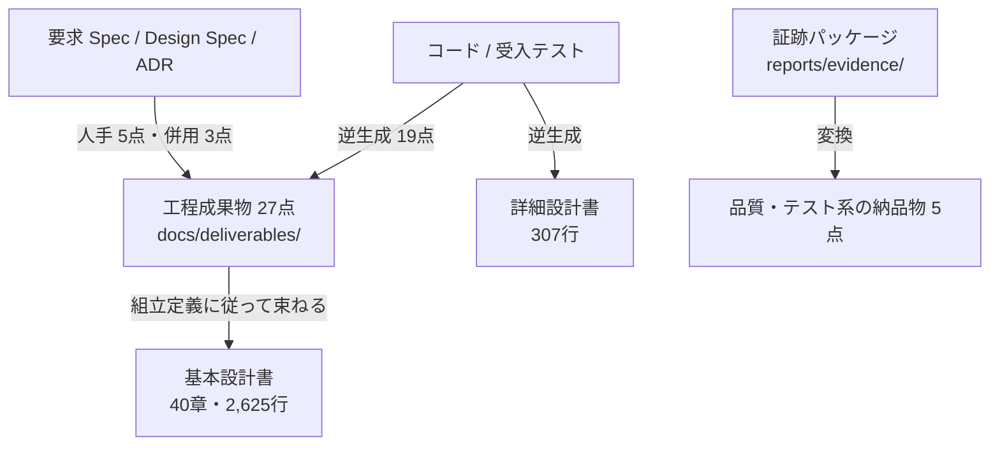

:::message
本記事はシリーズ「**J-SIX：Japanese SI Transformation**」の実践編（全6回）の第5回です。[第4回：TDD と4層品質ゲート](https://zenn.dev/seckeyjp/articles/j-six-walkthrough-04-tdd)の続きです。
:::

## 今回やること

実装と品質ゲートが終わりました。今回は**できあがったもの**を見ます。

1. 画面と帳票の実物
2. 工程成果物27点が実装からどう起き上がるか
3. 顧客の様式に束ねた基本設計書
4. 証跡から変換した品質・テスト系の納品物

日本の SI で「で、納品物は？」と聞かれる部分です。

## 1. できたもの

まず請求書です。実装前と実装後を並べます。

**実装前**


**実装後**


下部に「お振込先」が増えました。金融機関・支店・預金種別・口座番号・口座名義の5項目です。第4回で mutation testing が見つけたのは、このうち**預金種別だけが誰にも検証されていなかった**という穴でした。

請求明細の画面にも振込先が出ます。


## 2. 未登録のときはどうなるか

第2回で決めた判断を思い出してください。「**口座が未登録でも締めは止めない。印字を省いて警告を残す**」でした。

実際にそうなっているかを見ます。振込先を登録していない取引先の請求書です。


請求書自体は出ます。振込先の欄には「振込先未登録です。経理までお問い合わせください。」と表示されます。**伏せずに、未登録であることを示します。**

そして、この締めは監査記録に警告として残ります。経理担当者は請求一覧の画面でも、明細画面の「振込先」欄でも未登録に気づけます。

**「安全に倒す」とは、止めることではありません。** 月末の締めが1社の設定漏れで止まれば、経理の業務全体が止まります。止めずに進め、かつ見落とせないようにする。この判断は人間がするものです。

## 3. 工程成果物は実装から起き上がる

J-SIX では、設計書を IPA の**工程成果物27点**の単位で作ります。そして、その27点は「何から作るか（由来）」で分かれています。

| 由来 | 件数 | 何が書かれているか |
|---|---|---|
| コードから逆生成 | 18 | 画面・データ・外部 IF・バッチ・帳票の大半 |
| 受入テストから逆生成 | 1 | システム化業務説明 |
| コード＋Spec／ADR の併用 | 3 | 外部 IF 処理説明、帳票概要、帳票編集定義 |
| 人手で書く | 5 | 業務一覧、業務フロー、各領域の共通ルール |

今回の変更で更新された成果物を見てみます。

| 成果物 | 何が変わったか |
|---|---|
| ER図・エンティティ一覧・定義 | `BankAccount` の追加、`Customer` と `Invoice` への項目追加 |
| CRUD図 | 「振込先登録」の行と `BankAccount` の列 |
| 帳票レイアウト・項目説明・編集定義 | 「お振込先」ブロック、未登録時の表示、スナップショットの理由 |
| 画面レイアウト・入出力項目 | 明細画面の振込先の行 |
| バッチ処理定義・フロー・共通ルール | 警告の記録（`CLOSE_WARN_NO_BANK_ACCOUNT`）と出力件数 |
| システム化業務説明 | 振込先の事後条件（受入テストから） |

**11点が更新されました。** 1つの要件が、いかに広く波及するかが分かると思います。

そして第4回で書いたとおり、**この追随に5回のやり直しがかかりました**。判定者が「バッチ定義が古い」「トレーサビリティの件数が合っていない」と指摘するたびに直す、という繰り返しです。

### 由来の表示が効く場面

各成果物の冒頭には、由来と逆生成元が書かれています。

```markdown
# 帳票編集定義

**工程成果物**: 帳票 ⑤ ／ **由来**: コード＋ADR
**逆生成元**: `app/templates/report_invoice.html` の条件分岐、`app/billing.py`, ADR-0001/0002
**対象**: 月次請求書発行 ／ **版**: 1.1 ／ **日付**: 2026-09-21
```

これが顧客レビューで効きます。**重点的に見てほしいのは人手で書いた章**（業務一覧・業務フロー・共通ルール）です。逆生成した章は「実装がこうなっている」という事実の記述なので、レビューの意味が違います。由来が見えないと、レビュアーは27点すべてを同じ重みで読むことになります。

### 帳票編集定義の中身

コードだけを読んでも分からないことが、ここに書かれています。

| 処理 | 内容 |
|---|---|
| 転記元 | `Invoice.bank_account`（**締め時点のスナップショット**） |
| 注意 | 取引先マスタの現在の口座ではなく、締め時点の口座を使う。交付先名称と同じ考え方で、発行済み請求書の記載が後から変わらないようにするため |
| 未登録時 | 「振込先未登録です。経理までお問い合わせください。」を表示し、請求書自体は出力する（REQ-013） |

**「なぜ締め時点の口座なのか」はコードから復元できません。** ADR と Spec に残した理由が、逆生成した設計書に引用されて初めて、設計書として意味を持ちます。



## 4. 顧客の様式に束ねる

工程成果物は「作る単位」であって「提出する単位」ではありません。顧客が求めるのは「基本設計書」という1冊です。

そこで、**組立定義**に従って束ねます。今回できた基本設計書は、40章・2,625行になりました。

```markdown
## 目次

| 章 | 構成要素 | 由来 |
|---|---|---|
| 1.1 目的・業務背景 | requirement-spec.md | 人手 |
| 2.2 外部システム関連 | 01-system-relation.md | コードから逆生成 |
| 3.3 システム化業務説明 | 03-business-description.md | hold-out 受入テストから逆生成 |
| 5.5 帳票編集定義 | 05-report-edit-rules.md | コード＋ADR |
...
```

組立で守っているルールは4つです。

1. **構成要素の本文を書き換えない。** 変えるのは見出しのレベルと、束ねた後に辿れるようにする相対リンクだけ
2. **章ごとに由来を表示する**
3. **ID を振り直さない。** ID はテストとコードに書かれたトレーサビリティの鍵
4. **同じ成果物を2冊に全文で入れない。** 詳細設計書からは基本設計書を参照する

そして巻末に、**構成要素ごとの版表**を付けます。

> 表紙の版は「組み立てた時点」を表すにすぎない。どの章がいつの実装から起こされたかは、
> 下表の構成要素ごとの版・日付で判断すること。

1冊の表紙に書かれた日付は、中身の新しさを保証しません。章ごとに逆生成元と日付が分かる形にしておくことが、逆生成方式では重要になります。

:::message
今回のサンプルは、**顧客と目次を合意していません**。そのため J-SIX 同梱の組立例をそのまま使い、その旨を設計書の冒頭に明記しています。実案件では、顧客の目次に構成要素を対応付けた組立定義を先に作り、Phase 2 のゲートで合意します。詳しくは[IPA の工程成果物27点の記事](https://zenn.dev/seckeyjp/articles/j-six-ipa-deliverables)をご覧ください。
:::

## 5. 詳細設計書は「コードを読んでも分からないこと」に絞る

詳細設計書（307行）も逆生成しました。こちらは工程成果物の連結ではなく、コード・性質テスト・ADR・証跡から起こします。

書く内容を絞っているのが特徴です。

| 書く | 書かない |
|---|---|
| モジュールの責務と依存の向き | 関数本体を日本語に置き換えた処理記述 |
| 不変条件（PROP）と、それをどこで守っているか | 変数ごとの説明 |
| 例外と外部への応答の対応 | コードの条件分岐の列挙 |
| 状態遷移と、遷移を許す／拒む箇所 | 自明な getter / setter |
| 計算方式と**その根拠**（ADR・法令） | 型から読める引数と戻り値だけの表 |

たとえば「不変条件」の章には、こう書かれています。

| PROP | 不変条件 | どこで守っているか |
|---|---|---|
| PROP-002 | 税率ごとの消費税額 = floor(税率ごとの税抜合計 × 税率) | `InvoiceLine` が消費税額を**持たない**ことで、明細ごとの丸めを構造的に不可能にしている |
| PROP-007 | 保存された振込先は締め後のマスタ変更で変化しない | `BankAccount` が `frozen=True` であること |

**テストで守っているのか、型と構造で守っているのか**を書き分けています。これはコードを読めば分かることですが、読む前に知っておきたいことでもあります。

## 6. 品質系の納品物は証跡から変換する

テスト結果報告書・品質報告書・セキュリティ診断結果・トレーサビリティマトリクス・レビュー記録の5点は、**Phase 4 の品質ゲートが出力した証跡パッケージ**から変換します。

納品直前に人手で書き起こすのではなく、実行時のデータを整形するだけです。変換のルールは3つあります。

**(1) 数値は証跡から引用し、再計算しない**

```markdown
| 指標 | 実測値 | 閾値 | 判定 |
|---|---|---|---|
| テスト通過 | 111件／111件 | 全通過 | ✅ |
| ステートメントカバレッジ | 99.7% | 95.0% | ✅ |
| mutation score | 91.49% | 90.0% | ✅ |
```

**(2) 証跡・参考所見・承認を混ぜない**

AI の判定（G3 judge の結果や要約）は「参考所見」として別の節に置き、「単独で品質判定の根拠にしない」と明記します。LLM の判定は再実行しても同じ結果になるとは限らず、第三者が同じ手順で確かめられないからです。証跡は誰が何度実行しても同じ値になります。

**(3) 人間の承認欄が未記入なら「未承認」と書く**

```markdown
**本書作成時点の状態**: **未承認**（承認欄が未記入）。納品前に記入すること。
```

自動生成した納品物が、承認まで済んだように見えてはいけません。

さらに各納品物の末尾には、**検証条件**（commit・実行日時・設定ファイルのハッシュ・ツールの版・実行環境）が付きます。第三者が同じ条件で再現できるようにするためです。

## 7. できた納品物の一覧

最終的に、こうなりました。

| 納品物 | 行数 | 由来 |
|---|---|---|
| 基本設計書 | 2,625 | 工程成果物27点＋Spec＋ADR＋トレーサビリティ |
| 詳細設計書 | 307 | コード＋性質テスト＋ADR＋証跡 |
| テスト結果報告書 | 86 | 証跡 |
| 品質報告書 | 140 | 証跡 |
| セキュリティ診断結果 | 69 | 証跡 |
| トレーサビリティマトリクス | 52 | 証跡 |
| レビュー記録 | 93 | 証跡（参考所見・承認） |

工程成果物27点は別にあり、そこから上の設計書が組み上がっています。

**作成コストの大半は、実装と品質ゲートの段階で既に払われています。** 逆生成と組立の工程でやったのは、機械的な連結と、証跡の整形だけです。

## ここまでのまとめ

- **画面と帳票は実物。** 未登録時の扱いも、第2回で決めたとおりに動いている
- **27点のうち19点は実装から起き上がる。** 今回の変更では11点が更新された
- **由来の表示が、顧客レビューの重点を決める。** 人手の章と逆生成の章では読み方が違う
- **設計書は工程成果物のビュー。** 直接編集せず、構成要素から組み立て直す
- **品質系の納品物は証跡から変換する。** 数値は引用のみ、区分を混ぜない、未承認は未承認と書く

次回は最終回です。ここまでの実測値をまとめ、**うまくいったこと・面倒だったこと・測れていないこと**を正直に書きます。

---

本連載で使っているサンプル・テンプレート・Plugin は GitHub で公開しています。

https://github.com/SeckeyJP/j-six

今回できた設計書と納品物の実物:

https://github.com/SeckeyJP/j-six/tree/main/examples/monthly-billing/docs/design-docs
