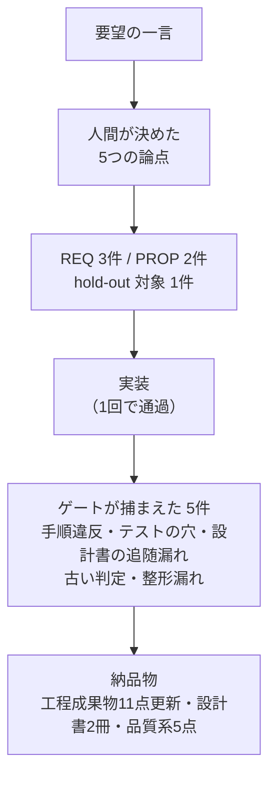

:::message
本記事はシリーズ「**J-SIX：Japanese SI Transformation**」の実践編（全6回）の最終回です。[第5回：画面・帳票と、27点の設計書](https://zenn.dev/seckeyjp/articles/j-six-walkthrough-05-deliverables)の続きです。
:::

## 今回やること

5回にわたって、「請求書に振込先口座を印字する」という1つの要件を、要求の一言から納品物まで通しました。最終回は振り返りです。

**測れたこと・うまくいったこと・面倒だったこと・測れていないこと**を、順に正直に書きます。J-SIX は著者のオリジナル設計であり、この記事も「うまくいきました」で終わらせるつもりはありません。

## 1. 測れたこと

まず数字です。すべて実測値で、リポジトリで再現できます。

| 指標 | 変更前 | 変更後 |
|---|---|---|
| テスト | 101件 | 111件 |
| hold-out 受入テスト | 19件 | 23件 |
| ステートメントカバレッジ | 98.8% | 99.7% |
| mutation score | 91.88%（505 中 464） | 91.49%（552 中 505） |
| トレーサビリティ | 16件（REQ 10 + PROP 6） | 21件（REQ 13 + PROP 8） |

成果物の側はこうなりました。

| 成果物 | 数 |
|---|---|
| 追加した業務ルール（REQ） | 3 |
| 追加した性質（PROP） | 2 |
| 更新した工程成果物 | 11点（27点中） |
| 組み立てた設計書 | 2冊（基本設計書 2,625行・詳細設計書 307行） |
| 証跡から変換した納品物 | 5点 |
| G3（意図・スコープ判定）の実行回数 | **7回** |

## 2. うまくいったこと

### ゲートが5種類の問題を捕まえた

第4回で書いたとおりです。

| 捕まえたもの | 層 |
|---|---|
| hold-out を実装と同時にコミット（手順違反） | G1 スコープ検査 |
| 預金種別を誰も検証していない（テストの穴） | G2 mutation testing |
| 設計書が実装に追いついていない | G3 judge |
| 古い判定の使い回し | 判定の鮮度チェック |
| 整形漏れ | CI（外側ループ） |

特に mutation testing の検出は、**カバレッジ 99.7% の状態で見つかった穴**です。5項目のうち4項目は検証していたのに、預金種別だけ誰も見ていませんでした。カバレッジでは原理的に見つかりません。

### 既存の方針が、新しい判断のコストを下げた

第2回で決めた5つの論点のうち、**4つは「既存の方針に揃える」で決まりました**。

- 未登録時に止めない → 既存の売上取込が「1行の不備で全体を止めない」方針だから
- 締め時点のスナップショット → 交付先名称が既にその扱いだから
- 確定後は変更不可 → 既存の REQ-007 と整合するから
- 会計連携に含めない → 現行の列構成を維持するため

これは、Spec・ADR・設計書が最新であることの効用です。設計書が古いと、この判断は毎回ゼロから考えることになり、人によって答えが変わります。

### 逆生成した成果物は、実装とずれなかった

27点のうち19点はコードと受入テストから起こします。この19点については、**実装と食い違うことが原理的にありません**。

## 3. 面倒だったこと

### G3 が7回。しかもコードの指摘は0件

いちばん時間を取られたのがここです。7回のうち4回が REJECT で、**指摘はすべて「設計書が実装に追いついていない」でした**。

| 回 | 指摘 |
|---|---|
| 2 | バッチ定義・エンティティ一覧・CRUD図・帳票／画面レイアウトが未更新 |
| 3 | 監査記録の定義が古い、記録順序が逆、フロー図の終端が未接続 |
| 4 | トレーサビリティの件数、hold-out 表の欠落 |
| 5 | README の自己矛盾、項番の重複、版数の不揃い |

**実装は1回で通りました。** 逆生成の対象は19点あり、人間（や AI）は目につきやすい成果物だけを直して終わりにしがちです。それを判定者が毎回見つけてきます。

さらに、設計書を直すたびに差分が変わるので、**判定が無効になって再判定**になります。修正 → 再判定 → 新しい指摘 → 修正、という繰り返しでした。

J-SIX 自身が「G3 の却下率と却下理由を計測し、効かなくなったら外す」と定めています。今回の却下理由は**すべて設計書の追随漏れ**だったので、「G3 を外す」のではなく「**設計書の追随を機械化する**」ほうが筋だと考えています。

### 判定基準を絞る必要があった

6回目で、判定の指示を変えました。「件数・版数・項番のずれなど、読み手が要件を誤解しない軽微な差異は報告しない」と明記したのです。その結果 PASS になりました。

これは調整として妥当だったと思いますが、**「基準を緩めれば通る」という構造**でもあります。判定者に何を見せ、何を見せないかは、運用で決まってしまいます。ここは今後の課題です。

### mutation testing のキャッシュに騙された

実装後に mutation score を測り直したら、テストが落ちて計測できませんでした。原因は、mutmut が**HTML テンプレートのような非 Python ファイルの変更を追跡せず、古いままキャッシュする**ことでした。

`mutants/` ディレクトリを消して全件やり直すと通りました。5分ほど余計にかかります。

### 手順は、守っているつもりで守れない

hold-out を実装と同時にコミットしてしまった件です。J-SIX の手順（hold-out → コミット → Red → コミット → タグ → 実装）を知っていて、書いた本人が守れていませんでした。

**機械が検査していなければ、間違いなく気づかないまま進んでいました。**

## 4. 測れていないこと

ここが最も重要です。今回の作業で**測っていない**ことを並べます。

| 主張 | 状態 |
|---|---|
| 工数が削減されたか | **未測定**。人手だけで同じ要件を実装した場合との比較をしていない |
| 本番の欠陥が減るか | **未測定**。サンプルであり運用していない |
| 設計書の追随コストが、従来方式より小さいか | **未測定**。今回は5回の指摘を受けて直しており、楽ではなかった |
| この進め方が顧客に受け入れられるか | **未検証**。記入済み実例は顧客確認を経ていない |
| 大規模なコードベースで同じように回るか | **未検証**。本サンプルは 352 ステートメント |

工数については、J-SIX のロードマップでも「同一題材を人手のみで実装する工数と協力者を確保できない」として**比較を見送っています**。そのため、シリーズ記事に書いた工数削減率（60〜70%）は**著者推定のまま**です。この連載でも、その数字を裏づけることはできていません。

## 5. 現時点での結論

今回の1周から、確かに言えることは次の3つだと思います。

**(1) コードを書く時間は短い。短くならないのは、それ以外の全部。**

実装そのものは1回で通りました。時間を取られたのは、手順の遵守、テストの網羅、そして設計書の追随です。「AI でコーディングが速くなる」という話は、工程全体のごく一部を指しています。

**(2) 機械が検査しているものだけが守られる。**

手順違反も、テストの穴も、設計書の追随漏れも、すべて機械が見つけました。人間（と AI）は、自分が守っているつもりのルールを守れません。裏返せば、**検査していないルールは守られていない**と考えたほうがよいということです。

**(3) 逆生成は「書く手間」を減らすが、「合わせる手間」は残る。**

19点は実装から起き上がるので、書く手間はほぼゼロです。しかし、人手で保つ5点と、成果物どうしの整合（件数・版数・相互参照）は残ります。今回の7回の判定は、その現実を示しています。

## 6. これから試す人へ

この連載と同じことを試すなら、順番はこうだと思います。

1. **まず品質ゲートの G1（スコープ検査）と G2（テスト通過・テスト改変検出）だけ入れる。** 追加のテストを書かずに導入でき、効果がすぐ出ます
2. **CI で同じ判定を動かす。** Hook は8回連続でブロックすると自動解除されるので、最終防衛線になりません
3. **mutation score は計測だけから始める。** 数タスク分の値を見てから閾値を決めます
4. **hold-out 受入テストを足す。** 手間はかかりますが、「見えているテストだけを通す実装」への一番効く対策です
5. **G3（LLM 判定）は最後。** 却下率と却下理由を記録しながら運用し、効かなくなったら外します

逆生成については、**まず1つの領域（データモデルか外部インタフェース）だけ**やってみることをおすすめします。27点すべてを一度に始めると、今回のような追随漏れが一気に噴き出します。

## おわりに

6回にわたり、1つの要件を通す様子をお見せしました。使ったコード・Spec・設計書・証跡はすべて GitHub で公開しており、手元で再現できます。

J-SIX はまだ発展途上のプロセスです。実測できていないことが多く、この連載でも「測っていない」と書いた項目のほうが、書けた数字より重要かもしれません。

それでも、**機械が検査するものを増やすと、人間は判断に集中できる**という手応えはありました。第2回で人間がやったのは、5つの質問に答えることだけです。それがこの要件の仕様そのものでした。

そこに時間を使えるようにすることが、このプロセスの狙いです。

---

本連載で使っているサンプル・テンプレート・Plugin は GitHub で公開しています。

https://github.com/SeckeyJP/j-six

今回の題材（月次請求書発行サンプル）:

https://github.com/SeckeyJP/j-six/tree/main/examples/monthly-billing

## 連載一覧

| 回 | タイトル |
|---|---|
| 1 | [Plugin を入れて、最初のプロジェクトを立ち上げる](https://zenn.dev/seckeyjp/articles/j-six-walkthrough-01-setup) |
| 2 | [「振込先を印字したい」を実装できる Spec にする](https://zenn.dev/seckeyjp/articles/j-six-walkthrough-02-spec) |
| 3 | [判断を ADR に残し、タスクに分解する](https://zenn.dev/seckeyjp/articles/j-six-walkthrough-03-design) |
| 4 | [TDD と4層品質ゲート](https://zenn.dev/seckeyjp/articles/j-six-walkthrough-04-tdd) |
| 5 | [画面・帳票と、27点の設計書](https://zenn.dev/seckeyjp/articles/j-six-walkthrough-05-deliverables) |
| **6** | **本記事（振り返り）** |
