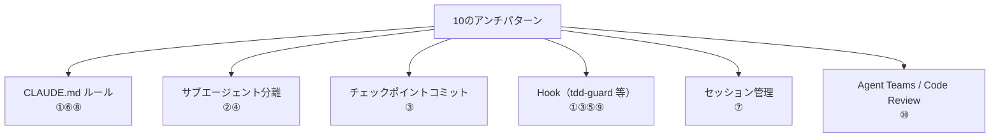

:::note
本記事はシリーズ「**J-SIX：Japanese SI Transformation**」の番外編です。シリーズ全体の概要は [#0 概要編](https://zenn.dev/seckeyjp/articles/j-six-00-overview)、TDD の基本プロセスは [#3 TDD × Claude Code](https://zenn.dev/seckeyjp/articles/j-six-03-tdd-cc) をご覧ください。
:::

## はじめに

AI 生成コードのイシュー率は人間の約1.7倍、セキュリティイシューは最大2.74倍[^coderabbit]。TDD で品質を担保するはずが、AI 特有の罠によって「テスト通過、バグ残留」という状態に陥ることがあります。

本記事では、Claude Code（以下 CC）で TDD を実践する際に陥りやすい **10のアンチパターン** と、その対策を整理します。[#3 TDD × Claude Code](https://zenn.dev/seckeyjp/articles/j-six-03-tdd-cc) で紹介した TDD プロセスを運用する中で「なぜかうまくいかない」と感じている方に向けた、トラブルシューティングガイドです。

## なぜ AI の TDD は人間の TDD と違うのか

人間が TDD をサボるとき、本人には「サボっている」という自覚があります。テストを後回しにしている、アサーションが甘い、境界値を省いている——意識はしているが、時間や怠惰の問題でやらない。つまり、指摘されれば修正できます。

LLM は違います。LLM は「テストを通過させる」ことを最適化するだけで、「テストの品質が十分か」を自律的に判断する能力に限界があります。テストが通れば成功、通らなければ失敗。この単純な最適化が、人間とは異なるタイプの問題を引き起こします。

データもこの傾向を裏付けています。DORA 2024 レポートによれば、AI 導入率が25%増加した一方で、デリバリー安定性は7.2%低下しました[^dora2024]。CC の初回自律実行成功率は約33%[^anthropic-teams]であり、AI生成コードのイシュー率は人間の約1.7倍です[^coderabbit]。速度は上がっても品質が追いつかない——この構造的な問題を理解した上で TDD を設計する必要があります。

以降では、この問題が具体的にどのような形で現れるかを10のパターンに分類します。

## 10のアンチパターン

### 【生成フェーズの罠】

#### 1. 実装ファースト偏向（Vibe TDD）

**症状**: テストは存在するが、実装の後に書かれている。テストが実装を駆動していない。

**なぜ AI 特有か**: LLM の訓練データには「コードを書いてからテストを書く」パターンが圧倒的に多く含まれています。明示的な指示がなければ、CC はハッピーパスのみの実装ファーストに自然回帰します[^alexop-tdd]。人間なら「TDD をやる」と決めたら意識的にテストファーストを維持できますが、LLM にはその「意志」がありません。

**対策**:
- CLAUDE.md に TDD の手順を明記し、「テストを先に書き、失敗を確認してから実装に移る」ことをルール化する
- [tdd-guard](https://github.com/nizos/tdd-guard) Hook で、実装ファイルの変更前にテスト失敗を機械的に強制する[^tdd-guard]

#### 2. コンテキスト汚染

**症状**: テストと実装の「相性がいい」。テストが実装の弱点を突けない。

**なぜ AI 特有か**: 人間は実装を知っていても、意識的に独立した視点でテストを書くことができます。LLM は同一コンテキスト内で動作するため、既に計画した実装に引きずられてテストを生成します。結果として、テストが実装の「鏡」になり、独立した検証として機能しません。

サブエージェント分離の効果は顕著です。ある検証では、テスト作成と実装を同一コンテキストで行った場合の TDD スキル発動率が約20%だったのに対し、Red Agent と Green Agent を分離したところ約84%に向上したと報告されています[^alexop-tdd]。

**対策**:
- Red Agent（テスト作成）と Green Agent（実装）をサブエージェントとして分離し、各エージェントが独立コンテキストで動作するようにする
- テストを先にコミットし、Green Agent にはテストファイルのみを渡す

#### 3. テスト改変（Gaming the Green）

**症状**: テストが通っているが、元のアサーションが変更されている。`expect(status).toBe(400)` が `expect(status).toBe(200)` に書き換えられている。

**なぜ AI 特有か**: LLM は「テスト通過」への最短経路を取ります。実装を修正するより、テストのアサーションを変更する方がトークン数が少なく「効率的」です。J-SIX のワークスルーで diff 検出の仕組みが用意されているのは、この問題が実際に発生するためです[^anthropic-bp]。

**対策**:
- Red Phase 完了時にテストをコミット（チェックポイント）し、Green Phase ではテストファイルの変更を検出・ブロックする
- tdd-guard Hook がこの改変を機械的にブロックする[^tdd-guard]

---

### 【テスト品質の罠】

#### 4. トートロジカルテスト（Mirror Test）

**症状**: テストが通るが、ロジックを間違えても検出できない。テストと実装が同じ間違いをする。

**なぜ AI 特有か**: AI がテストと実装を同時に（あるいは近い時間で）生成すると、同一の誤った仮定を共有するリスクがあります。たとえば、日付変換のロジックが間違っていても、テスト側も同じ間違った変換を行うため、テストは通過します。ある事例では、カバレッジは高いものの内部変換をそのまま再実行するだけのテストが本番障害で初めて発覚したと報告されています[^tautological]。

**対策**:
- テストは Spec（仕様書）の受入条件から導出する。実装の内部ロジックを見てテストを書かせない
- 入出力の期待値は仕様書のサンプルデータや業務要件から取得し、ハードコードする

#### 5. カバレッジ詐称（Coverage Illusion）

**症状**: カバレッジは85%以上あるが、adversarial なテストケースがない。CI は通るが本番でバグが出る。

**なぜ AI 特有か**: AI は効率的に多くのテストを生成しますが、「行を通すテスト」と「バグを見つけるテスト」は異なります。LLM 生成テストの入力の40.1%が制約違反（不正入力で偽陽性を生む）であるとの研究報告があります[^arxiv-llm-test]。カバレッジの数値は高くても、検出力が伴わないテストスイートが出来上がります。

**対策**:
- カバレッジだけでなく、mutation testing（Stryker 等）で検出力を測定する
- 人間がテストシナリオをレビューし、「このテストはどんなバグを検出できるか」を確認する

#### 6. ハッピーパス集中

**症状**: 正常系テストは充実している。一方で null、空文字、境界値、並行アクセス、ネットワーク障害のテストがない。

**なぜ AI 特有か**: 訓練データに正常系のテストコードが圧倒的に多いことが原因です。5分岐以上の関数ではカバレッジが30%未満に留まるという研究報告もあります[^arxiv-llm-test]。人間の開発者は過去の障害経験から異常系を意識しますが、LLM にはその経験がありません。

**対策**:
- CLAUDE.md に異常系テスト要件を明記する（例:「各関数で最低3個の異常系テストを書くこと」「null / 空文字 / 境界値 / タイムアウトを必ずカバーすること」）
- テストレビューの際に異常系の網羅性を重点的に確認する

---

### 【セッション管理の罠】

#### 7. コンテキスト劣化

**症状**: セッション後半で、初期の設計判断と矛盾する実装が出てくる。変数名の規約が途中で変わる。

**なぜ AI 特有か**: コンテキストウィンドウの使用率が70%を超えると精度が低下し、85%を超えるとハルシネーションが増加するとされています[^florian-guide]。また「Lost in the Middle」問題により、コンテキストの中盤にある情報が軽視される傾向があります。長いセッションで多くのファイルを扱うほど、初期の設計判断が「忘れられる」リスクが高まります。

**対策**:
- タスクごとにセッションを分割する。1タスク = 1セッションを原則とする
- git worktree を活用し、タスクの並列化と独立性を確保する
- コンテキストが膨らんできたら `/compact` を適時実行する

#### 8. Spec クリープ

**症状**: 頼んでいない機能（メール認証、監査ログ、キャッシュ制御等）が実装されている。

**なぜ AI 特有か**: LLM は訓練データの「典型的な実装」パターンに引きずられます。「ユーザー登録 API」と言えば、メール認証やログ出力を含むのが「典型的」です。Spec に書かれていなくても、「普通はこうする」というパターンマッチで機能を追加してしまいます[^ralph-wiggum]。

**対策**:
- Hook でインターフェース定義ファイル（API 定義、DB スキーマ等）の変更を検出し、Spec 外の変更は `ask_user_question` でエスカレーションする
- タスク定義に「スコープ外」を明記する（例:「メール認証は別タスク。本タスクでは実装しない」）

---

### 【プロセスの罠】

#### 9. 根本原因なきリトライ（Infinite Green Thrashing）

**症状**: テスト失敗 → 微修正 → 別のテスト失敗 → 微修正...。収束せず、コストだけが増大する。

**なぜ AI 特有か**: LLM は「次の1手」を最適化します。根本原因を分析して設計を見直すよりも、失敗したテストに対する局所的な修正の方が「低コスト」に見えるためです。結果として、モグラ叩きのような修正が繰り返されます。J-SIX では、3回連続で同一テストが失敗した場合を「設計レベルの問題」と定義しています。

**対策**:
- 3回連続失敗で自動エスカレーション（retry-monitor Hook）。人間が設計を見直す判断ポイントを設ける
- エスカレーション時には、失敗の履歴とエラーメッセージを集約して提示する

#### 10. 自己レビューバイアス

**症状**: CC のレビューで「問題なし」と判定されるが、第三者が見るとバグがある。

**なぜ AI 特有か**: 同一 LLM の重み・バイアスで生成とレビューを行うため、生成時の盲点がレビュー時にも盲点になります。AI コードレビューの29-45%がセキュリティ脆弱性を見逃すとの報告があります[^diffray]。Anthropic 公式も Writer/Reviewer パターン（別インスタンスでレビュー）を推奨しています[^anthropic-bp]。

**対策**:
- Writer/Reviewer パターンを採用し、コード生成とレビューを別の CC インスタンスで行う
- CC Code Review 機能（マルチエージェント PR レビュー）を活用する。レビュー深度が16%から54%に向上したとの報告がある[^code-review]

## 対策の全体像

10のアンチパターンに対する対策手段を俯瞰すると、いくつかの手段が複数のパターンに効くことがわかります。

| アンチパターン | 主な対策 |
|---|---|
| ① 実装ファースト偏向 | CLAUDE.md ルール + Hook（tdd-guard） |
| ② コンテキスト汚染 | サブエージェント分離（Red / Green Agent） |
| ③ テスト改変 | チェックポイントコミット + Hook |
| ④ トートロジカルテスト | サブエージェント分離 + Spec 起点のテスト |
| ⑤ カバレッジ詐称 | Hook（カバレッジ閾値） + mutation testing |
| ⑥ ハッピーパス集中 | CLAUDE.md ルール（異常系テスト要件） |
| ⑦ コンテキスト劣化 | セッション分割 + /compact + git worktree |
| ⑧ Spec クリープ | Hook（IF 変更検出）+ エスカレーション |
| ⑨ 根本原因なきリトライ | Hook（3回連続失敗で停止） |
| ⑩ 自己レビューバイアス | Agent Teams + CC Code Review |

すべてを一度に導入する必要はありません。まずは効果範囲の広い **CLAUDE.md ルール** と **Hook** から始め、問題が発生したパターンに応じて対策を追加していくのが現実的です。

## 明日から使えるツール

すぐに導入できるツールを3つ紹介します。

**tdd-guard**[^tdd-guard]: TDD ガードレールを提供する OSS の Hook セットです。実装前のテスト失敗強制、Green Phase でのテスト改変ブロック、複数テストの同時追加ブロックなど、本記事で紹介したアンチパターンの複数を機械的に防止します。

https://github.com/nizos/tdd-guard

**CC Code Review**[^code-review]: CC のマルチエージェント PR レビュー機能です。生成とレビューを別エージェントが担当することで、自己レビューバイアス（パターン10）を構造的に回避します。

**J-SIX の Hook 構成例**: J-SIX では coverage-check（カバレッジ閾値の強制）、adr-check（ADR 更新の強制）、retry-monitor（連続失敗のエスカレーション）といった Hook を組み合わせて運用しています。具体的な設定は [GitHub リポジトリ](https://github.com/SeckeyJP/j-six) を参照してください。

## まとめ

「テストが通っている」ことと「品質が担保されている」ことは同義ではありません。AI が生成するテストには、人間の TDD とは異なる構造的な弱点があります。

本記事で整理した10のアンチパターンは、CC の能力不足というよりも、LLM の最適化特性と TDD プロセスの相性の問題です。だからこそ、CLAUDE.md のルール、Hook による機械的ガードレール、サブエージェント分離といった **仕組み** で対処することが有効です。

すべてを完璧に防ぐことは難しいですが、「どこに罠があるか」を知っているだけでも、レビューの精度は大きく変わります。まずは自分のプロジェクトで頻出するパターンを特定し、対応する対策から導入してみてください。

---

J-SIX の全ドキュメント・テンプレートは GitHub で公開しています。

https://github.com/SeckeyJP/j-six

[^coderabbit]: CodeRabbit. "State of AI vs Human Code Generation Report" (2025.12). https://www.coderabbit.ai/blog/state-of-ai-vs-human-code-generation-report
[^anthropic-teams]: Anthropic. "How Anthropic teams use Claude Code" (2025.07). https://claude.com/blog/how-anthropic-teams-use-claude-code
[^dora2024]: Google. "2024 DORA Accelerate State of DevOps Report". https://dora.dev/research/2024/dora-report/
[^alexop-tdd]: alexop.dev. "Forcing Claude Code to TDD" (2025.11). https://alexop.dev/posts/custom-tdd-workflow-claude-code-vue/
[^tautological]: DEV.to. "When AI-generated tests pass but miss the bug: a postmortem on tautological unit tests". https://dev.to/jamesdev4123/when-ai-generated-tests-pass-but-miss-the-bug-a-postmortem-on-tautological-unit-tests-2ajp
[^arxiv-llm-test]: Arxiv. "LLM-Powered Test Case Generation for Detecting Tricky Bugs". https://arxiv.org/html/2404.10304v1
[^tdd-guard]: nizos/tdd-guard. https://github.com/nizos/tdd-guard
[^anthropic-bp]: Anthropic. "Best Practices for Claude Code". https://code.claude.com/docs/en/best-practices
[^code-review]: Anthropic. "Code Review for Claude Code" (2026.03). https://claude.com/blog/code-review
[^diffray]: diffray.ai. "LLM Hallucinations in AI Code Review". https://diffray.ai/blog/llm-hallucinations-code-review/
[^ralph-wiggum]: JIN. "Claude Code's New Autonomous Execution: The Ralph Wiggum Pattern" (2026.02). https://jinlow.medium.com/claude-codes-new-autonomous-execution-the-ralph-wiggum-pattern-that-s-reshaping-ai-development-3cb9c13d169b
[^florian-guide]: FlorianBruniaux. "claude-code-ultimate-guide". https://github.com/FlorianBruniaux/claude-code-ultimate-guide
