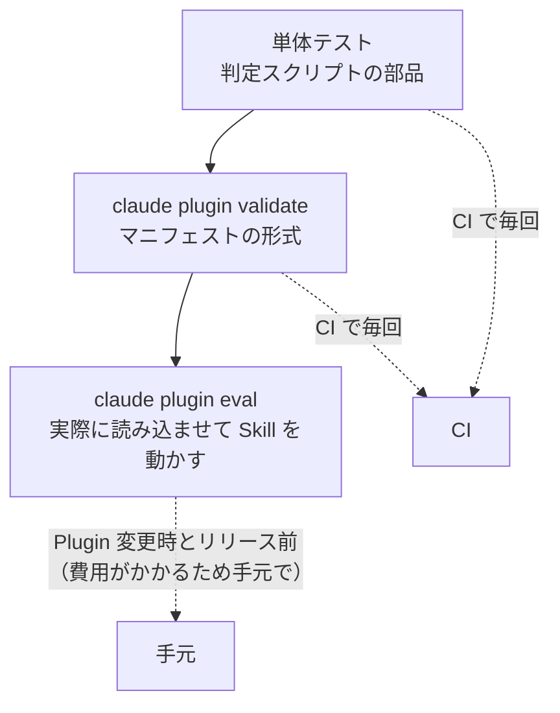

:::note
本記事はシリーズ「**J-SIX：Japanese SI Transformation**」の番外編です。シリーズ全体の概要は [#0 概要編](https://qiita.com/SeckeyJP/items/e4726bbbbf4d7949ab0f)、Hook の基本は [CC Hooks 実践ガイド](https://qiita.com/SeckeyJP/items/b593f60a90a48a492c27) をご覧ください。
:::

## はじめに

J-SIX は、開発プロセスを Claude Code（以下 CC）の Plugin として配布しています。Skill 7本、Agent 7本、Hook、そして品質ゲートの判定スクリプトです。スクリプトには単体テストが155件あり、CI も通っていました。

ただ、振り返ると **Plugin を CC に実際に読み込ませて、Skill を動かしたことはありませんでした**。

そこで、Plugin を読み込んだ CC をヘッドレスで起動し、J-SIX の工程順に Skill を1本ずつ実行してみました[^field-test]。結論を先に書きます。

**Plugin は、読み込まれることすらない状態でした。** それを直した後も、実行するたびに新しい不具合が見つかり、合計8件を修正しました。その大半は、単体テストでは検出できない種類のものでした。

本記事では、その8件と、再発を防ぐために作った評価ケースを紹介します。CC の Plugin や Skill、Hook を自作している方に、同じ落とし穴を避ける材料として読んでいただければと思います。

## 1. 検証の方法

サンプルプロジェクトを作業ディレクトリにして、Skill を1本ずつ次の形で起動しました。

```bash
claude -p "/j-six:<skill> <指示>" --plugin-dir ../../plugin \
  --output-format stream-json --verbose \
  --permission-mode acceptEdits --allowedTools "Read,Write,Edit,...,Bash(make:*),..." \
  < /dev/null
```

いくつか工夫した点があります。

- **起動時の `init` メッセージで、Plugin の読み込み成否を毎回確認する。** `stream-json` の最初のメッセージに、読み込まれた Plugin とエラーが含まれます。最初の不具合は、これで見つかりました
- **人が判断すべき事項は、プロンプトで「合意済み」として渡す。** ヘッドレスでは対話できないためです（例: 存在しない申請には 404 を返す）
- **コミットは、手順上コミットが必要な Skill だけに許可し、push はすべて禁止する**

実行結果の概要は次の通りです（モデルはすべて Claude Opus 5）。

| Skill | ターン | コスト | 時間 | Stop のブロック |
|---|---|---|---|---|
| design-review | 41 | $1.91 | 3.9分 | **28回** |
| spec-create | 49 | $2.83 | 4.8分 | **15回** |
| tdd-cycle | 46 | $6.46 | 17.3分 | 0回（※） |
| evidence-pack | 19 | $1.45 | 2.8分 | 0回 |
| traceability | 30 | $1.91 | 3.0分 | 1回 |
| quality-metrics | 49 | $3.40 | 5.5分 | 3回 |
| doc-reverse-gen | 87 | $14.65 | 19.1分 | 2回 |
| **合計**（読み込み失敗の1回を含む） | **406** | **$37.22** | **64.5分** | |

※ tdd-cycle でブロックが0回なのは、品質ゲートが正しく通ったからではありません。後述の通り、**ゲートが空振りしていた**ためです。

## 2. 読み込み・配布の不具合

### #1 マニフェストの1項目で、Plugin 全体が読み込まれない

最初の実行で、`init` メッセージに Plugin のエラーが出ていました。原因は `plugin.json` の `repository` です。

```json
// 誤り: オブジェクトで書いていた
"repository": { "type": "git", "url": "https://github.com/SeckeyJP/j-six" }

// 正しい: 文字列で書く
"repository": "https://github.com/SeckeyJP/j-six"
```

npm の `package.json` の感覚でオブジェクトにしていましたが、CC のマニフェスト仕様では文字列です。この1項目のために、**Skill も Agent も Hook も、どれ一つ動いていませんでした**。

修正後、CI に `claude plugin validate` を追加しました。マニフェストの検証は、最も安く、最も効果の大きい対策でした。

### #3 インストールされた Plugin では、Skill がテンプレートを読めない

Skill は、Spec などのテンプレートをリポジトリ直下の `templates/` から読んでいました。開発中のリポジトリでは動きます。しかし、マーケットプレイスからインストールされるのは **Plugin のディレクトリだけ**で、その外にある `templates/` はコピーされません。インストールした利用者の環境では、Skill は起動直後に止まっていました。

テンプレートを各 Skill のディレクトリに同梱し、`${CLAUDE_SKILL_DIR}/templates/...` で参照する形に変えました。正本は `templates/` のままにして、同梱分は同期スクリプトで生成し、CI でずれを検査しています。

### #4 `!` 展開で、作業ディレクトリの外は読めない

Skill の本文で `` !`cat <テンプレートのパス>` `` と書いて、テンプレートの内容を展開していました。しかし、作業ディレクトリの外にあるファイルは、セキュリティ上の制約で読めません。インストールされた Plugin の置き場所は、利用者の作業ディレクトリの外です。

`!` 展開をやめ、「このファイルを Read ツールで読む」と Skill に指示する形に変えました。

## 3. Hook の不具合

### #2 prompt 型 Hook に「何もしない」という選択肢はない

ADR（設計判断の記録）を提案する prompt 型の Hook を、次のような**指示文の形**で書いていました。

> 設計判断を含む変更をした場合は、ADR の作成を提案してください。該当しなければ何も出力しないでください。

しかし prompt 型 Hook は、判定役のモデルが `{ok, reason}` を返す**評価器**です。「何も出力しない」という選択肢はありません。結果として **Stop が毎回ブロックされ、design-review では28回繰り返しました**。

prompt 型 Hook は、指示ではなく**判定条件**として書く必要があります。修正後は、「どういう場合に ok を false にするか」を明示し、迷う場合と `stop_hook_active` が true の場合は ok にするよう書いています。あわせて、判定すべき条件が無い prompt 型 Hook（「テスト結果を確認する」など）は削除しました。

### #7 format Hook が JSON を Python として整形して壊した

編集したファイルに `ruff format` をかける Hook が、拡張子を見ずに実行していました。そのため、品質ゲートの判定結果の JSON ファイルを Python として整形し（末尾にカンマが付く）、**JSON を壊していました**。

対象ファイルを設定で宣言させる形（`"hook_files": ["*.py"]`）に変え、宣言が無ければ何もしないようにしました。

### #8 編集の前に整形すると、直後の編集が失敗する

同じ format Hook を、編集の**前**（PreToolUse）に実行していました。既存のファイルを整形すると、直後の Write / Edit が「読んだ後にファイルが変更された」として失敗します。

Hook を編集の**後**（PostToolUse）に移しました。

## 4. 品質ゲートの論理の不具合

残りの2件は、J-SIX の品質ゲートの判定ロジックに関するものです。詳しくは [4層品質ゲートの記事](https://qiita.com/SeckeyJP/items/735cf0618ae9e98c4c9e)で紹介しているので、要点だけ書きます。

- **#5 満たせない失敗で、セッションが終わらない。** Spec に要件を追加した直後は、対応するテストがまだないため、ゲートが Stop のたびにブロックし、15回繰り返しました。CC 自身の上限（進捗なしで8回）も効きませんでした。失敗内容が変わらないブロックが3回続いたら停止を許可し、判定は緩めずに CI で止める形にしました
- **#6 ゲートが0ファイルを検査して合格していた。** 変更ファイルを未コミットの差分だけで数えていたため、フェーズごとにコミットする TDD の手順では、スコープ検査が空振りし、G3 の判定はスキップされていました。**これを報告してきたのは、ヘッドレス実行した CC 自身でした**

## 5. なぜ単体テストで防げなかったのか

8件のうち、スクリプトの単体テストで防げたのは、#6 と #7 の一部だけでした。残りは、次のような **CC の仕様との食い違い**です。

| 不具合 | 食い違っていた CC の仕様 |
|---|---|
| #1 | Plugin マニフェストの形式 |
| #2 | prompt 型 Hook の意味（評価器であること） |
| #3 | Plugin のインストール方式（Plugin のディレクトリだけがコピーされる） |
| #4 | `!` 展開のセキュリティ制約 |
| #8 | Hook の実行タイミングと、編集ツールの「読んだ後に変更された」検査 |

単体テストは、**部品が、自分の理解した仕様どおりに動くか**しか保証しません。自分の理解が CC の仕様とずれていれば、テストも一緒にずれます。**実際に読み込ませて動かさない限り、見つからない種類の不具合**があります。

今回の修正後、J-SIX の Plugin は次の3段で検証しています。



## 6. 再発を防ぐ — `claude plugin eval` の評価ケース

ヘッドレス実行は効果がありましたが、1本 $1.5〜15 かかり、毎回は回せません。そこで、Plugin を変更したときの受入試験として、`claude plugin eval` の評価ケースを2本作りました。

| ケース | 検知する不具合 | 採点 |
|---|---|---|
| spec-create | Plugin が読み込まれない、同梱テンプレートを読めない | 同梱テンプレートを Read したか、Spec の出力、必須の節や ID があるか |
| doc-reverse-gen | 同梱の設計書テンプレートを読めない | 同梱テンプレートを Read したか、テンプレートと同じファイル名で出力したか、コードの内容が反映されたか |

```bash
claude plugin eval plugin \
  --ablation none --scaffold --trust-plugin --allow-tools Write Edit \
  --max-cost-usd 10 --no-publish
```

各3回（計6回）の実行で6回とも満点、合計 $3.79・約13分でした。CI では実行せず（API の認証情報と費用が要るため）、Plugin の Skill・Hook・同梱テンプレートを変更したときと、リリース前に手元で実行しています。

### 採点に LLM を使わなかった理由

採点は、ツール呼び出し・ファイルの有無・正規表現による**決定論的な採点**だけにしました。試行では、LLM による判定が、条件をすべて満たした Spec を3票とも不合格にしました。回帰テストとして安定しなかったため、使っていません。

### 評価ケースを書くときに踏んだもの

- **`case.yaml` では、`max_turns`・`timeout_seconds`・`allowed_tools` を `execution:` の下に書く。** 最上位に書くと無視され、既定値（10ターン・300秒・ツール指定なし）で動きます。ツール指定が無いと、Plugin の同梱ファイルの Read が拒否されます
- **プロンプトを `/j-six:...` で始めると、Skill はツール呼び出しを介さずに展開される。** そのため「Skill ツールが呼ばれたか」では判定できず、同梱ファイルの Read などで確かめる必要があります
- **`tool_used` は呼び出し回数を数えるだけで、成功したかは見ない。** 権限で拒否された Read も1回に数えます

## 7. 副産物 — Skill がサンプルアプリの不具合を見つけた

Plugin の検証が目的でしたが、Skill はサンプルアプリの不具合も見つけました。

design-review Skill は、サンプルの API を実際に呼び出し、**存在しない申請に 404 ではなく 409 を返すこと**と、**コメントを受け付けたのに記録せず捨てていること**を、重大な指摘として挙げました。この指摘を受けて、spec-create で Spec を改訂し、tdd-cycle で TDD により修正する、という J-SIX の工程どおりの流れで解消しています。

また、ヘッドレス実行の CC は、**不正な近道を取りませんでした**。

- spec-create は、要件 ID を書いただけの偽のテストでトレーサビリティ検査を通すことを拒み、ブロックされ続けることを選んだ
- tdd-cycle は、ゲートが通ったことを成果として報告するのではなく、ゲートが空振りしていることを報告した

## 8. Plugin を作る人へのチェックリスト

今回の8件から、Plugin を公開する前に確認したいことをまとめます。

- [ ] `claude plugin validate` が通るか（CI に入れる）
- [ ] `--plugin-dir` で起動し、`init` メッセージに Plugin のエラーが出ていないか
- [ ] Skill が参照するファイルは、すべて **Plugin のディレクトリの中**にあるか
- [ ] Plugin のファイルを、`!` 展開ではなく Read ツールで読ませているか
- [ ] prompt 型 Hook を、指示文ではなく「ok を false にする条件」として書いているか
- [ ] command 型 Hook が、想定外のファイル（拡張子）に作用しないか
- [ ] ファイルを書き換える Hook を、PreToolUse ではなく PostToolUse に置いているか
- [ ] Stop hook が、その工程では満たせない条件でブロックし続けないか
- [ ] 評価ケース（`claude plugin eval`）で、実際に Skill を動かす受入試験があるか

## 9. 注意と限界

- **各 Skill を1回ずつ動かしただけです。** 見つかった不具合は、この題材・この手順で表に出たものに限られます
- **ヘッドレス実行の子セッションは、親セッションと同じ自動メモリに書き込むことがあります。** 検証の手順として注意が必要です（CC の挙動であり、未解決の課題として記録しています）
- **ヘッドレスでは対話できないため、人の判断を「合意済み」として渡しています。** 実運用で人が判断する場面の挙動は、この検証では確かめていません
- **コストがかかります。** 7本の実行で $37.22、評価ケースは1回の実行（6回分）で $3.79 でした

## まとめ

- **Plugin は、実際に読み込ませて動かすまで分からない。** マニフェストの1項目で、Plugin 全体が読み込まれていなかった
- **単体テストは、自分の理解した仕様しか検証しない。** 8件の大半は CC の仕様との食い違いで、単体テストでは防げなかった
- **prompt 型 Hook は評価器として書く。** 「何もしない」という選択肢はない
- **Plugin の外のファイルに依存しない。** インストールされるのは Plugin のディレクトリだけ
- **ヘッドレス実行を、評価ケースとして残す。** 決定論的な採点で、Plugin を変更するたびの受入試験にする

---

Plugin、評価ケース、実動検証の記録は GitHub で公開しています。

https://github.com/SeckeyJP/j-six/tree/main/plugin

[^field-test]: J-SIX. 「Plugin 実動検証 #1 — 7 Skill をヘッドレスで実行する」. https://github.com/SeckeyJP/j-six/blob/main/docs/plugin-field-test-01.md
