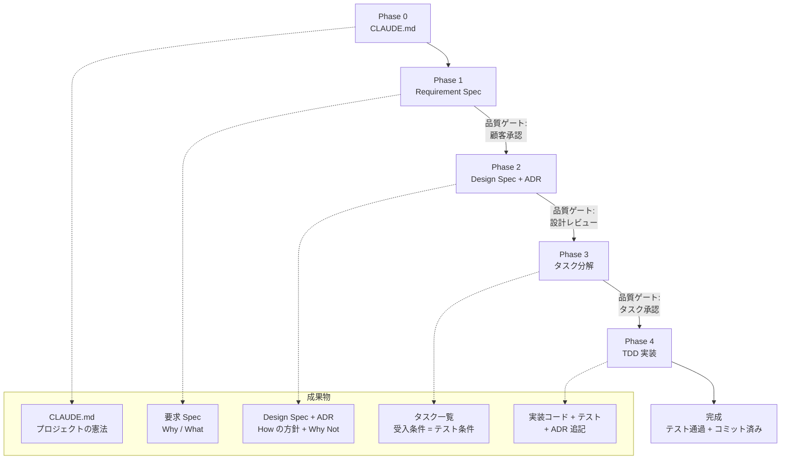
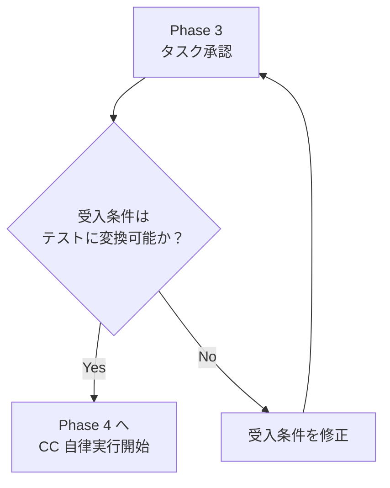
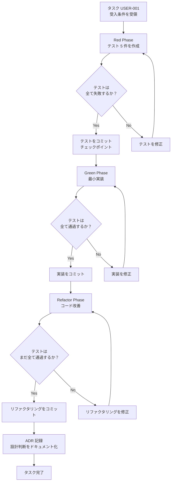

:::note
本記事はシリーズ「**J-SIX：Japanese SI Transformation**」の番外編です。[#0 概要編](https://zenn.dev/seckeyjp/articles/j-six-00-overview)で全体像を把握し、[#1 SDD](https://zenn.dev/seckeyjp/articles/j-six-01-sdd)で背景を理解した上でお読みください。
:::

## はじめに

[#1 の記事](https://zenn.dev/seckeyjp/articles/j-six-01-sdd)では「なぜ V 字モデルの前提が崩壊し、Spec-Driven Development（SDD）が台頭しているか」を解説した。理屈はわかったが、実際に手を動かすとなると「で、何から始めればいいの？」という疑問が残る。

本記事はその続編として、**EC サイトのユーザー登録 API** を題材に、SDD の全工程をハンズオン形式で一気通貫で体験する。Phase 0（CLAUDE.md）→ Phase 1（Spec）→ Phase 2（設計）→ Phase 3（タスク分解）→ Phase 4（TDD 実装）。各 Phase で Claude Code（以下 CC）に渡すプロンプトと、CC が返す出力例を具体的に示すので、手元で再現しながら読み進めてほしい。

---

## 1. 題材とゴール

### 作るもの

EC サイトの**ユーザー登録 API**。シンプルだが、バリデーション、重複チェック、パスワードハッシュ化など SDD の各 Phase を体験するのに十分な複雑さがある。

- **技術スタック**: TypeScript + Express + PostgreSQL + Jest
- **エンドポイント**: `POST /api/v1/users`

### V 字モデルなら

要件定義書 → 基本設計書 → 詳細設計書 → 実装 → 単体テスト → 結合テスト。工程ごとに設計書を書き、レビュー会議を通し、実装は最後にまとめて行う。

### SDD なら

Spec → Design Spec + ADR → タスク分解 → TDD 実装。設計意図だけを記録し、CC が TDD で自律的に実装する。

### SDD の Phase フローと成果物



それでは、Phase 0 から順に進めよう。

---

## 2. Phase 0: CLAUDE.md を書く

CLAUDE.md はプロジェクトの「憲法」だ。CC の全セッションがこの文書を読み込み、ここに書かれたルールに従って動作する。Anthropic 社内の調査でも「CLAUDE.md の充実度と CC の出力品質は直接相関する」と報告されている[^anthropic-teams]。

### CC への指示

```
/init を実行して CLAUDE.md の雛形を生成してください。
EC サイトのバックエンド API プロジェクトです。
技術スタック: TypeScript + Express + PostgreSQL + Jest
```

### 最小限の CLAUDE.md（例）

```markdown
# EC サイト バックエンド API

## プロジェクト概要
EC サイトのバックエンド REST API。ユーザー管理・商品管理・注文管理を提供する。

## 技術スタック
- 言語: TypeScript (strict mode)
- フレームワーク: Express.js
- DB: PostgreSQL 16 + node-postgres
- テスト: Jest + supertest
- リンター: ESLint + Prettier

## コーディング規約
- 命名規則: camelCase（変数・関数）、PascalCase（型・クラス）
- ディレクトリ構成: feature-based（src/features/{feature}/ 配下に controller, service, repository, __tests__）
- エラーレスポンス: { error: { code: string, message: string } }
- 日本語コメント可。ただし API レスポンスは英語キー

## TDD ルール（必須）
1. 実装前にテストを書く（Red Phase）
2. テスト失敗を確認してからコミットする
3. テストが通る最小の実装を書く（Green Phase）
4. テスト通過を確認してからコミットする
5. 必要に応じてリファクタリングする（Refactor Phase）
6. テストを改変して通す行為は禁止

## ADR ルール
- 技術選定、ライブラリ選択、設計パターンの採用時は ADR を作成
- テンプレート: docs/adr/template.md
- 連番管理: ADR-NNNN

## 禁止事項
- any 型の使用禁止（unknown + 型ガードを使うこと）
- console.log による本番ログ出力禁止（logger を使うこと）
- テストなしのコミット禁止
```

CLAUDE.md は最初から完璧である必要はない。プロジェクトが進む中で CC と一緒に育てていけばよい。詳しくは [#4 CLAUDE.md 編](https://zenn.dev/seckeyjp/articles/j-six-04-claude-md)を参照。

---

## 3. Phase 1: Requirement Spec を CC と作る

Phase 1 のゴールは「何を作るか」の合意だ。CC のインタビューモードを活用すると、人間が見落としがちな曖昧性を検出できる。

### CC への指示

```
EC サイトのユーザー登録機能の要求 Spec を作成してください。
テンプレートは docs/specs/requirement-spec.md にあります。

まず私にインタビューして、曖昧な点を洗い出してから
Spec のドラフトを書いてください。
```

### CC が質問する例

CC は `ask_user_question` を使って、曖昧性を一つずつ潰していく。

```
CC: 要求 Spec の作成にあたり、いくつか確認させてください。

  1. ユーザー登録時に必要な情報は何ですか？
     （例: メールアドレス、パスワード、氏名、電話番号、住所...）

  2. メールアドレスの確認（認証メール送信）は必要ですか？

  3. ソーシャルログイン（Google, Apple等）への対応は
     スコープ内ですか？

  4. パスワードポリシーの要件はありますか？
     （最小文字数、英数字混在の要否、記号の要否等）

  5. 個人情報保護法への対応として、
     利用規約・プライバシーポリシーへの同意取得は必要ですか？
```

ここで重要なのは、CC が**スコープ外の可能性があるもの**を明示的に聞いてくることだ。「ソーシャルログインは？」「メール認証は？」といった質問により、後工程で「これも必要だった」という手戻りを防げる。

### 完成する Spec の主要セクション

CC のインタビューを経て、以下のような Spec が生成される。

```markdown
# 要求 Spec — EC サイト ユーザー登録

## 1. 業務背景
EC サイトの新規ユーザー獲得のため、メールアドレスによる
ユーザー登録機能を提供する。

## 2. スコープ
### 2.1 対象
- メールアドレス + パスワードによるユーザー登録
- 入力バリデーション（メール形式、パスワード強度）
- メールアドレス重複チェック

### 2.2 対象外（明示）
- ソーシャルログイン（後続フェーズで対応）
- メールアドレス確認フロー（後続タスクで対応）
- パスワードリセット機能

## 3. 業務要件
### ユースケース
| # | ユースケース | アクター | 優先度 |
|---|---|---|---|
| UC-001 | 新規ユーザー登録 | 未登録ユーザー | 高 |

### 業務ルール
| # | ルール |
|---|---|
| BR-001 | メールアドレスはシステム全体で一意 |
| BR-002 | パスワードは 8 文字以上 |

### 非機能要件
| カテゴリ | 要件 | 目標値 |
|---|---|---|
| 性能 | API レスポンスタイム | 200ms 以内 |
| セキュリティ | パスワード保存 | ハッシュ化必須 |

## 4. 制約条件
- 既存の PostgreSQL インスタンスを使用
- REST API として提供（GraphQL は対象外）
```

**「対象外」を明示する**ことが SDD の Spec で最も重要なポイントだ。CC は Spec に書かれていないことを勝手に実装しない。逆に言えば、書かなかったことは作られない。

### Phase Gate: 顧客承認

この Spec をステークホルダーと合意する。V 字モデルの「要件定義書」に相当するが、分量は圧倒的に少ない。必要なのは「Why（なぜ作るか）」と「What（何を作るか）」だけだ。

---

## 4. Phase 2: Design Spec + ADR

Phase 2 のゴールは「どう作るかの方針」を決めることだ。ここで重要な原則がある。

> **Design Spec は「意図的に不完全」である。**

V 字モデルの基本設計書は、全テーブル定義・全 API の詳細を網羅しようとする。SDD の Design Spec は、アーキテクチャ方針と技術選定理由だけを記録する。詳細はコードが Source of Truth であり、必要なら Phase 6 でコードから逆生成する[^cgi-sdd]。

### CC への指示

```
要求 Spec（docs/specs/requirement-spec.md）に基づいて、
Design Spec と必要な ADR を作成してください。

Design Spec のテンプレートは docs/specs/design-spec.md、
ADR のテンプレートは docs/adr/template.md にあります。

詳細設計は不要です。アーキテクチャ方針と主要な技術判断のみ記録してください。
```

### CC が生成する Design Spec（抜粋）

```markdown
# Design Spec — EC サイト ユーザー登録

## 1. アーキテクチャ概要
### アーキテクチャスタイル
モジュラーモノリス（feature-based ディレクトリ構成）

### 技術スタック
| レイヤー | 技術 | 選定理由 |
|---|---|---|
| バックエンド | Express.js | CLAUDE.md で指定 |
| DB | PostgreSQL 16 | CLAUDE.md で指定 |
| パスワードハッシュ | bcrypt | ADR-0005 参照 |

## 2. DB 設計
### 主要テーブル
| テーブル名 | 概要 | 主要カラム |
|---|---|---|
| users | ユーザー情報 | id, email, password_hash, name, created_at |

> 詳細な DDL はコードから自動生成する（Phase 6）。

## 3. API 設計
| メソッド | パス | 概要 | 認証 |
|---|---|---|---|
| POST | /api/v1/users | ユーザー新規登録 | 不要 |

### エラーレスポンス
CLAUDE.md の共通フォーマットに準拠。
```

### ADR の発生例: bcrypt 採用

CC が技術選定を行うと、自動的に ADR ドラフトを生成する。

```markdown
# ADR-0005: パスワードハッシュに bcrypt を採用

## ステータス
承認

## コンテキスト
ユーザー登録 API でパスワードをハッシュ化して保存する必要がある。

## 判断
bcrypt を使用する。

## 検討した代替案
| 代替案 | メリット | デメリット | 却下理由 |
|---|---|---|---|
| argon2 | メモリハード関数で最も安全 | ネイティブバイナリ依存、CI環境での問題報告あり | 運用実績が bcrypt に劣る |
| scrypt | Node.js 標準ライブラリに含まれる | パラメータチューニングが複雑 | bcrypt の方がシンプルで十分な安全性 |

## 影響
### ポジティブ
- 広く検証された実装で安全性が高い
- npm bcrypt パッケージの成熟度が高い

### ネガティブ（トレードオフ）
- argon2 に比べると理論上の耐性は劣る
- 将来的な移行が必要になる可能性
```

ADR で重要なのは**「却下した代替案」を記録する**ことだ。半年後に「なぜ argon2 にしなかったのか」と聞かれたとき、ADR を見れば判断の経緯がわかる。

### Phase Gate: 設計レビュー

Design Spec と ADR をレビューする。V 字モデルの「基本設計レビュー会議」に相当するが、レビュー対象は方針と判断理由だけなので、議論が本質に集中しやすい。

---

## 5. Phase 3: タスク分解

Phase 3 のゴールは、CC が自律実行できる単位にタスクを分解し、各タスクに**受入条件**を定義することだ。

SDD の核心はここにある。**受入条件 = テスト条件**。Phase 4 で CC が書くテストは、この受入条件から直接導出される[^agentfactory-sdd]。

### CC への指示

```
Design Spec に基づいて、ユーザー登録機能のタスクを分解してください。
各タスクには以下を定義してください:
- タスク ID
- タスク名
- 受入条件（= テストで検証する条件）
- 依存関係
```

### CC が生成するタスク例

```
タスク: USER-001 ユーザー登録API
受入条件:
  - POST /api/v1/users でユーザーを新規登録できる
  - email の重複チェックを行い、重複時は 409 を返す
  - パスワードは bcrypt でハッシュ化して保存
  - 成功時は 201 + ユーザー情報（パスワード除く）を返す
  - バリデーション: email 形式、パスワード 8 文字以上
依存: なし（並列実行可能）
```

受入条件を見れば、Phase 4 でどんなテストを書くべきかが明白だ。「email の重複チェックを行い、重複時は 409 を返す」→ 重複 email で POST して 409 が返ることを検証するテスト、という具合に。

### Phase Gate: タスク承認 — 自律実行圏への最後のゲート

ここが**人間が CC の手綱を握る最後のポイント**だ。タスク承認後、CC は受入条件に基づいて TDD で自律的に実装を進める。タスクの粒度と受入条件の精度が、Phase 4 の品質を決定する。



---

## 6. Phase 4: TDD 実装 — 1 サイクルを体験する

いよいよ本丸だ。Phase 3 で承認したタスク USER-001 を、CC に TDD で実装させる。

### CC への指示

```
USER-001「ユーザー登録API」をTDDで実装してください。
受入条件は以下の通りです。

受入条件:
  - POST /api/v1/users でユーザーを新規登録できる
  - email の重複チェックを行い、重複時は 409 を返す
  - パスワードは bcrypt でハッシュ化して保存
  - 成功時は 201 + ユーザー情報（パスワード除く）を返す
  - バリデーション: email 形式、パスワード 8 文字以上

TDDの手順:
  1. まずテストを書いてください（Red Phase）
  2. テストが失敗することを確認してコミットしてください
  3. テストが通る最小の実装を書いてください（Green Phase）
  4. テストが通ることを確認してコミットしてください
  5. 必要ならリファクタリングしてください（Refactor Phase）
```

CLAUDE.md に TDD ルールを書いておけば、毎回この手順を指示する必要はない[^anthropic-bp]。

### Step 1: Red Phase — テスト作成

CC が受入条件からテストコードを生成する。この時点では実装が存在しないため、テストは必ず失敗する。

```typescript
// src/features/users/__tests__/register-user.test.ts

describe('POST /api/v1/users', () => {
  describe('正常系', () => {
    it('有効な入力でユーザーを登録し201を返す', async () => {
      const res = await request(app)
        .post('/api/v1/users')
        .send({
          email: 'test@example.com',
          password: 'password123',
          name: 'テスト太郎',
        });

      expect(res.status).toBe(201);
      expect(res.body).toHaveProperty('id');
      expect(res.body.email).toBe('test@example.com');
      expect(res.body).not.toHaveProperty('password');
    });
  });

  describe('バリデーション', () => {
    it('不正なemail形式で400を返す', async () => {
      const res = await request(app)
        .post('/api/v1/users')
        .send({ email: 'invalid', password: 'password123', name: '太郎' });

      expect(res.status).toBe(400);
    });

    it('8文字未満のパスワードで400を返す', async () => {
      const res = await request(app)
        .post('/api/v1/users')
        .send({ email: 'test@example.com', password: 'short', name: '太郎' });

      expect(res.status).toBe(400);
    });
  });

  describe('重複チェック', () => {
    it('既存emailで409を返す', async () => {
      // 1人目を登録
      await request(app)
        .post('/api/v1/users')
        .send({ email: 'dup@example.com', password: 'password123', name: '太郎' });

      // 同じemailで2人目を登録
      const res = await request(app)
        .post('/api/v1/users')
        .send({ email: 'dup@example.com', password: 'password456', name: '次郎' });

      expect(res.status).toBe(409);
    });
  });

  describe('セキュリティ', () => {
    it('パスワードがハッシュ化されてDBに保存される', async () => {
      await request(app)
        .post('/api/v1/users')
        .send({ email: 'hash@example.com', password: 'password123', name: '太郎' });

      const user = await db.query(
        'SELECT password_hash FROM users WHERE email = $1',
        ['hash@example.com']
      );
      expect(user.rows[0].password_hash).not.toBe('password123');
    });
  });
});
```

受入条件の 5 項目が、そのまま 5 つのテストケースに対応していることに注目してほしい。

CC がテストを実行し、失敗を確認してコミットする。

```
CC: テストを作成しました。実行して失敗を確認します。

$ npm test -- --testPathPattern=register-user

  FAIL  src/features/users/__tests__/register-user.test.ts
  ● POST /api/v1/users › 正常系 › 有効な入力でユーザーを登録し201を返す
    Cannot find module '../register-user.controller'

  Tests: 5 failed, 0 passed

テストが期待通り失敗しました。コミットします。

$ git add -A
$ git commit -m "test(users): ユーザー登録APIのテストを追加（Red Phase）"
```

**ここが TDD のチェックポイントだ。** テストをコミットしてから実装に進むことで、CC が実装中にテストを改変した場合に `git diff` で検出できる[^alexop-tdd]。

### Step 2: Green Phase — 最小実装

CC が 5 つのテストを通す最小の実装を行う。

```
CC: テストを通す最小の実装を行います。

[CC がコントローラ、サービス、バリデーション等を生成]

テストを実行します。

$ npm test -- --testPathPattern=register-user

  PASS  src/features/users/__tests__/register-user.test.ts
  ✓ 有効な入力でユーザーを登録し201を返す (45ms)
  ✓ 不正なemail形式で400を返す (12ms)
  ✓ 8文字未満のパスワードで400を返す (8ms)
  ✓ 既存emailで409を返す (67ms)
  ✓ パスワードがハッシュ化されてDBに保存される (34ms)

  Tests: 5 passed

全テスト通過。コミットします。

$ git add -A
$ git commit -m "feat(users): ユーザー登録APIを実装（Green Phase）"
```

### Step 3: Refactor Phase — リファクタリング

テストが通った状態で、CC がコードの改善を行う。テストがセーフティネットとして機能するため、リファクタリングで機能が壊れればすぐにわかる。

```
CC: リファクタリングの余地を確認します。

  - バリデーションロジックを共通ミドルウェアに抽出
  - エラーレスポンスのフォーマットを統一ヘルパーに移行

テストを再実行して、リファクタリングが機能を壊していないことを確認します。

$ npm test -- --testPathPattern=register-user

  Tests: 5 passed

コミットします。

$ git add -A
$ git commit -m "refactor(users): バリデーションを共通ミドルウェアに抽出"
```

### ADR 自動記録

実装の過程で CC が設計判断を検出し、ADR ドラフトを自動提案する。

```
CC: パスワードのハッシュ化に bcrypt を使用する設計判断を行いました。
    ADR を作成します。

[docs/adr/0005-password-hashing-bcrypt.md を自動生成]

  # ADR-0005: パスワードハッシュに bcrypt を採用
  ## 判断: bcrypt を使用
  ## 検討した代替案:
  | argon2  | より新しい       | ライブラリ成熟度 | チーム経験不足     |
  | scrypt  | Node.js 標準     | チューニング複雑 | bcrypt の方がシンプル |

確認をお願いします。問題なければ承認してください。
```

人間は ADR の内容を確認し、必要に応じて修正するだけだ。ADR をゼロから書く手間がなくなる。

### エスカレーション例 — Spec にない要件を発見

CC は Spec に記載のない要件を勝手に実装しない。判断が必要な場面では人間にエスカレーションする。

```
CC: 実装中に確認事項があります。

  受入条件にはメールアドレスの確認（メール送信）について
  記載がありませんが、一般的なユーザー登録フローでは
  メールアドレスの確認ステップが必要です。

  以下のいずれかを選択してください:
  1. メール確認なしで登録完了（現在の受入条件通り）
  2. メール確認フローを追加（Spec の更新が必要）
  3. この判断を保留し、後続タスクで対応

  どちらにしますか？
```

Phase 1 で「メールアドレス確認フロー」を明示的にスコープ外にしていたので、ここでは「1. 現在の受入条件通り」を選択できる。**スコープ外を明示しておくことの効果が、ここで発揮される。**

もう一つの典型的なエスカレーション例として、テストが繰り返し失敗するケースがある。

```
CC: ⚠️ エスカレーション: テストが3回連続で失敗しました。

  失敗しているテスト: 既存emailで409を返す

  試行1: unique constraint の catch が不完全
  試行2: PostgreSQL のエラーコード判定を修正 → 別のテストが壊れた
  試行3: トランザクション分離レベルの問題の可能性

  根本的な設計判断が必要かもしれません。
  DB の unique constraint vs アプリ層でのチェックについて
  方針を確認してください。
```

CC は「速いが雑な新人開発者」に類似する特性を持つ。3 回連続で失敗するのは、タスクの粒度が大きすぎるか、設計上の問題がある兆候だ。このエスカレーション条件は CLAUDE.md で定義しておくことを推奨する。

### TDD 1 サイクルのまとめ



---

## 7. 振り返り — V 字モデルとの比較

ユーザー登録 API 1 本を Phase 0 から Phase 4 まで通して体験した。V 字モデルと SDD で、各工程がどう対応するかを整理しよう。

| V 字モデル | SDD（J-SIX） | 変わったこと |
|---|---|---|
| 開発標準・コーディング規約 | Phase 0: CLAUDE.md | CC が読める形式で一元管理 |
| 要件定義書（数十ページ） | Phase 1: Requirement Spec | Why/What に集中。分量は 1/5 以下 |
| 基本設計書（全テーブル・全 API） | Phase 2: Design Spec + ADR | 方針と判断理由のみ。詳細は書かない |
| 詳細設計書 + WBS | Phase 3: タスク分解 | 受入条件 = テスト条件で曖昧さゼロ |
| 実装 → 単体テスト | Phase 4: TDD 実装 | テストが先。CC が自律実行 |
| 結合テスト・総合テスト | Phase 5: 品質検証 | 自動テスト + 人間サンプリング |
| 各工程で設計書作成 | Phase 6: ドキュメント逆生成 | コードから自動生成。乖離ゼロ |

### 「設計書がなくなる」のではない

誤解されがちだが、SDD は設計書を廃止するわけではない。**設計書の作り方が変わる**のだ。

- **従来**: 実装前に詳細な設計書を書く → 実装中に乖離が発生 → 保守フェーズで設計書が信用されなくなる
- **SDD**: 設計意図（Spec + ADR）だけ先に書く → CC が TDD で実装 → コードから設計書を逆生成 → 設計書とコードは原理的に一致

### Agent Teams で並列実行

タスクに依存関係がなければ、複数の CC セッションで並列に TDD を回せる。Agent Teams と git worktree を組み合わせることで、USER-001（登録）、USER-002（検索）、USER-003（更新）を同時に進行できる[^anthropic-teams]。詳しくは [Agent Teams 編](https://zenn.dev/seckeyjp/articles/j-six-agent-teams)を参照。

---

## まとめ

本記事では、EC サイトのユーザー登録 API を題材に、SDD の Phase 0 から Phase 4 を一気通貫で体験した。

1. **Phase 0**: CLAUDE.md でプロジェクトの憲法を定義する
2. **Phase 1**: CC のインタビューで曖昧性を潰し、Spec を作る
3. **Phase 2**: 設計意図と技術判断だけを Design Spec + ADR に記録する
4. **Phase 3**: 受入条件 = テスト条件としてタスクを分解する
5. **Phase 4**: CC が TDD で自律的に Red → Green → Refactor を回す

各 Phase で使ったテンプレート（Requirement Spec、Design Spec、ADR）は GitHub で公開している。手元で試す際の出発点にしてほしい。

https://github.com/SeckeyJP/j-six

TDD との組み合わせについてさらに詳しく知りたい方は [#3 TDD × CC 編](https://zenn.dev/seckeyjp/articles/j-six-03-tdd-cc)を、TDD 導入時のよくある失敗パターンについては [TDD アンチパターン編](https://zenn.dev/seckeyjp/articles/j-six-tdd-antipatterns)を参照してほしい。

---

[^anthropic-teams]: Anthropic. "How Anthropic teams use Claude Code" (2025.07). https://claude.com/blog/how-anthropic-teams-use-claude-code
[^anthropic-bp]: Anthropic. "Best Practices for Claude Code". https://code.claude.com/docs/en/best-practices
[^alexop-tdd]: alexop.dev. "Forcing Claude Code to TDD" (2025.11). https://alexop.dev/posts/custom-tdd-workflow-claude-code-vue/
[^cgi-sdd]: CGI. "Spec-driven development" (2026.03). https://www.cgi.com/en/blog/artificial-intelligence/spec-driven-development
[^agentfactory-sdd]: Panaversity. "Chapter 16: SDD with Claude Code". https://agentfactory.panaversity.org/docs/General-Agents-Foundations/spec-driven-development
