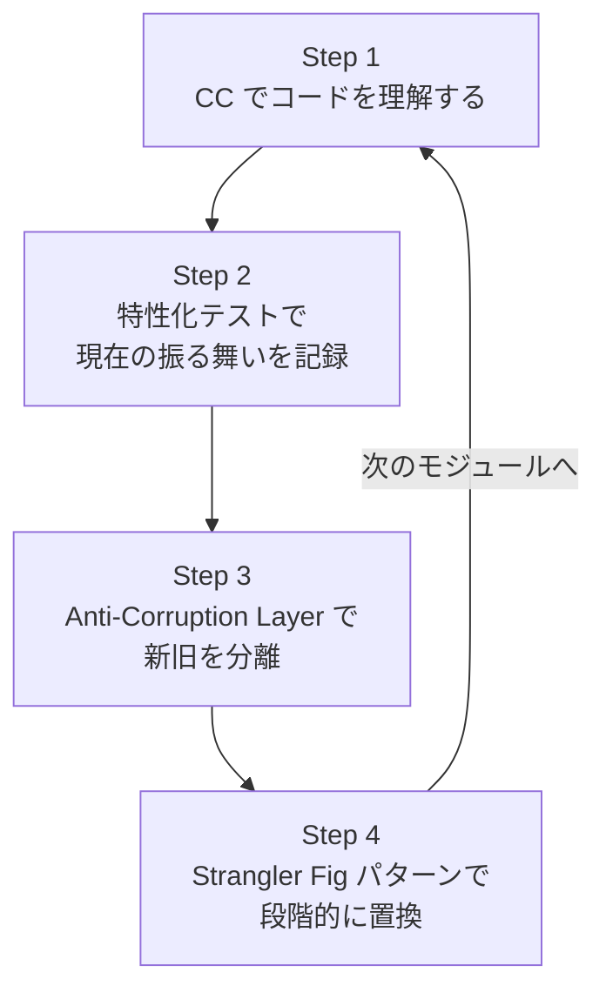
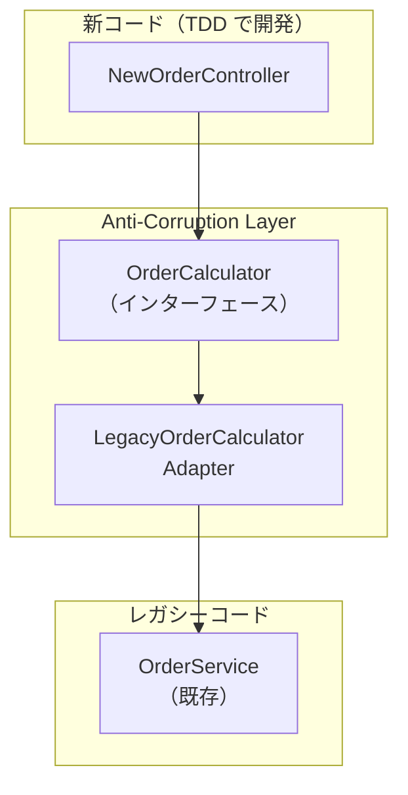
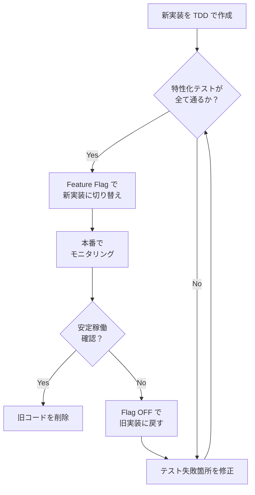

:::note
本記事はシリーズ「**J-SIX：Japanese SI Transformation**」の番外編です。シリーズ全体の概要は [#0 概要編](https://qiita.com/SeckeyJP/items/e4726bbbbf4d7949ab0f)、既存プロジェクトからの移行戦略は [#5 段階的移行](https://qiita.com/SeckeyJP/items/8fe3905cf5a3520cfd8a) をご覧ください。
:::

## はじめに — 「うちは既存コードだらけなんだけど」

J-SIX シリーズでは、新規開発を前提に SDD（Spec-Driven Development）+ TDD のプロセスを解説してきました。しかし現実には、多くの開発現場で主な業務は **レガシーコードの保守・改修** です。

テストのないコードベース。ドキュメントのない設計。誰も触りたくない God Class。「動いているから触るな」という暗黙のルール。

こうした環境で「Claude Code（以下 CC）を導入したい」と思っても、どこから手をつければいいか分からない。本記事では、CC を使ってレガシーコードを安全に改修する **4ステップ戦略** を解説します。

## 1. レガシーコードの現実

Michael Feathers は著書で、レガシーコードを「テストのないコード」と定義しました[^feathers]。この定義に従えば、日本の SI 案件の多くはレガシーコードを抱えています。

| 課題 | CC 活用への影響 |
|---|---|
| テストがない or 少ない | TDD サイクルの起点がない |
| コードが密結合 | テスト可能な単位に分離できない |
| 設計書とコードが乖離 | Spec の作成が困難 |
| 暗黙のビジネスルール | コードを読んでも仕様が分からない |
| コードベースが巨大 | CC のコンテキストウィンドウに収まらない |

「レガシーコードだから CC は使えない」と思いがちですが、実はその逆です。CC はレガシーコードの読解・テスト生成・段階的改修で大きな力を発揮します。ただし、アプローチを変える必要があります。

基本方針は Martin Fowler の **Strangler Fig パターン**[^fowler-strangler]と、Michael Feathers の **特性化テスト**[^feathers]の考え方を組み合わせたものです。レガシーコードを一気に書き換えるのではなく、安全な「島」を少しずつ作り、拡大していきます。

## 2. 「島を作る」戦略 — 4ステップ

レガシーコードベース全体を一度に改修するのは非現実的です。代わりに、レガシーの海の中に **テストで守られた島** を作り、島を徐々に拡大していきます。



### Step 1: CC にコードを読ませて理解する

CC の強みの一つは、大量のコードを短時間で読解できることです。Anthropic 社内でも、Data Infrastructure チームが CC を使って不慣れなコードベースを探索・理解している事例が報告されています[^anthropic-teams]。人間が数日かけて読む既存コードを、CC が数時間で構造化されたレポートにまとめてくれます。

**CC への指示例:**

```
src/legacy/ ディレクトリのコードを読み、以下を報告してください:
1. 主要なクラスとその責務
2. 依存関係の構造（何が何に依存しているか）
3. テストの有無と網羅状況
4. 最もリスクの高い（変更頻度 × 複雑度）モジュール
5. 暗黙のビジネスルール（コードから読み取れる業務ロジック）
```

CC は分析結果をレポートとして出力します。このレポートを基に **CLAUDE.md にコードマップセクションを追記** してください。

**CLAUDE.md への追記例:**

```markdown
## コードマップ

### 主要モジュール
- `src/services/OrderService.java` — 注文処理の中核。God Class 化しており 2,000行超
- `src/services/InventoryService.java` — 在庫管理。OrderService と密結合
- `src/dao/OrderDao.java` — 注文データの永続化。SQL が直書き

### 依存関係
OrderService → InventoryService → OrderDao → DB
OrderService → PricingUtils（静的メソッド群）
OrderService → 外部API（税率取得、非同期）

### テスト状況
- UT: OrderServiceTest.java のみ存在（カバレッジ推定 15%）
- IT/ST: なし

### 改修リスクマップ
- 高: OrderService.calculateTotal()（複雑度高、変更頻度高）
- 中: InventoryService.reserve()（外部依存あり）
- 低: OrderDao（CRUD のみ）
```

CLAUDE.md にコードマップがあると、CC は新しいセッションでもコードを読み直さずに全体像を把握できます。Anthropic の公式ベストプラクティスでも、CLAUDE.md の充実度と CC の出力品質には強い相関があると報告されています[^anthropic-bp]。

もう一つ有効なのが **ADR（Architecture Decision Record）の遡及作成** です。レガシーコードには「なぜこうなっているのか」が記録されていないことが多い。CC にコードの設計意図を推測させ、ADR として記録しておくと、後の改修で判断を誤るリスクが減ります。

**ADR 遡及作成の指示例:**

```
OrderService.calculateTotal() 内の割引計算ロジックについて:
1. なぜ端数を切り捨てているのか（四捨五入ではなく）
2. なぜ税計算が割引適用後に行われているのか
コードから設計意図を推測し、ADR として記録してください。
推測が確実でない場合は「要確認」と明記してください。
```

CC が推測した ADR は、当時の関係者やドメインエキスパートに確認を取ってから確定します。推測の精度は完璧ではありませんが、「何も記録がない」状態からの大きな前進です。

> **ポイント:** この段階では CC の自律度は L1（CC が提案、人間が判断）で運用します。レガシーコードの理解が不十分な状態で CC に自律実行させるのは危険です。

### Step 2: 特性化テストで現在の振る舞いを記録する

ここが最も重要なステップです。

**特性化テスト（Characterization Test）**[^feathers] とは、コードの「あるべき姿」ではなく **「現在の振る舞い」を記録する** テストです。バグがあっても、その「バグった振る舞い」をそのままテストに記録します。目的は「正しさの保証」ではなく、**リファクタリング時の安全ネット** です。

**CC への指示例:**

```
OrderService.calculateTotal() の特性化テストを書いてください。

特性化テストのルール:
- 現在の振る舞いを正確に記録することが目的です
- 「正しいか」は問いません。「今こう動いている」を記録してください
- assertion の期待値は、実際にコードを実行した結果をそのまま使ってください
- 入力のバリエーションを網羅してください:
  - 正常系（標準的な注文、複数商品）
  - 境界値（数量0、数量1、金額0、最大値）
  - 異常系（null入力、在庫不足、無効な商品ID）
  - 特殊ケース（割引適用、税率変更、端数処理）
```

**CC が生成する特性化テストの例:**

```java
class OrderServiceCharacterizationTest {

    @Test
    void 標準的な注文の合計金額() {
        Order order = createOrder(
            item("PROD-001", 2, 1000),  // 2個 × 1,000円
            item("PROD-002", 1, 500)    // 1個 × 500円
        );
        // 現在の振る舞いを記録（税込 2,750円）
        assertThat(service.calculateTotal(order))
            .isEqualTo(new BigDecimal("2750"));
    }

    @Test
    void 数量ゼロの商品が含まれる場合() {
        Order order = createOrder(
            item("PROD-001", 0, 1000),  // 数量0
            item("PROD-002", 1, 500)
        );
        // 現在の振る舞い: 数量0の商品は無視される
        assertThat(service.calculateTotal(order))
            .isEqualTo(new BigDecimal("550"));
    }

    @Test
    void 割引適用時の端数処理() {
        Order order = createOrder(
            item("PROD-001", 3, 333)  // 3個 × 333円 = 999円
        );
        order.setDiscountRate(0.1);   // 10%割引
        // 現在の振る舞い: 切り捨て（999 × 0.9 = 899.1 → 899）+ 税
        assertThat(service.calculateTotal(order))
            .isEqualTo(new BigDecimal("988"));
    }

    @Test
    void null入力時の振る舞い() {
        // 現在の振る舞い: NullPointerException をスロー
        assertThrows(NullPointerException.class,
            () -> service.calculateTotal(null));
    }
}
```

**テストの assertion に注目してください。** 期待値は「正しい値」ではなく「現在の出力値」です。割引時の端数処理が `899` であることが仕様上正しいかどうかは問いません。リファクタリング後にこの値が変わったら「振る舞いが変化した」と検出できることが重要です。

カバレッジの目安として、変更対象のモジュールで **80% 以上** を目指してください（著者推定の目安）。100% は不要ですが、主要なパスは網羅しておきたいところです。

> **ポイント:** テストが書けない箇所（密結合すぎてインスタンス化できない等）があれば記録しておきます。それは Step 3 以降のリファクタリング対象リストになります。

### Step 3: Anti-Corruption Layer で新旧を分離する

特性化テストで安全ネットを張ったら、次は **Anti-Corruption Layer（ACL: 腐敗防止層）** を作ります。ACL はレガシーコードと新コードの間に置くインターフェースで、レガシーの設計が新コードに侵食するのを防ぎます。

**CC への指示例:**

```
OrderService の外部インターフェースを抽出して、
Anti-Corruption Layer を作成してください。

要件:
- OrderService の公開メソッドに対応するインターフェースを定義
- 新しいコードはこのインターフェースを通じてのみ
  レガシーコードにアクセスする
- 既存の呼び出し元は変更しない（既存コードの修正は最小限に）
- インターフェースの命名は新しい設計方針に合わせる
```

**CC が生成する ACL の例:**

```java
// --- ACL: 新コードが使うインターフェース ---
public interface OrderCalculator {
    Money calculateTotal(OrderRequest request);
    Money calculateTax(OrderRequest request);
}

// --- ACL の実装: レガシーへの橋渡し ---
public class LegacyOrderCalculatorAdapter implements OrderCalculator {
    private final OrderService legacyService;  // レガシーコード

    @Override
    public Money calculateTotal(OrderRequest request) {
        // 新しい型 → レガシーの型に変換
        Order legacyOrder = toLegacyOrder(request);
        BigDecimal result = legacyService.calculateTotal(legacyOrder);
        return Money.of(result);
    }
}
```

**依存の方向が重要です。** 新コードは ACL を通じてレガシーにアクセスしますが、レガシーコードは新コードに依存しません。この一方向の依存が「島」を守ります。逆方向の依存（レガシー → 新コード）を許すと、レガシーの変更が新コードに波及し、島が侵食されます。



ACL を挟むことで、**ここから先の新コードは J-SIX の [Phase 4 TDD プロセス](https://qiita.com/SeckeyJP/items/a9dc743a14977686adbf)に乗せられます。** 新コードはインターフェースに依存するので、レガシーの内部実装に引きずられません。テストではインターフェースをモック化できるので、レガシーコードを起動しなくてもテストが書けます。

ACL の作成自体は小さな作業です。レガシーの内部には一切手を入れません。それでも「新コードがレガシーに直接依存する」状態から「インターフェースを介して疎結合になった」状態への転換は大きい。ここが改修の転換点です。

### Step 4: Strangler Fig パターンで段階的に置換する

Martin Fowler の Strangler Fig パターン[^fowler-strangler]に従い、新しい「島」を少しずつ拡大し、レガシーを縮小していきます。

**CC への指示例:**

```
OrderService.calculateTotal() を新しい実装に置き換えてください。

手順:
1. NewOrderCalculator を TDD で作成
   - OrderCalculator インターフェースを実装
   - Red-Green-Refactor サイクルで開発
2. Feature Flag で新旧を切り替え可能にする
   - Flag ON: NewOrderCalculator を使用
   - Flag OFF: LegacyOrderCalculatorAdapter を使用（フォールバック）
3. 特性化テストが新実装でも全て通ることを確認
4. 旧コードは削除せず、Flag で無効化した状態で残す
```

**Feature Flag による切り替えの例:**

```java
@Component
public class OrderCalculatorFactory {
    @Value("${feature.new-order-calculator:false}")
    private boolean useNewCalculator;

    public OrderCalculator create() {
        if (useNewCalculator) {
            return new NewOrderCalculator();      // 新実装
        }
        return new LegacyOrderCalculatorAdapter(); // 旧実装
    }
}
```

**置換のフローは以下の通りです。**



特性化テストが **安全ネット** として機能する点がポイントです。新実装が旧実装と同じ振る舞いをすることを、テストが保証してくれます。

Feature Flag のメリットは **ロールバックの容易さ** です。本番環境で新実装に問題が見つかっても、Flag を OFF にするだけで瞬時に旧実装に戻せます。データベーススキーマの変更を伴わない場合、この切り替えはほぼノーリスクです。

安定稼働を確認したら、旧コードを削除します。削除のタイミングは「新実装で十分な期間（著者推定で2-4スプリント）運用し、問題が出なかった後」が目安です。焦って消す必要はありません。

## 3. CC 活用のコツ

レガシーコードは巨大です。CC のコンテキストウィンドウには限りがあり、コンテキスト使用率が 70% を超えると精度が低下し始めるとの報告もあります[^florian-guide]。レガシーコードの改修では、このコンテキスト管理が成否を分けます。

### コンテキスト管理

**`.claudeignore` で不要なファイルを除外する:**

```
# ビルド成果物
build/
dist/
target/

# 依存ライブラリ
node_modules/
vendor/

# 今回の改修に無関係なモジュール
src/legacy/reporting/
src/legacy/batch/
```

**`/compact` でコンテキストを圧縮する:**

コンテキストが膨らんできたら `/compact` で圧縮します。ただし、圧縮前に重要な分析結果は CLAUDE.md に書き出しておいてください。コンテキストを圧縮すると、それまでの詳細な分析結果が要約に縮約されます。CLAUDE.md に永続化しておけば、次回セッションでも参照できます。

**Subagent に調査を委譲する:**

レガシーコードの調査は Subagent に任せ、主コンテキストを汚さないのが有効です[^anthropic-bp]。Subagent は独自のコンテキストで動作するため、大量のファイルを読み込んでも主セッションのコンテキストには影響しません。

```
以下の調査を Subagent に委譲してください:
「src/services/ 配下の全クラスの依存関係を分析し、
 循環依存があれば報告してください」

結果のサマリーだけを私に報告してください。
```

### パターン別の CC 活用法

レガシーコードの改修パターンは3つに分けられます。

| パターン | 概要 | CC の活用法 |
|---|---|---|
| **A: 薄いラッパー追加** | レガシーの内部は触らず、ACL だけ追加 | ACL のインターフェース設計と実装を CC に任せる。レガシーコードの変更は最小限 |
| **B: 内部リファクタリング** | 特性化テストの保護下で段階的に改修 | CC に1つずつ改善を指示。「各改善後にテストが通ること」を必ず確認 |
| **C: 完全置換** | Strangler Fig で新実装に移行 | 新実装は [J-SIX の TDD プロセス](https://qiita.com/SeckeyJP/items/a9dc743a14977686adbf)で。特性化テストで新旧の互換性を検証 |

**パターン B（内部リファクタリング）の CC 指示例:**

```
src/services/OrderService.java をリファクタリングしてください。

手順:
1. まず既存の特性化テストが全て通ることを確認
2. 以下の改善を1つずつ行い、各改善後にテストが通ることを確認:
   - God Method の分割（calculateTotal を小さなメソッドに）
   - マジックナンバーの定数化
   - エラーハンドリングの統一
3. 各改善でコミットを分けてください
4. 設計判断が発生したら ADR を作成してください
```

小さな改善を積み重ね、毎回テストを通す。これが特性化テストに守られたリファクタリングです。CC に「一度に全部やって」と指示するのではなく、1つの改善ごとにテスト実行とコミットを挟むことが重要です。[Hooks 機能](https://qiita.com/SeckeyJP/items/b593f60a90a48a492c27)を使えば、コミット前にテスト実行を自動で強制することもできます。

**どのパターンを選ぶかの判断基準:**

- レガシーの内部ロジックに手を入れる余裕がない → **パターン A**
- 内部の品質は改善したいが、外部インターフェースは変えたくない → **パターン B**
- 外部インターフェースも含めて刷新したい → **パターン C**

現場では、まずパターン A で ACL を作り、余裕ができたらパターン B や C に進む、という段階的なアプローチが現実的です。

## 4. 注意事項

CC を使ったレガシーコード改修には限界もあります。正直に示しておきます。

- **レガシーコードの全てを CC に理解させようとしない。** 変更対象のモジュールに集中してください。コンテキストを無駄遣いすると CC の精度が落ちます
- **特性化テストは「正しさ」を保証しない。** 保証するのは「現在の振る舞いからの変化の検出」です。バグを含んだまま記録していることを忘れないでください
- **God Class は一度に全て分割しない。** 最初は ACL で隔離するだけで十分です。分割はテストが充実してから段階的に進めてください
- **DB マイグレーションは CC の自律実行圏外。** データの不可逆な変更は人間が判断してください。CC が生成したマイグレーションスクリプトは必ずレビューしてください

## まとめ

「レガシーコードだから CC は使えない」は誤解です。むしろ、レガシーコードの読解やテスト生成は CC が得意とする分野です。

**4ステップを振り返ります:**

1. **理解** — CC にコードを読ませ、コードマップを作成する
2. **特性化テスト** — 現在の振る舞いを記録し、安全ネットを張る
3. **ACL** — 新旧コードを分離し、レガシーの侵食を防ぐ
4. **段階的置換** — Strangler Fig パターンで島を拡大する

全部を一度にやる必要はありません。まずは **Step 1（CC にコードを読ませる）** から始めてみてください。CLAUDE.md にコードマップを書き出すだけでも、チームの理解が深まります。

レガシーコードの改修は、[#5 段階的移行](https://qiita.com/SeckeyJP/items/8fe3905cf5a3520cfd8a)で解説した Stage 1（CC 補助 V字モデル）の一環として始められます。既存のプロセスを変えずに、CC を補助的に活用するところからスタートしてください。

:::note
J-SIX の全ドキュメント・テンプレートは GitHub で公開しています。
https://github.com/SeckeyJP/j-six
:::

## 参考文献

[^feathers]: Michael Feathers. "Working Effectively with Legacy Code" (2004). Prentice Hall. -- 特性化テスト（Characterization Test）の概念の原典
[^fowler-strangler]: Martin Fowler. "Strangler Fig Application". https://martinfowler.com/bliki/StranglerFigApplication.html
[^anthropic-teams]: Anthropic. "How Anthropic teams use Claude Code" (2025.07). https://claude.com/blog/how-anthropic-teams-use-claude-code
[^anthropic-bp]: Anthropic. "Best Practices for Claude Code". https://code.claude.com/docs/en/best-practices
[^florian-guide]: FlorianBruniaux. "claude-code-ultimate-guide". https://github.com/FlorianBruniaux/claude-code-ultimate-guide -- コンテキスト管理の指針
