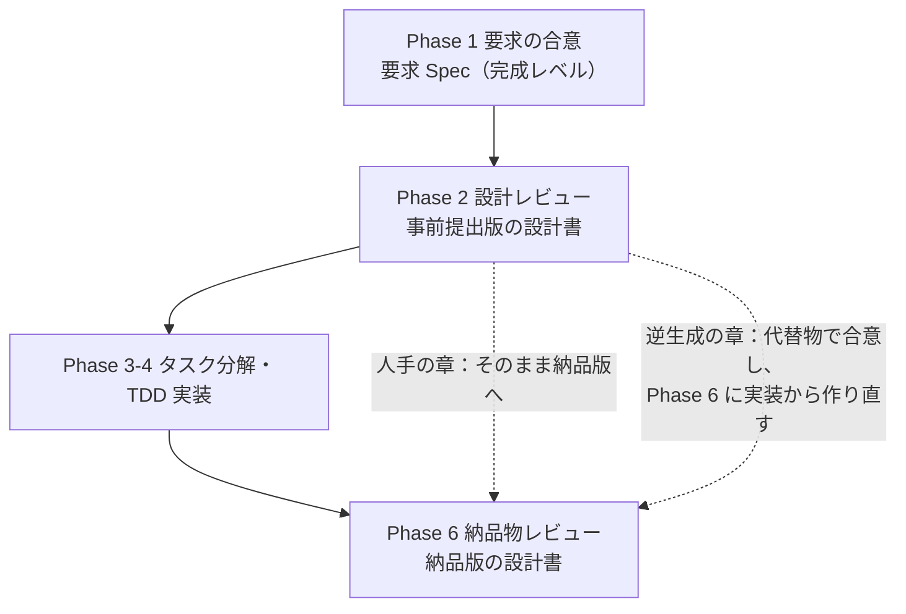

:::note
本記事はシリーズ「**J-SIX：Japanese SI Transformation**」の番外編です。シリーズ全体の概要は [#0 概要編](https://qiita.com/SeckeyJP/items/e4726bbbbf4d7949ab0f)、設計書を実装から逆生成する考え方は [#2 3層ドキュメント戦略](https://qiita.com/SeckeyJP/items/8f413ed405ae0398f94c) をご覧ください。
:::

## はじめに

J-SIX は「設計書は事前に書くものから、実装から逆生成するものへ」と提案してきました。この提案に対して、SI の現場から最も多く返ってくる反応はこれです。

> 顧客は実装の前に基本設計書を求める。設計レビューで承認をもらわないと、次の工程に進めない。

もっともな指摘です。契約の構造も、顧客の社内手続きも、すぐには変わりません。

本記事では、この問いに対する J-SIX v2.1 の答えを紹介します。鍵になるのは、「基本設計書」をひとかたまりで考えるのをやめ、IPA の**工程成果物27点**に分解して、**何を・いつ・どこまで合意するか**を成果物ごとに決めることです。

想定読者は、顧客との合意形成を担う PM・PL・SE の方です。Claude Code（以下 CC）で設計書を逆生成する仕組みそのものは、[設計書逆生成の記事](https://qiita.com/SeckeyJP/items/62c54852396ac4549462)で解説しています。

## 1. 「基本設計書」は何を合意する文書なのか

IPA の「機能要件の合意形成ガイド」は、外部設計の成果物を**工程成果物**という単位で整理しています。そして、次のように明記しています[^ipa-guide]。

> 外部設計工程には、現時点では業界として標準とされる「工程成果物」が存在しません。
> …設計書の作成単位や構成が、本ガイドで想定している「工程成果物」と一致しないことがあります。
> — IPA「機能要件の合意形成ガイド」概要編 2.1

つまり、「基本設計書」の中身は顧客ごとに違います。画面レイアウトも、業務フローも、エンティティ定義も、同じ「基本設計書」という1冊に入っています。

ここに、事前設計書の問題の根があります。**1冊の中に、実装前に合意できるものと、実装しないと正確に書けないものが混ざっている**のです。1冊単位で「実装前に出す／出さない」を議論する限り、答えは出ません。

J-SIX は IPA ガイドの工程成果物27点をテンプレートにしました。6つの領域に分かれます。

| 領域 | 点数 | 主な成果物 |
|---|---|---|
| システム振舞い | 4 | システム化業務一覧・業務フロー・業務説明・共通ルール |
| 画面 | 6 | 画面一覧・画面遷移・画面レイアウト・入出力項目・アクション明細・共通ルール |
| データモデル | 4 | ER図・エンティティ一覧・エンティティ定義・CRUD図 |
| 外部インタフェース | 4 | 外部システム関連図・IF一覧・IF項目説明・IF処理説明 |
| バッチ | 4 | バッチ処理一覧・処理フロー・処理定義・共通ルール |
| 帳票 | 5 | 帳票一覧・帳票概要・レイアウト・項目説明・編集定義 |

## 2. 27点を「由来」で分けると、合意の種類が見える

J-SIX は27点のそれぞれに、**何から作るか（由来）**を決めています。

| 由来 | 件数 | 何が書かれているか |
|---|---|---|
| 人手で書く（Spec / CLAUDE.md） | 5 | **なぜ作るか・どう運用するか**。業務一覧、業務フロー、システム振舞い・画面・バッチの共通ルール |
| コード＋Spec／ADR の併用 | 3 | 実装の事実と、その根拠。外部 IF 処理説明、帳票概要、帳票編集定義 |
| 受入テストから逆生成 | 1 | 受入条件を満たした振る舞い。システム化業務説明 |
| コードから逆生成 | 18 | **何をどう実装したか**。画面・データ・外部 IF・バッチ・帳票の大半 |

この表を合意の視点で読み直すと、次のことが分かります。

- **人手の5点は、顧客と事前に合意すべき内容そのもの**です。業務のどこをシステム化するか、共通のルールをどうするか。実装の前に決まっていなければ困ります
- **逆生成の19点は、実装の事実の記述**です。エンティティの型や画面の入出力項目を実装前に確定させても、実装の過程で必ず変わります。事前に書いたものは、実装後に「設計書とコードの乖離」になります

「設計書を先に出してください」という要求を、**「意図とルールは先に合意する。実装の事実は、実装から起こして納品する」**と読み替えることができます。

## 3. 合意の段階を測る — 合意成熟度

合意には段階があります。IPA ガイドは、これを**合意成熟度**の3レベルとして定義しています[^ipa-guide]。

| レベル | 定義 |
|---|---|
| 仕掛レベル | 発注者が「言い切った」、開発者が「聞き切った」 |
| 充実レベル | 図表に書いてレビューを繰り返し、合意内容が充実した |
| 完成レベル | 合意内容が管理され、発注者・開発者の双方が確認できた |

J-SIX v2.1 は、この合意成熟度を Phase ゲートの**到達基準**にしました。ポイントは、成熟度を**成果物ごとに**判定することです。

| ゲート | 完成レベルを求めるもの | 充実レベルでよいもの |
|---|---|---|
| Phase 1 顧客承認 | 要求 Spec（ユースケース・業務ルール・受入条件・非機能要件） | 業務フロー（プロトタイプで確認） |
| Phase 2 設計レビュー | Design Spec・ADR・実動プロトタイプ、**人手で書く工程成果物**、提出する設計書の目次 | **実装から逆生成する工程成果物**（代替物で確認） |
| Phase 6 納品物レビュー | 逆生成した工程成果物を含む全納品物 | — |

従来の設計レビューでは、「基本設計書をレビューして承認した」かどうかが問われます。J-SIX では、Phase 2 の時点で逆生成する成果物が充実レベルにとどまっていることを、**未達とは扱いません**。その成果物は Phase 6 に実装から起こし、納品物レビューで顧客が確認した時点で完成レベルになります。

一方で、仕掛レベルのまま残っている項目があれば、ゲートを通しません。「未確定」と明記したうえで、**確定させる Phase と担当者**を決めることを条件にしています。

## 4. 事前設計書はこう出す — 提出の時期を2回に分ける

合意成熟度で整理すると、設計書を出す時期は2回になります。

J-SIX が用意している基本設計書の組立例では、章ごとに「事前提出で出せるか」を決めています。抜粋すると次の通りです。

| 章 | 構成要素 | 由来 | 事前提出 |
|---|---|---|---|
| 目的・業務背景 | 要求 Spec | 人手 | ○ |
| システム化業務一覧・業務フロー | 工程成果物 | 人手 | ○ |
| 業務ルール | 要求 Spec の業務ルールと Property | 人手 | ○ |
| システム化業務説明 | 工程成果物 | 受入テストから逆生成 | 代替: 要求 Spec の受入条件 |
| 画面レイアウト | 工程成果物 | コードから逆生成 | 代替: **実動プロトタイプ**の画面 |
| ER図 | 工程成果物 | コードから逆生成 | 代替: Design Spec の ER 概要 |
| エンティティ定義・CRUD図 | 工程成果物 | コードから逆生成 | × |
| 帳票編集定義 | 工程成果物 | コード＋ADR | △ ADR 由来の部分のみ |

事前提出版では、逆生成する章に**代替物**を入れ、その章に「本章は Phase 6 に実装から逆生成した版に差し替える」と明記します。顧客から見ると、目次の揃った基本設計書が実装前に届き、どの章が合意済みで、どの章が差し替え予定かが分かります。

ここで守るべきことが2つあります。

1. **目次の合意を、中身より先に取る。** 顧客の様式がある場合は、顧客の目次の章ごとに構成要素を対応付けます。どの章を事前に出し、どの章を差し替えるかは、Phase 2 のゲートで顧客と合意しておきます
2. **事前提出版の内容を、納品版に手で書き写して延命させない。** 納品版は実装から作り直します。書き写すと、実装とずれた記述がそのまま納品されます

## 5. 詳細設計書は実装前に書かない

IPA の27点は外部設計の成果物で、内部設計（モジュール構成や処理の実装方式）は含まれていません。そこで J-SIX は、詳細設計書について**独自の方針**を定めています（著者の見解です）。

**詳細設計書は、実装前に書きません。** 詳細設計工程にあたる Phase 3 の成果物は、受入条件・Property・変更を許すファイル範囲を付けた**タスク一覧**です。実装前はこれを詳細設計書の代替として顧客と合意し、詳細設計書そのものは Phase 6 にコード・テスト・ADR から逆生成します。

実装前に関数単位の処理を日本語で書くと、実装後にコードと二重管理になります。逆生成する詳細設計書でも、書く内容を絞っています。

| 書く | 書かない |
|---|---|
| モジュールの責務と依存の向き | 関数本体を日本語に置き換えた処理記述 |
| 不変条件（Property）と、それをどこで守っているか | 変数ごとの説明 |
| 例外と外部への応答の対応（業務エラー → HTTP 409 など） | コードの条件分岐の列挙 |
| 計算方式と**その根拠**（ADR・法令） | 型から読める引数と戻り値だけの表 |

詳細設計書の価値は、**コードを読んでもすぐには分からないこと**にあります。コードを1行ずつ日本語に置き換えた文書は、コードより読みにくく、食い違う機会を増やすだけです。

## 6. 非機能要件は IPA 非機能要求グレードで書く

合意の対象として見落とされやすいのが非機能要件です。J-SIX v2.1 は、要求 Spec の非機能要件を IPA の**非機能要求グレード**の6大項目で分類するようにしました[^ipa-grade]。

非機能要求グレードは、システム基盤の非機能要求を6大項目・34中項目・116小項目・238メトリクスに体系化したものです。そのうち開発コストや品質への影響が大きい92項目を重要項目とし、3つのモデルシステムごとに要求レベルの例を示しています。

J-SIX のテンプレートでの使い方は次の通りです。

1. **モデルシステムを1つ選ぶ**（社会的影響がほとんど無い／限定される／極めて大きい）。重要項目の要求レベルは、このモデルシステムの例示値を出発点にする
2. **合意した重要項目だけを書く。** 238メトリクスすべてを埋める必要はない
3. **対象外とした大項目も、行を消さずに「対象外（理由）」と書く**
4. **品質ゲートの閾値は別表にする。** 非機能要求グレードはシステム基盤の要求を扱い、テストの品質は対象外だから

第2サンプル（月次請求書発行）の記入例を抜粋します。

| 大項目 | 要件 | レベル／目標値 | 根拠 |
|---|---|---|---|
| 可用性 | 運用スケジュール | 平日業務時間帯。締め処理は月1回 | 経理の月次業務 |
| 運用・保守性 | 処理の追跡 | 全締め処理・確定操作を監査ログに記録 | 内部統制 |
| 移行性 | 過去の請求データ | 移行しない。現行は Excel の手作業で移行元システムが無いため | 現行業務 |
| システム環境・エコロジー | — | 対象外（本番化の際に設置環境と合わせて合意する） | — |

モデルシステムには「社会的影響が限定されるシステム」を選んでいます。請求書は取引先に交付されるため、誤りの影響が経理部門にとどまらず社外に及ぶ、という理由です。

:::note
非機能要求グレードの Excel 版は、著作権表示を付ければ改変して案件用の合意表にできます。PDF 版は改変できません。J-SIX のテンプレートには、大項目の区分だけを載せています。
:::

## 7. 記入済み実例から — 消費税の端数処理

J-SIX のリポジトリには、27点すべての記入済み実例（月次請求書発行）があります。その中から、合意・根拠・実装・設計書がどうつながるかが分かる例を1つ紹介します。

請求書の消費税額には、1円未満の端数が出ます。素朴に実装すると「明細ごとに消費税を計算して切り捨て、合計する」になりがちです。しかしインボイス制度では、**一の請求書につき税率ごとに1回だけ端数処理する**ことになっており、明細ごとに端数処理して合計する方法は認められていません[^nta]。

この判断は、次のように各層に記録されています。

| 層 | 記録 |
|---|---|
| 要求 Spec | 業務ルール REQ-005（端数処理の単位） |
| ADR | ADR-0001「消費税の端数処理を請求単位・税率ごとに1回で行う」。国税庁 Q&A を根拠に、明細単位の計算を却下した理由を残す |
| テスト | 性質テスト PROP-002「任意の明細集合について、税率ごとの消費税額 = floor(税率ごとの税抜合計 × 税率)」で検証 |
| 工程成果物 | 帳票編集定義（由来: コード＋ADR）に、算出式・禁止事項・具体例を記載 |

帳票編集定義には、具体例も載せています。

| 税率 | 明細 | 対価の額の合計 | 消費税額 |
|---|---|---|---|
| 10% | 999 円 + 1,111 円 | 2,110 円 | floor(211.0) = **211 円** |

明細ごとに丸めると、floor(99.9) + floor(111.1) = 99 + 111 = **210 円**になり、1円ずれます。

この帳票編集定義は、実装前に顧客と合意するものではありません。しかし「なぜ明細単位で計算しないのか」は、コードだけを読んでも分かりません。**ADR に残した根拠が、逆生成した設計書に引用されて初めて、設計書として意味を持つ**のです。これが、Spec（Why）・ADR（Why Not）・逆生成（What/How）の3層ドキュメント戦略です。

## 8. 限界

- **J-SIX の記入済み実例は、顧客確認を経ていません。** 完成レベルの条件は「双方が確認できた」ことなので、実例は完成レベルとは言えません。実際の顧客との合意で、この進め方が受け入れられるかは未検証です
- **契約が変えられない場合もあります。** 「実装前に全章を確定させた基本設計書」が契約上の必須要件であれば、J-SIX の2回提出はそのままでは使えません。その場合は、事前提出版を確定版として扱い、実装との差異を変更管理で追う従来の方法と組み合わせることになると考えています（著者の見解）
- **人手の成果物は、人が更新しなければ古くなります。** 逆生成の19点は実装とずれませんが、人手の5点と、併用3点の Spec・ADR 由来の部分には乖離のリスクが残ります
- **IPA のガイドは2010年のもので、現在はアーカイブに置かれています。** 工程成果物の名称と構造を参照していますが、テンプレートの様式は J-SIX 独自のものです

## まとめ

- **「基本設計書」を1冊で考えない。** 1冊の中に、実装前に合意できるものと、実装しないと正確に書けないものが混ざっている
- **27点を由来で分けると、合意の種類が見える。** 人手の5点は事前に合意する「意図とルール」、逆生成の19点は実装から起こす「事実」
- **合意成熟度を成果物ごとに判定する。** 逆生成する成果物が Phase 2 で充実レベルなのは、未達ではない
- **設計書は2回出す。** 事前提出は人手の章と代替物で、納品は実装から作り直す。書き写して延命させない
- **非機能要件は非機能要求グレードの6大項目で、合意したものだけを書く**
- **根拠は ADR に残す。** 逆生成した設計書が意味を持つのは、コードからは分からない理由が引用されているとき

「設計書を先に出してください」への答えは、「出せません」ではなく、「**どの章を、どの段階まで、先に出すか**を一緒に決めましょう」です。

---

工程成果物27点のテンプレート、組立定義、記入済み実例は GitHub で公開しています。

https://github.com/SeckeyJP/j-six/tree/main/templates/deliverables

記入済み実例（月次請求書発行）:

https://github.com/SeckeyJP/j-six/tree/main/examples/monthly-billing/docs/deliverables

[^ipa-guide]: IPA.「機能要件の合意形成ガイド ver.1.0」(2010.03). https://www.ipa.go.jp/archive/files/000004517.pdf
[^ipa-grade]: IPA.「非機能要求グレード2018」. https://www.ipa.go.jp/archive/digital/iot-en-ci/jyouryuu/hikinou/ent03-b.html
[^nta]: 国税庁.「インボイス制度に関するQ&A」問57. https://www.nta.go.jp/taxes/shiraberu/zeimokubetsu/shohi/keigenzeiritsu/pdf/qa/57.pdf
