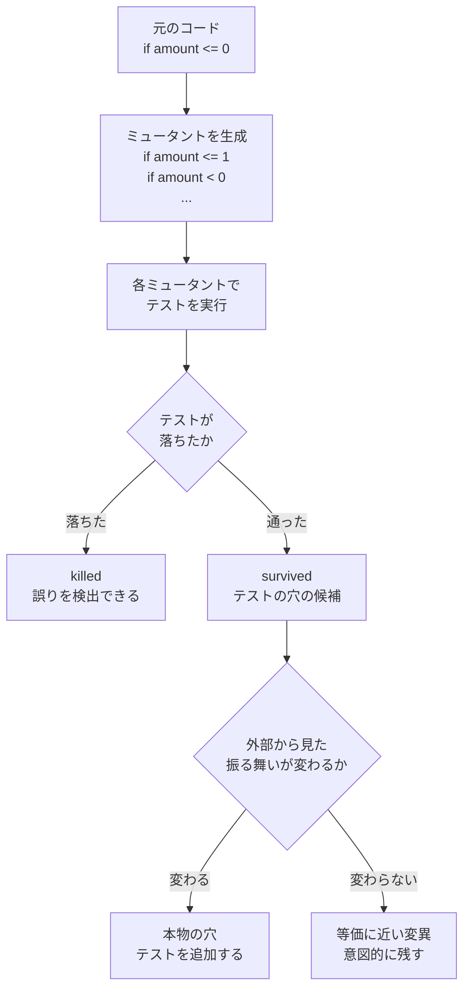

:::note
本記事はシリーズ「**J-SIX：Japanese SI Transformation**」の番外編です。シリーズ全体の概要は [#0 概要編](https://zenn.dev/seckeyjp/articles/j-six-00-overview)、TDD の基本プロセスは [#3 TDD × Claude Code](https://zenn.dev/seckeyjp/articles/j-six-03-tdd-cc) をご覧ください。
:::

## はじめに

「カバレッジ 99%」と聞いて、テストは十分だと感じるでしょうか。

J-SIX のサンプルシステム（申請承認ワークフロー）は、Claude Code（以下 CC）の TDD でカバレッジ 99% に達していました。このコードに mutation testing をかけたところ、**mutation score は 91.8%** でした。生き残ったミュータント15件を1件ずつ分類すると、**本物のテストの穴が3件**ありました。うち2件は、**差し戻しの監査ログに操作者と理由が正しく記録されなくても、テストが通ってしまう**というものです。内部統制の要件そのものに関わる穴でした。

本記事は、この実測の記録です。何を測り、何が見つかり、どう塞いだか。そして、この結果から**言えること・言えないこと**を分けて書きます。先に断っておくと、題材は1つの小規模なシステム（207 ステートメント）で、一般化できる数字ではありません。ただ、「カバレッジが高いから大丈夫」という判断がどこで外れるかを、具体例で示すことはできます。

計測に使ったコードと手順はすべて GitHub で公開しており、手元で再現できます。

## 1. カバレッジが測らないもの

カバレッジは「テストが**実行した**行」を数えます。しかし、その行の誤りをテストが**検出できるか**は測りません。

mutation testing は後者を測る手法です。コードを機械的に少しだけ壊した版（ミュータント）を大量に作り、それぞれに対してテストを実行します。

- テストが落ちれば、そのミュータントは **killed**（テストが誤りを検出できた）
- テストが通ってしまえば **survived**（その誤りはテストをすり抜ける）

killed の割合が **mutation score** です。



生き残ったミュータントがすべてテストの穴とは限りません。エラーメッセージの文言を変えただけの変異のように、外部から見た振る舞いが変わらないものも生き残ります。**生存ミュータントは「穴の候補」であり、1件ずつ分類する必要があります。** この分類が、本記事の中心になります。

### なぜ AI の TDD で重要なのか

CC に TDD でテストを書かせると、カバレッジは簡単に上がります。しかし [TDD × AI の10のアンチパターン](https://zenn.dev/seckeyjp/articles/j-six-tdd-antipatterns) で整理した通り、AI は「テストを通すこと」に最適化しがちで、アサーションの弱いテストでもカバレッジは上がります。

J-SIX は v2.1 で、Phase 4 の品質ゲートのうち「テスト品質検証（G2）」に mutation score を加えました。**「テストが通ること」ではなく「テストが機能していること」を検証する**ためです。本記事の実測は、この判断の裏づけとして行ったものです。

## 2. 測定条件

| 項目 | 値 |
|---|---|
| 題材 | 申請承認ワークフロー（FastAPI。起票 → 提出 → 多段承認 / 差し戻し / 却下） |
| 対象コード | `app/`（368 行 / 207 ステートメント） |
| テスト | 例ベース 37件 + hold-out 受入テスト 10件 |
| カバレッジ | **99%**（207 ステートメント中 未到達 2） |
| mutation ツール | mutmut 3.7.0[^mutmut] |
| ミュータント総数 | 183 |

再現手順は次の通りです。

```bash
git clone https://github.com/SeckeyJP/j-six.git
cd j-six/examples/approval-workflow
make setup            # アプリ本体（Python 3.9+）
make setup-mutation   # mutation testing 用（Python 3.10+）
make test             # カバレッジ計測
make mutation         # mutation score 計測 → reports/mutation.json
```

:::note
**環境上のつまずき**: mutmut 3.x を Python 3.9 で動かすと、`RuntimeError: context has already been set` で停止しました。mutmut 3.x は Python 3.10 以上が前提です。そこで mutation testing 専用の venv（Python 3.13）を分け、アプリ本体は 3.9 のまま動かしています。**mutation testing のために、プロダクトの対応バージョンを上げる必要はありません。**
:::

183 ミュータントの実行は約2分でした。

## 3. 結果 ①: カバレッジ 99% で mutation score 91.8%

```
183 ミュータント: 168 killed / 15 survived
mutation score = 168 / 183 = 91.80%
```

生き残った15件を分類しました。

| 分類 | 件数 | 例 | 本物の穴か |
|---|---|---|---|
| エラーメッセージの文言 | 9 | `"タイトルは必須です"` → `"XXタイトルは必須ですXX"` | ✗ API が返すステータスコードは変わらない |
| 既定引数 `note=""` | 3 | `note: str = ""` → `note: str = "XXXX"` | ✗ 既定値の note を検証していないだけ |
| **境界値** | 1 | `if amount <= 0` → `if amount <= 1` | **✓ 本物** |
| **監査ログの操作者** | 1 | 差し戻しの `_log(req, Action.REMAND, actor, note)` → `_log(req, Action.REMAND, note)` | **✓ 本物** |
| **監査ログの理由** | 1 | 差し戻しの `_log(req, Action.REMAND, actor, note)` → `_log(req, Action.REMAND, actor, )` | **✓ 本物** |

### 穴 ①: 境界の反対側を確かめていない

```python
if amount <= 0:
    raise WorkflowError("金額は1以上で指定してください")
```

これを `amount <= 1` に変えても、テストは通りました。金額 0 の異常系テストはあったので、この行はカバレッジ上「通過済み」です。しかし、**金額 1 円の申請が受け付けられること**を確かめるテストが1つもありませんでした。

境界の片側だけを試しているテストは、カバレッジでは原理的に検出できません。行は実行されているからです。

### 穴 ② ③: 差し戻しの監査ログが壊れても気づけない

```python
def remand(self, request_id: str, actor: str, note: str = "") -> ApprovalRequest:
    ...
    self._log(req, Action.REMAND, actor, note)
```

`_log(req, Action.REMAND, note)` に変えると、引数が1つずれて、**操作者の欄に差し戻しコメントの文字列が入ります**。`_log(req, Action.REMAND, actor, )` に変えると、**差し戻しの理由が記録されません**。どちらのミュータントもテストをすり抜けました。

この題材の要求 Spec には「全状態遷移を時刻・操作者付きで記録する」（REQ-010）という要件があります。差し戻しの処理自体はテストで実行されていましたが、**監査ログの操作者と理由を検証するアサーションがありませんでした**。

日本の SI で扱う業務システムでは、監査ログは内部統制の要件です。「カバレッジ 99% だから監査ログも検証できている」とは言えないことが、具体例で示されました。

## 4. 生存ミュータントから「性質」を導く

本物の穴3件には共通点がありました。**個別の例では書き漏らしやすいが、性質として書けば必ず破れる**形をしているのです。

そこで、要求 Spec に Property（`PROP-nnn`）を追加し、Hypothesis[^hypothesis] で性質テスト（Property-Based Testing、PBT）に変換しました。

| PROP | 性質 | 殺したミュータント |
|---|---|---|
| PROP-002 | 金額 1 以上・妥当な承認者なら、起票は必ず成功し DRAFT になる | 穴 ① 境界値 |
| PROP-005 | どの操作でも、監査ログ末尾の `actor` は操作を行った本人と一致する | 穴 ② 操作者・③ 理由 |

PROP-002 のテストは次の通りです。

```python
AMOUNT = st.integers(min_value=1, max_value=10_000_000)

@given(applicant=ACTOR, amount=AMOUNT, title=st.text(min_size=1, max_size=20))
def test_prop_002_any_valid_request_is_created_as_draft(applicant, amount, title):
    """PROP-002 / REQ-001: 金額 1 以上・妥当な承認者なら起票は必ず成功し DRAFT になる。"""
    assume(title.strip())
    service = WorkflowService()
    req = service.create_request(
        applicant, amount, title, _approvers_for(amount, applicant)
    )
    assert req.status is Status.DRAFT
```

金額を 1〜10,000,000 の範囲で生成すると、Hypothesis は境界値の 1 を試します。**境界を1つずつ例として書き足すのではなく、「範囲全体で成り立つ」と書けば境界が含まれる**のが PBT の利点です。

PROP-005 は、差し戻し・却下・提出のすべての操作に同じ性質を当てます。

```python
@given(applicant=ACTOR, amount=AMOUNT, note=st.text(min_size=1, max_size=20))
def test_prop_005_audit_log_records_the_actual_actor(applicant, amount, note):
    """PROP-005 / REQ-010: 監査ログ末尾の actor は操作を行った本人と一致する。"""
    service = WorkflowService()
    approvers = _approvers_for(amount, applicant)
    req = service.create_request(applicant, amount, "申請", approvers)
    service.submit(req.id, applicant)

    service.remand(req.id, approvers[0], note)
    assert req.audit_log[-1].actor == approvers[0]
    assert req.audit_log[-1].note == note
    # ... 提出・却下についても同様に検証する
```

個別の操作ごとに「この操作の監査ログを確認する」テストを書くと、どこかで書き漏らします。「どの操作でも成り立つ」と性質で書けば、その余地がありません。

## 5. 結果 ②: PBT を足して 93.4%

性質テストを8件追加しました（テスト 37 → 45件）。

```
183 ミュータント: 171 killed / 12 survived
mutation score = 171 / 183 = 93.44%（+1.64pt）
```

**狙った3件を正確に殺し、それ以外のミュータントの状態は変わりませんでした。**

### 残る12件は意図的に生かす

残った12件は、エラーメッセージの文言（9件）と既定引数 `note`（3件）の変異です。これらを殺すには、エラーメッセージの文言をテストで固定することになります。J-SIX では、これを**やらない**方針にしました。

1. **文言は仕様ではない。** 設計で決めているのは「HTTP 409 を返す」ことで、メッセージの本文ではありません。仕様が定めていない詳細をテストで固定すると、文言を改善するたびにテストが壊れます
2. **正しい実装まで落とす。** 仕様にない詳細を監督面にすると、仕様どおりの正しい実装を不合格にしてしまいます

**mutation score 100% は目的ではありません。** 生存ミュータントを分類し、本物の穴だけを塞ぐことが目的です。

## 6. 2つ目の題材でも穴が見つかった

同じ方法を、画面・帳票・バッチを持つ2つ目のサンプル（月次請求書発行）にも適用しました。

初回の計測は **87.89%** で、閾値に届きませんでした。生存55件を分類すると、**本物の穴が8種**ありました。主なものを挙げます。

| 生存ミュータント | 意味 |
|---|---|
| `month > 1` → `month >= 1` | 1月締め（前月が前年12月になる）を検証していない |
| 会計連携の `continue` → `break` | 請求番号順で先頭の請求が未確定だと、以降の確定済み請求が会計連携から丸ごと欠ける |
| 採番の `+= 1` → `-= 1` | 請求番号が連番になることを検証していない |
| 請求の再利用経路 | 再締めで請求番号が変わっても気づけない |
| CSV の `lineterminator` | 出力ファイルの改行コードが環境依存になる |

例ベースのテスト14件と性質テスト2件を追加して、**92.95%** になりました。

**締め処理の年跨ぎ、会計連携の欠落、請求番号の採番。** いずれも請求業務で実際に事故になりうる種類の穴です。

### mutation testing でも見つからなかった不具合

一方で、mutation testing が万能でないことも、この題材で分かりました。

CSV の列数がヘッダと合わない行があると、**日次の売上取込全体が止まる**という不具合がありました。仕様は「1行の不備で取込全体を止めない」です。この不具合は、**カバレッジ 98.8%・mutation score 92.3% の状態で見逃され**、PR 前のコードレビューで見つかりました。

原因は、テストデータが常に正しい列数だったことです。mutation testing は「既存のテストが、コードの変化を検出できるか」を測ります。**テストが一度も与えていない種類の入力については、何も教えてくれません。** 入力空間の抜けを探すのは、性質テストの入力生成や、人間による探索的テスト・レビューの役割です。

## 7. 閾値をいくつにするか

J-SIX は、mutation score の**既定の閾値を定めていません**。当初は仮に 70% を置いていましたが、根拠がなかったため採用しませんでした。閾値を指定しなければ、計測だけを行います。

申請承認ワークフローでは、実測に基づいて **90%** を設定しました。

| 判断 | 根拠 |
|---|---|
| 実測値 93.4% | 現状の到達点 |
| 閾値 90% | 実測から約3pt の余裕。等価に近いミュータントが12件あり、リファクタリングでこの比率が動きうるため |
| 仮値 70% を採らない | 実測値と23pt 離れており、ゲートとして機能しない |

**この 90% を他のプロジェクトに当てはめてはいけません。** 題材は小規模で、外部依存のない純粋な状態遷移のため、mutation score が高く出やすい性質があります。自分のプロジェクトで数タスク計測してから決めてください。

## 8. J-SIX の品質ゲートへの組み込み

J-SIX では、mutation score を Phase 4 の G2（テスト品質検証）で判定します。設定は `.jsix-checks.json` に書きます。

```json
"mutation": {
  "cmd": "make mutation",
  "report": "reports/mutation.json",
  "min_score": 90
}
```

判定スクリプトは、**特定の mutation ツールに依存しません**。読むのは次のどちらかの形式の JSON だけです。

- **mutation-testing-elements** 形式[^mte]（Stryker などが出力する共通形式）
- **最小契約**: `{"score": 91.8}`。任意で生存ミュータントの一覧を添えられる

mutmut の結果をこの形式に変換するアダプタは、Plugin ではなく**利用者側のリポジトリ**に置いています。言語ごとのツールを Plugin に持ち込まないためです。Java なら PIT[^pit]、JavaScript / TypeScript / C# なら Stryker[^stryker] など、プロジェクトの言語に合ったツールの出力をこの形式に揃えれば、同じゲートで判定できます。

ゲートを通過すると、証跡パッケージに mutation score と**生存ミュータントの一覧**が記録されます。人間のレビュアーは、生存ミュータントを見て「本物の穴か、意図的に残したものか」を確認できます。

### 大規模なコードベースでは

183 ミュータントなら約2分ですが、大規模なコードベースで毎回全体を計測するのは現実的ではありません。Google は、変更差分に絞り、カバレッジの無い行や「興味のない」行を除外することで、mutation testing をコードレビューの日常的な工程に組み込んでいます[^google-mutation]。J-SIX のゲートにも `"scope": "changed"` という設定があり、変更したファイルのミュータントだけで score を判定できます（mutation-testing-elements 形式の場合）。ただしこれは**判定の範囲**を絞るものです。mutation testing の実行自体を変更ファイルに絞るには、ツール側の設定が必要です。**実行時間をどこまで短縮できるかは、まだ実測していません。**

## 9. 言えること・言えないこと

**言えること**

- カバレッジ 99% でも mutation score は 91.8% にとどまり、本物のテストの穴が3件残っていた。うち2件は監査ログ（内部統制の要件）に関わるものだった
- 生存ミュータントは、性質テストの出発点として質が高い。3件とも性質として書き直すことで正確に塞げた
- 2つ目の題材でも、締め処理・会計連携・採番の穴が8種見つかった
- mutation score 100% は目的ではない。仕様が定めていない詳細を固定するテストは、脆いテストを生む
- mutation testing は、テストが与えていない種類の入力については何も教えない

**言えないこと**

- 閾値 90% の一般性（題材は2つとも小規模）
- 「カバレッジより N pt 低くなる」といった一般則。99% と 91.8% の差は、この題材での値にすぎない
- 大規模プロジェクトでの実行時間と運用コスト
- mutation score をゲートに加えたことで、本番での欠陥が実際に減るか（本番運用のデータが要る）

## まとめ

- **カバレッジは「実行した行」、mutation score は「誤りを検出できる行」を測る。** カバレッジ 99% のコードで、監査ログの操作者と理由が壊れても気づけない状態だった
- **生存ミュータントは1件ずつ分類する。** 本物の穴は3件で、残りの12件は文言などの等価に近い変異だった
- **本物の穴は、性質テストで塞ぐ。** 「範囲全体で」「どの操作でも」と書けば、書き漏らしの余地がなくなる
- **閾値は自分のプロジェクトで測ってから決める。** 他所の数字を持ち込まない
- **mutation testing も万能ではない。** テストが一度も与えていない入力の抜けは、別の手段で探す

AI にテストを書かせる時代だからこそ、「テストが通っている」の一歩先、「テストが機能している」を測る価値があります。まずは手元のプロジェクトで一度だけ計測し、生き残ったミュータントを眺めてみてください。

---

計測に使ったサンプル・スクリプト・ケーススタディは GitHub で公開しています。

https://github.com/SeckeyJP/j-six

ケーススタディ #2（本記事の元になった計測記録）:

https://github.com/SeckeyJP/j-six/blob/main/docs/case-study-02.md

[^mutmut]: boxed/mutmut. Python 向け mutation testing ツール. https://github.com/boxed/mutmut
[^hypothesis]: Hypothesis. Python 向け Property-Based Testing ライブラリ. https://hypothesis.readthedocs.io/
[^mte]: stryker-mutator/mutation-testing-elements. mutation testing 結果の共通スキーマ. https://github.com/stryker-mutator/mutation-testing-elements
[^pit]: PIT Mutation Testing. Java / JVM 向け mutation testing ツール. https://pitest.org/
[^stryker]: Stryker Mutator. JavaScript / TypeScript / C# / Scala 向け mutation testing ツール. https://stryker-mutator.io/
[^google-mutation]: Petrović, G., Ivanković, M. "State of Mutation Testing at Google". ICSE-SEIP 2018. https://research.google/pubs/state-of-mutation-testing-at-google/
