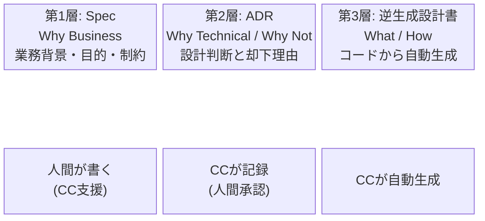
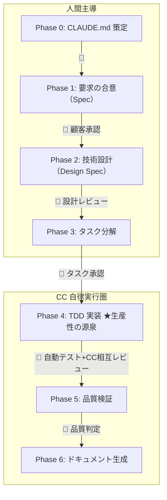
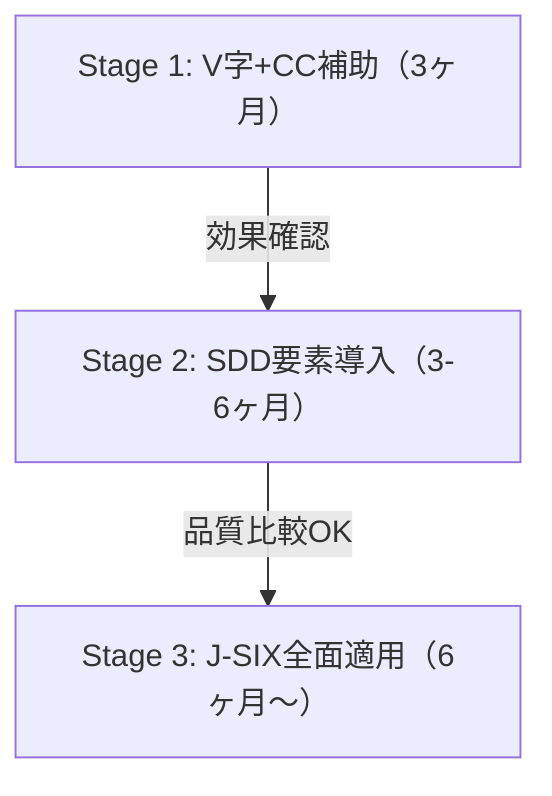

:::note
本記事はシリーズ「**J-SIX：Japanese SI Transformation**」の概要編です。
:::

## はじめに

日本のSI業界で30年以上主流であり続けるV字モデル（ウォーターフォール）。このプロセスの前提が、Claude Code の登場で根本から崩れつつあります。

本記事では、Claude Code をフル活用した AI ネイティブ開発プロセス **「J-SIX」（Japanese SI Transformation）** を提案します。V字モデルを「捨てる」のではなく「進化させる」アプローチです。

J-SIX の全ドキュメント・テンプレートは GitHub で公開しています。

https://github.com/SeckeyJP/j-six

## V字モデルの前提が崩壊している

V字モデルが合理的だった前提は、「実装コストが高い」「テスト作成が高コスト」「変更が困難」という時代のものでした。Claude Code（以下CC）がこれらを根本から覆しています。

| 崩壊した前提 | CC がもたらす現実 |
|---|---|
| 実装コストが高い | CC は数分で数百行のコードを生成する |
| テスト作成が高コスト | テストコードを自動生成。TDD サイクルが回る |
| 変更が困難 | 変更コストが劇的に低下 |

### しかし変わらないもの

一方で、以下の前提はCCを使っても変わりません。

- **何を作るかの合意は人間が行う** — ビジネス要件の理解はAIでは代替不可
- **アーキテクチャ判断は人間が行う** — トレードオフの判断は文脈依存
- **品質の最終責任は人間にある** — CC生成コードには人間の約1.7倍のイシューが含まれ、セキュリティ関連では最大2.74倍との調査報告あり[^coderabbit]

### CC の現実的な能力水準

楽観論でも悲観論でもなく、データで判断します。

| 指標 | 数値 | 出典 |
|---|---|---|
| 初回自律実行成功率 | 約33% | Anthropic 社内報告[^anthropic-teams] |
| AI生成コードのイシュー率 | 人間の約1.7倍 | CodeRabbit 調査[^coderabbit] |
| Sonnet 4.5 コード編集エラー率 | 0%（内部ベンチマーク） | Anthropic 公式[^sonnet45]（※現在は Sonnet 4.6 がリリース済み。数値は 4.5 発表時点のもの） |

**CCは「速いが雑な新人開発者」に似た特性を持ちます。** 適切なガードレール（TDD・Hooks・レビュー）があれば実用水準ですが、「任せっきり」は危険です。

## 世界では何が起きているか — SDD の台頭

海外では **Spec-Driven Development（SDD）** が急速に普及しています。仕様書（Spec）を「第一級の実行可能な成果物」として扱い、仕様から直接コードとテストを生成する手法です。

BMAD Method、Superpowers、GitHub Spec Kit、cc-sdd など複数のフレームワークが登場し、CGI 等の大手企業もSDDの概念を発信し始めています[^cgi-sdd]。

共通する原則は4つあります。**Spec First**（仕様が Source of Truth）、**Phase Gate**（フェーズ完了時に人間が承認）、**TDD**（テスト駆動開発）、**並列エージェント**（Writer/Reviewer 分離）です。

シリーズ #1 で詳しく解説します

V字モデルの前提崩壊の詳細、SDDの各フレームワーク比較、J-SIXが「CC ネイティブ + 日本品質レイヤー」を選んだ理由を深掘りします。

## J-SIX の4つの設計原則

J-SIX は以下の4原則で設計しました。

### ① CC ネイティブ

BMAD 等の外部フレームワークに依存せず、CC のネイティブ機能（CLAUDE.md、Subagents、Hooks、Agent Teams等）だけで構築します。CCのアップデートに自然に追従でき、ベンダーロックインのリスクを回避します。

### ② 3層ドキュメント戦略

コードからは「何をどう実装したか」は復元できますが、「なぜそうしたか」「なぜ他の方法を採らなかったか」は復元できません。そこで3層のドキュメント体系を設計しました。

- **第1層：Spec** — 業務背景・目的・制約（Why Business）
- **第2層：ADR** — 設計判断の理由と却下した代替案（Why Technical / Why Not）
- **第3層：逆生成設計書** — コードから自動生成する構造情報（What / How）

### ③ TDD が品質の中核

テストを先に書き、CCに実装させる。サブエージェント分離で「テスト作成者」と「実装者」のコンテキスト汚染を防止。Writer/Reviewer パターンでCC同士が相互レビュー。これがCCの自律実行を品質面で支えるメカニズムです。

### ④ 段階的移行

既存のV字モデル案件を止めずに、3ステージで移行します（後述）。

## J-SIX のプロセス全体像

**最大のパラダイムシフトは Phase 6** です。設計書を事前に書くのではなく、実装後にコードから逆生成します。コードが Source of Truth なので、設計書との乖離が原理的にゼロになります。

「設計書がなくなる」のではありません。「作り方が変わる」のです。顧客への納品物は従来フォーマット（Excel/Word）でも出力可能です。

シリーズ #2 で詳しく解説します

3層ドキュメント戦略の詳細、コードから復元できる情報/できない情報の4象限マトリクス、ADRの具体例を掲載します。

## 段階的に移行できる

J-SIX への移行は「ビッグバン」ではなく、3ステージで段階的に進めます。

### Stage 1: V字 + CC 補助（3ヶ月）

V字モデルのプロセスは変えず、実装・UTでCCを補助的に使います。CLAUDE.mdの基本版を整備し、効果を計測します。

**目標**: 実装工数 **20-30%** 削減

### Stage 2: SDD 要素の導入（3-6ヶ月）

新規モジュールからTDDを開始。ADR運用を開始。設計書は従来方式と逆生成を「二重作成」して品質を比較します。

**目標**: 実装工数 **40-50%** 削減

### Stage 3: J-SIX 全面適用（6ヶ月〜）

J-SIX プロセス（Phase 0-6）を全面適用。設計書は逆生成のみ。Agent Teams + git worktree で並列実行。

**目標**: 実装工数 **60-70%** 削減（著者推定）

### 投資対効果

5人チームの場合の試算です（CC Max $100/月/人、人件費80万円/人月の仮定。価格は2026年3月時点）。

| ステージ | CC 費用（月額） | 工数削減効果（月額） |
|---|---|---|
| Stage 1 | 約7.5万円 | 約100万円 |
| Stage 2 | 約7.5万円 | 約180万円 |
| Stage 3 | 約7.5万円 | 約260万円 |

※ 上記は仮定条件に基づく著者の試算であり、プロジェクト特性により異なります。

シリーズ #5 で詳しく解説します

各ステージの完了基準、レガシーコードへの適用戦略、移行を阻む壁（組織・技術・顧客）と対策を詳述します。

## 明日からできること

J-SIX の全面導入を待つ必要はありません。今日からできる3ステップがあります。

**Step 1: CLAUDE.md を書く**

プロジェクトのコーディング規約・ビルドコマンド・ディレクトリ構成を CLAUDE.md に記述します。これだけでCC の出力品質が大きく安定します。テンプレートを公開しています。

https://github.com/SeckeyJP/j-six/tree/main/templates/claude-md

**Step 2: 実装 + UT で CC を使い始める**

まずは新規コードの生成とテストコード作成にCCを使ってみてください。人間がレビュー・承認する前提で、Stage 1 の運用です。

**Step 3: 効果を計測する**

CC活用/非活用の工数比較、CC生成コードのバグ密度を記録します。このデータが Stage 2 への移行判断の根拠になります。

## まとめ

J-SIX は日本のSI開発プロセスを「捨てる」のではなく「進化させる」提案です。

- **品質基準は維持する。** バグ密度・カバレッジ等の定量基準は変えない
- **変わるのは「作り方」。** 設計書は逆生成、テストはTDD、実装はCC自律実行
- **段階的に移行できる。** 既存案件を止めずに3ステージで移行
- **期待効果は大きい。** 実装工数 60-70%削減（著者推定目標値）

このプロセスは著者のオリジナル設計ですが、世界標準のSDD原則と、Anthropic・CodeRabbit等の公開データに基づいています。期待効果の数値は推定であり、実プロジェクトでの検証はこれからの課題です。

## シリーズ記事

| # | タイトル | 状態 |
|---|---|---|
| **#0** | **本記事（概要編）** | ✅ |
| #1 | [V字モデルの前提崩壊と SDD の台頭](https://zenn.dev/seckeyjp/articles/j-six-01-sdd) | 公開済 |
| #2 | [3層ドキュメント戦略 — 設計書は「逆生成」の時代へ](https://zenn.dev/seckeyjp/articles/j-six-02-3layer-doc) | 公開済 |
| #3 | [TDD × Claude Code — 自律実行で生産性を最大化する](https://zenn.dev/seckeyjp/articles/j-six-03-tdd-cc) | 公開済 |
| #4 | [CLAUDE.md 実践ガイド — AI開発の「プロジェクト憲法」を書く](https://zenn.dev/seckeyjp/articles/j-six-04-claude-md) | 公開済 |
| #5 | [V字モデルからの段階的移行 — 既存案件を止めずに J-SIX へ](https://zenn.dev/seckeyjp/articles/j-six-05-migration) | 公開済 |

## 参考文献・リンク

### J-SIX プロジェクト

https://github.com/SeckeyJP/j-six

### 引用した調査・データ

[^coderabbit]: CodeRabbit. "State of AI vs Human Code Generation Report" (2025.12). https://www.coderabbit.ai/blog/state-of-ai-vs-human-code-generation-report
[^anthropic-teams]: Anthropic. "How Anthropic teams use Claude Code" (2025.07). https://claude.com/blog/how-anthropic-teams-use-claude-code
[^sonnet45]: Anthropic. "Introducing Claude Sonnet 4.5" (2026.02). https://www.anthropic.com/news/claude-sonnet-4-5
[^cgi-sdd]: CGI. "Spec-driven development: From vibe coding to intent engineering" (2026.03). https://www.cgi.com/en/blog/artificial-intelligence/spec-driven-development

### CC ベストプラクティス

- Anthropic. "Best Practices for Claude Code". https://code.claude.com/docs/en/best-practices
- Anthropic. "How Claude Code works". https://code.claude.com/docs/en/how-claude-code-works
