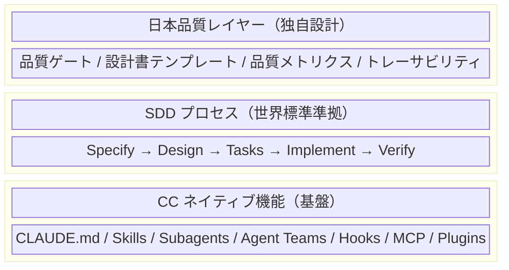

:::note
本記事はシリーズ「**J-SIX：Japanese SI Transformation**」の #1 です。[#0 概要編](https://zenn.dev/seckeyjp/articles/j-six-00-overview)で全体像を把握してからお読みください。
:::

## はじめに

日本の SI 業界で 30 年以上にわたり主流を占めてきた V 字モデル。設計書を工程ごとに積み上げ、テストで品質を検証するこのプロセスは、「実装コストが高く、変更が困難」な時代には合理的だった。

しかし 2025 年以降、Claude Code（以下 CC）をはじめとする AI コーディングエージェントが急速に進化し、V 字モデルの成立前提そのものが揺らぎ始めている。

世界では **Spec-Driven Development（SDD）** と呼ばれる新しい開発パラダイムが台頭し、仕様書（Spec）を起点に AI が自律的にコードを生成するプロセスが現実のものとなった。

本記事では、V 字モデルの前提がなぜ崩壊しつつあるのかを 5 つの根拠から示し、SDD の概念と主要フレームワークを整理した上で、J-SIX が「CC ネイティブ + 日本品質レイヤー」という方式を選んだ理由を解説する。

---

## 1. V 字モデルの前提が崩壊した 5 つの根拠

V 字モデルは以下の前提のもとで合理的なプロセスだった。CC の登場により、これらの前提が一つずつ崩れている。

### 根拠 1：実装コストはもう「高く」ない

V 字モデルでは「実装コストが高い」ため、上流で詳細に設計して手戻りを防ぐ必要があった。CC は数分で数百行のコードを生成する。実装コストの劇的な低下により、「手戻り防止のために事前に詳細設計を書く」という動機が薄れている。

### 根拠 2：人間が全行コードを書く時代は終わった

設計書で事前にロジックを確定させる理由のひとつは、「人間がゼロからコードを書く」前提だった。現在は CC がコードの大部分を生成し、人間はレビューと判断に集中する形に変わりつつある。

### 根拠 3：テスト作成のコストが劇的に低下した

テスト仕様書を事前に準備して効率化する必要があったのは、テスト作成自体が高コストだったからだ。CC はテストコードを自動生成でき、TDD（テスト駆動開発）のサイクルが CC 前提で回るようになった。

### 根拠 4：変更はもう「困難」ではない

ウォーターフォールで凍結点を設けて変更を管理していたのは、変更コストが高かったためだ。CC によるリファクタリング支援と自動テストの組み合わせにより、変更コストは大幅に低下している。

### 根拠 5：しかし「崩壊しない前提」もある

一方で、**CC では代替できない領域**が明確に存在する。ここを見誤ると、AI 過信による品質崩壊を招く。

| 変わらない前提 | 理由 |
|---|---|
| **何を作るかの合意は人間が行う** | ビジネス要件・ステークホルダー合意は AI で代替不可 |
| **アーキテクチャ判断は人間が行う** | 技術選定・非機能要件のトレードオフは文脈依存 |
| **品質の最終責任は人間にある** | CC 生成コードには人間の約 1.7 倍のイシューを含むとの調査報告あり[^coderabbit] |
| **トレーサビリティは必要** | 監査・保守において追跡可能性は不可欠 |
| **顧客との合意プロセスは必要** | 日本の SI モデルでは受発注関係がある |

つまり V 字モデルの「実行面の前提」は崩壊したが、「判断面の前提」は健在だ。新しいプロセスには、この両面を踏まえた設計が求められる。

---

## 2. CC の現実的な能力水準

V 字モデルの前提が崩壊したからといって、CC に任せれば全て解決するわけではない。CC の現実を正しく理解しておく必要がある。

| 指標 | 数値 | 出典 |
|---|---|---|
| 初回自律実行成功率 | 約 33% | Anthropic RL Engineering チームの報告[^anthropic-teams] |
| AI 生成 PR のイシュー率 | 人間の約 1.7 倍 | CodeRabbit 調査（2025.12、470PR 分析）[^coderabbit] |
| セキュリティイシュー | 人間の最大 2.74 倍 | 同上[^coderabbit] |

CC は「速いが雑な新人開発者」に類似する特性を持つ（著者の解釈）。適切なガードレール — TDD、Hooks、レビュー — があれば実用水準に達するが、「任せっきり」は危険だ。

この特性を踏まえた上で、世界ではどのような開発プロセスが生まれつつあるのかを見ていこう。

---

## 3. SDD（Spec-Driven Development）とは何か

### 核心思想

SDD の核心は、**仕様書（Spec）を「第一級の実行可能な成果物」として扱い、仕様から直接実装を生成する**ことにある[^cgi-sdd][^agentfactory-sdd]。

V 字モデルでは設計書が工程間の「契約」として機能していた。SDD では Spec が**生きた文書**として実装とテストを直接駆動し、乖離を許さない。

### SDD の 4 フェーズ

各フェーズの間に **Phase Gate**（品質ゲート）が設けられ、人間が承認してから次へ進む。最後の実装フェーズだけは自動テストがゲートを担う。

### V 字モデルとの本質的な違い

| 観点 | V 字モデル | SDD |
|---|---|---|
| Source of Truth | 設計書（Excel/Word） | Spec（Markdown） |
| 設計書の位置づけ | 実装の前に書く「設計図」 | 実装を駆動する「仕様」 |
| テストのタイミング | 実装後 | Spec 後（テストファースト） |
| 変更への耐性 | 低い（凍結管理） | 高い（Spec 更新で追従） |
| 工程間の進行 | 直列 | タスク単位で並列 |

---

## 4. 主要 SDD フレームワークの比較

2025 年後半から 2026 年にかけて、SDD の原則を実装した複数のフレームワークが登場している。

| フレームワーク | 特徴 | 規模適性 | CC 統合度 |
|---|---|---|---|
| **BMAD Method**[^bmad] | 21 の専門 AI エージェント[^bmad-agents]、アジャイル統合 | 中〜大規模 | 高 |
| **Superpowers**[^superpowers] | TDD 中心の 7 フェーズ、Anthropic 公式マーケットプレイス入り | 小〜中規模 | 最高 |
| **cc-sdd** | Kiro 風コマンド、8 エージェント対応、13 言語 | 小〜大規模 | 高 |
| **GitHub Spec Kit** | GitHub 公式、CLI 提供、軽量 | 小〜中規模 | 中 |
| **SPARC** | 5 フェーズ（仕様→擬似コード→設計→改善→完成）、並列実行 | 中規模 | 高 |

### 共通する 6 つの設計原則

これらのフレームワークに共通する原則がある。

1. **Spec First** — コードの前に仕様。仕様が Source of Truth
2. **Phase Gates** — フェーズ完了時に人間が承認
3. **TDD** — テストを先に書き、CC に実装させる
4. **Parallel Agents** — Writer/Reviewer 分離、サブエージェントによるコンテキスト分離
5. **Living Documentation** — 設計書はコードと常に同期
6. **CLAUDE.md as Constitution** — 全ルール・規約・判断基準を一箇所に集約

### フレームワーク選定の課題

どのフレームワークにも共通する課題がある。**日本の SI 品質基準への対応が不足している**点だ。

| 評価軸 | BMAD | Superpowers | cc-sdd | Spec Kit |
|---|---|---|---|---|
| CC ネイティブ活用度 | 中 | 高 | 高 | 中 |
| 大規模 SI 案件適性 | ○ | △ | △ | △ |
| 日本品質基準対応 | 追加要 | 追加要 | 追加要 | 追加要 |
| 導入・学習コスト | 高 | 低 | 低 | 中 |
| CC 進化への追従性 | リスクあり | 高 | 高 | 中 |

5 つすべてのフレームワークで「日本品質基準対応」が「追加要」となっている。設計書文化、受発注構造、IPA/共通フレーム準拠 — これらは海外フレームワークのスコープ外だ。

---

## 5. なぜ J-SIX は CC ネイティブ + 日本品質レイヤーを選んだか

### 既存フレームワークの限界

BMAD のような包括的フレームワークは魅力的に見えるが、実際には以下の問題がある。

- **CC ネイティブ機能との重複**：BMAD の Architect Agent と CC の Plan Mode、BMAD の Developer Agent と CC の Subagent など、機能が重複する[^augment-sdd]
- **CC 進化との衝突リスク**：CC の上に独自レイヤーを被せているため、CC のアップデート時に破綻する可能性がある
- **規模の不適合**：BMAD は「5 人未満のチームには非推奨」との公式見解がある[^augment-sdd]

Superpowers は CC との統合度が最も高いが、ソロ開発者〜小チーム向けであり、日本の SI 案件のような組織的プロセスには対応していない。

### CC は SDD をネイティブに実現できる

ここで重要な発見がある。SDD の 4 フェーズに必要な機能は、**CC にすべてネイティブで存在する**。外部フレームワークを導入しなくても、CC の機能だけで SDD を実現できるのだ（次節で詳述）。

### J-SIX の 3 層アーキテクチャ

そこで J-SIX は、以下の 3 層構造を採用した。

| レイヤー | 責務 |
|---|---|
| **CC ネイティブ機能** | プロセスの「実行エンジン」。Anthropic が継続的にアップデートするため、ここに依存するのが最も安全 |
| **SDD プロセス** | プロセスの「骨格」。特定フレームワークには依存せず、SDD の原則レベルで採用 |
| **日本品質レイヤー** | プロセスの「品質保証」。日本の SI 固有の品質基準・設計書文化に対応。ここが J-SIX の独自価値 |

この構造であれば、CC がアップデートされても基盤が自然に追従し、SDD の原則を維持しつつ、日本市場に必要な品質基準を確保できる。

---

## 6. CC の 7 つのネイティブ機能

J-SIX が外部フレームワークに依存しない根拠は、CC 自体が SDD の主要機能を吸収済みであることにある。以下が 2026 年 3 月時点での CC の 7 つの拡張メカニズムだ[^mental-model]。

| # | 機能 | 分類 | 役割 |
|---|---|---|---|
| 1 | **CLAUDE.md** | Knowledge（常時 ON） | プロジェクト憲法。全セッションで自動読込 |
| 2 | **Skills** | Knowledge（オンデマンド） | 特定ワークフローの手順書。必要時にのみ読込 |
| 3 | **Subagents** | Worker（独立） | 独立タスクの委譲。別コンテキストで実行[^subagents] |
| 4 | **Agent Teams** | Worker（協調） | 複数エージェントが共有タスクリストとメッセージで協調[^agent-teams] |
| 5 | **Hooks** | ライフサイクル制御 | イベント駆動のガードレール（commit 前 lint、テスト自動実行等） |
| 6 | **MCP Servers** | 外部接続 | DB、Slack、GitHub 等の外部ツールとの統合 |
| 7 | **Plugins** | パッケージ | Skills + Agents + Hooks をバンドルして共有 |

### SDD フェーズとの対応関係

SDD の各フェーズが CC ネイティブ機能でどう実現されるかを整理する。

| SDD フェーズ | CC ネイティブ機能 |
|---|---|
| **Specify**（仕様策定） | Subagents（並列リサーチ）、ask_user_question（インタビューモード）、Plan Mode |
| **Design**（技術設計） | Plan Mode + Subagents（並列技術調査）、CLAUDE.md（設計方針の永続化） |
| **Tasks**（タスク分解） | Native Tasks システム、依存関係の自動分析、Subagent への自動委譲 |
| **Implement**（実装） | Subagents（TDD の Red/Green/Refactor 分離）、Agent Teams（並列実装）、git worktree、Hooks |

外部フレームワークが提供する機能のほぼ全てが、CC ネイティブで代替可能だ。

---

## 7. 先行フレームワークから学ぶべきエッセンス

J-SIX は外部フレームワークに「依存」はしないが、各フレームワークの優れたエッセンスは積極的に取り入れている。

| フレームワーク | 取り入れるエッセンス | CC ネイティブでの実現 |
|---|---|---|
| **BMAD** | ロール分離（PM/Architect/QA）の考え方 | Subagent の description で役割を定義 |
| **BMAD** | Phase Gate の厳格な管理 | Hooks で Phase 完了条件を自動チェック |
| **Superpowers** | TDD の Red-Green-Refactor 分離[^alexop-tdd] | Subagent 分離（テスト作成/実装/リファクタリング） |
| **Superpowers** | Socratic Brainstorming | Plan Mode + ask_user_question の活用 |
| **Anthropic 社内** | Writer/Reviewer パターン[^anthropic-bestpractices] | 別セッションの CC でコードレビュー |
| **Anthropic 社内** | CLAUDE.md の徹底活用[^anthropic-teams] | 日本向けテンプレートを充実 |

「車輪の再発明」ではなく「先人の知見を CC ネイティブ機能で再実装する」というアプローチだ。

---

## まとめ：V 字モデルを「捨てる」のではなく「進化させる」

本記事の要点を整理する。

1. **V 字モデルの実行面の前提は崩壊した** — 実装コスト、テストコスト、変更コストの劇的な低下
2. **判断面の前提は健在** — 要件合意、アーキテクチャ判断、品質責任は人間の領域
3. **SDD が世界標準として台頭** — Spec First、Phase Gate、TDD、並列エージェントが共通原則
4. **既存フレームワークは日本市場にそのまま適用できない** — 品質基準・設計書文化への対応が不足
5. **CC ネイティブ機能で SDD を実現可能** — 7 つの拡張メカニズムが外部フレームワークを代替
6. **J-SIX は 3 層構造で最適解を目指す** — CC ネイティブ基盤 + SDD 原則 + 日本品質レイヤー

V 字モデルの全てが間違っていたわけではない。品質ゲートの考え方、トレーサビリティの重視、顧客合意のプロセス — これらは SDD にも J-SIX にも受け継がれている。変わるのは「実行方法」であり、「品質への姿勢」ではない。

次回の記事（#2）では、日本の SI 業界にとって最大の関心事である「設計書はどうなるのか」に正面から向き合い、J-SIX の 3 層ドキュメント戦略を詳しく解説する。

---

## 参考文献・出典

[^coderabbit]: CodeRabbit. "State of AI vs Human Code Generation Report" (2025.12). https://www.coderabbit.ai/blog/state-of-ai-vs-human-code-generation-report
[^anthropic-teams]: Anthropic. "How Anthropic teams use Claude Code" (2025.07). https://claude.com/blog/how-anthropic-teams-use-claude-code
[^cgi-sdd]: CGI. "Spec-driven development: From vibe coding to intent engineering" (2026.03). https://www.cgi.com/en/blog/artificial-intelligence/spec-driven-development
[^agentfactory-sdd]: Agent Factory / Panaversity. "Chapter 16: Spec-Driven Development with Claude Code". https://agentfactory.panaversity.org/docs/General-Agents-Foundations/spec-driven-development
[^bmad]: BMAD-METHOD (GitHub). https://github.com/bmad-code-org/BMAD-METHOD
[^bmad-agents]: Pasqualepillitteri.it. "Spec-Driven Development AI Framework Guide". https://www.pasqualepillitteri.it/en/news/158/framework-ai-spec-driven-development-guide-bmad-gsd-ralph-loop
[^superpowers]: Pasqualepillitteri.it. "Superpowers Claude Code Complete Guide". https://www.pasqualepillitteri.it/en/news/215/superpowers-claude-code-complete-guide
[^augment-sdd]: Augment Code. "6 Best Spec-Driven Development Tools for AI Coding in 2026". https://www.augmentcode.com/tools/best-spec-driven-development-tools
[^mental-model]: Dean Blank. "A Mental Model for Claude Code" (2026.03). https://levelup.gitconnected.com/a-mental-model-for-claude-code-skills-subagents-and-plugins-3dea9924bf05
[^subagents]: Anthropic. "Create custom subagents". https://code.claude.com/docs/en/sub-agents
[^agent-teams]: ClaudeFast. "Claude Code Agent Teams: The Complete Guide 2026". https://claudefa.st/blog/guide/agents/agent-teams
[^alexop-tdd]: alexop.dev. "Forcing Claude Code to TDD" (2025.11). https://alexop.dev/posts/custom-tdd-workflow-claude-code-vue/
[^anthropic-bestpractices]: Anthropic. "Best Practices for Claude Code". https://code.claude.com/docs/en/best-practices

---

**J-SIX リポジトリ**: https://github.com/SeckeyJP/j-six

J-SIX のプロセス定義、CLAUDE.md テンプレート、Skills などの一式を公開しています。

---

## シリーズ一覧

| # | タイトル | 状態 |
|---|---|---|
| #0 | [J-SIX 概論 — なぜ今、日本のSI開発プロセスを再設計するのか](https://zenn.dev/seckeyjp/articles/j-six-00-overview) | 公開済 |
| **#1** | **本記事（V字モデルの前提崩壊と SDD の台頭）** | ✅ |
| #2 | [3層ドキュメント戦略 — 設計書は「逆生成」の時代へ](https://zenn.dev/seckeyjp/articles/j-six-02-3layer-doc) | 公開済 |
| #3 | [TDD × Claude Code — 自律実行で生産性を最大化する](https://zenn.dev/seckeyjp/articles/j-six-03-tdd-cc) | 公開済 |
| #4 | [CLAUDE.md 実践ガイド — AI開発の「プロジェクト憲法」を書く](https://zenn.dev/seckeyjp/articles/j-six-04-claude-md) | 公開済 |
| #5 | [V字モデルからの段階的移行 — 既存案件を止めずに J-SIX へ](https://zenn.dev/seckeyjp/articles/j-six-05-migration) | 公開済 |
