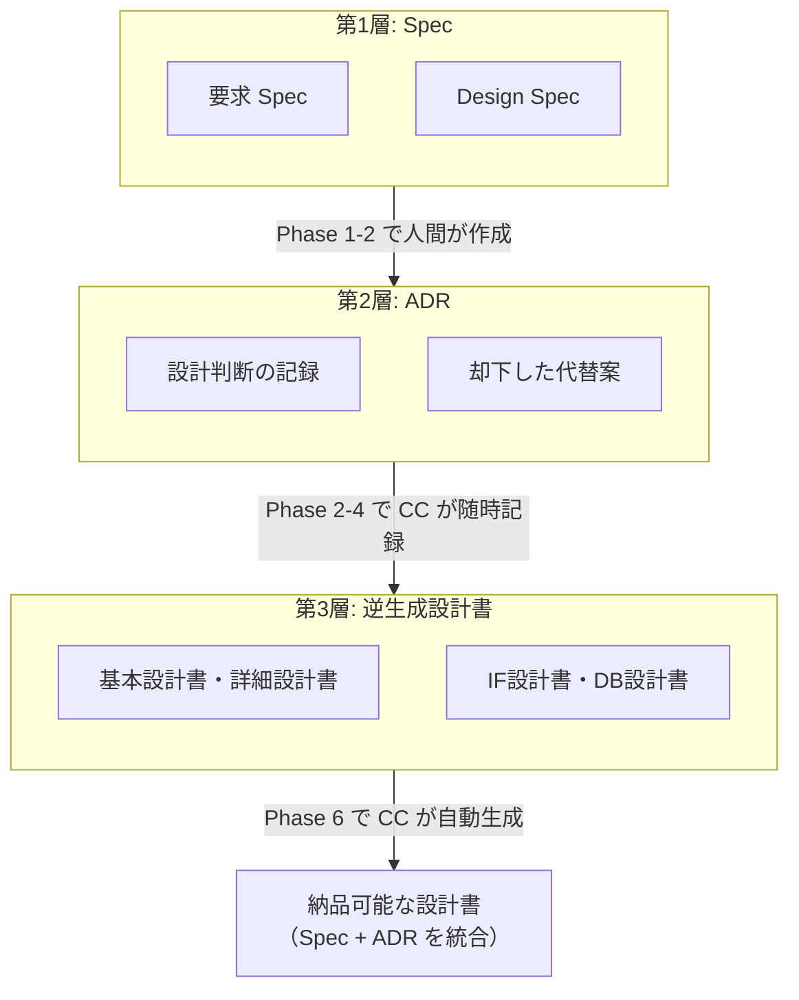

:::note
本記事はシリーズ「**J-SIX：Japanese SI Transformation**」の #2 です。シリーズ全体の概要は[#0 概要編](/seckeyjp/articles/j-six-00-overview)をご覧ください。
:::

## はじめに — 「設計書はどうなるのか？」

AI ネイティブな開発プロセスを提案すると、日本のSI現場で最初に返ってくる質問はほぼ決まっています。

> 「で、設計書はどうなるの？」

納品物としての設計書、契約上の成果物としての設計書、保守引継ぎのための設計書。日本のSI業界にとって設計書は開発プロセスの根幹であり、ここに答えなければどんなプロセス改革も絵に描いた餅で終わります。

本記事では、この問いに正面から回答します。結論を先に述べると：

**設計書はなくならない。作り方が変わる。**

そして、その「新しい作り方」は、従来の設計書よりも情報量が多く、かつコードとの乖離がゼロになるという、逆説的な結果をもたらします。

## コードから復元できる情報/できない情報

設計書を「逆生成」する――つまり実装済みコードから設計書を自動生成するアプローチは、設計書とコードの乖離を原理的に排除する画期的な手法です。富士通は2025年にAIによる設計書リバースエンジニアリングサービスを発表し、手動比50%の効率化を報告しています[^fujitsu]。

しかし、このアプローチには根本的な限界があります。

> **コードには「何をどう実装したか」は刻まれているが、「なぜそうしたか」「なぜ他の方法を採らなかったか」は刻まれていない。**

この限界を整理するために、情報を「コードに存在するか」と「構造的か意図的か」の2軸で4象限に分類します[^4quadrant]。

### 4象限マトリクス

|  | コードに存在する | コードに存在しない |
|---|---|---|
| **構造的（静的情報）** | **完全復元可能** クラス/関数構造、DBスキーマ、APIエンドポイント、依存関係、データ型/制約 | **部分復元可能** システム全体の配置構成、外部IFの相手先仕様、非機能要件の数値目標 |
| **意図的（暗黙知）** | **推測可能** 処理の振る舞い（テストから）、エラーハンドリング方針、命名規則 | **復元不可能** 設計判断の理由、却下した代替案、業務上の背景知識、将来の拡張計画 |

各象限を具体的に見てみましょう。

**完全復元可能な情報**は、逆生成が最も得意とする領域です。クラス構造はソースコード解析、DBスキーマはDDL/マイグレーション解析、APIエンドポイントはOpenAPI/ルーティング解析から正確に生成できます。

**推測可能な情報**は、テストコードやコードパターンから読み取れます。TDDで書かれたテストが充実していれば、処理の振る舞いやエラーハンドリング方針の推測精度は高くなります。ただし「推測」である以上、人間の確認は必要です。

**部分復元可能な情報**は、IaC（Infrastructure as Code）やCI/CD設定が充実していれば復元率が上がりますが、本番環境固有の構成や要件の算出根拠は復元できません。

そして**復元不可能な情報**。ここが最大の課題です。

| 復元できない情報 | なぜコードに残らないか |
|---|---|
| 設計判断の理由（Why） | コードは「What」しか表現しない |
| 却下した代替案（Why Not） | 採用されなかった案はコードに痕跡を残さない |
| 業務上の背景知識 | コードは技術的実装であり業務知識は含まない |
| 将来の拡張計画 | 未実装の計画はコードに存在しない |
| ステークホルダー間の合意事項 | 政治的・組織的な判断はコードに反映されない |
| 制約の根拠 | 「なぜこの制約があるか」はコードに残らない |

「なぜ PostgreSQL を選んだか」はコードからは分かりません。分かるのは「PostgreSQL を使っている」という事実だけです。日本のSI案件で求められる設計書には、この「Why」と「Why Not」が含まれることが多く、ここにギャップが生じます。

## 3層ドキュメント戦略

この限界を克服するために、J-SIX では**3層のドキュメント戦略**を提案しています[^3layer]。



### 第1層：Spec（Why Business）

Spec は J-SIX プロセスにおいて**事前に作成する唯一のドキュメント**です。Phase 1（要求の合意）と Phase 2（技術設計）で人間が主導し、CC が支援して作成します。

従来の「設計書」との違いは、Spec が「実装の手順書」ではなく「意図の記録」である点です。

Spec に含めるべき内容は以下の通りです。

- **業務背景**: 現行業務の課題、本システムで解決したいこと
- **スコープ**: 対象業務範囲と対象外の明示
- **業務要件**: ユースケース一覧、業務ルール、非機能要件
- **制約条件**: 技術的制約とその根拠、組織的制約、法規制要件
- **前提条件**: 本Specが前提としている状況、前提が変わった場合の影響

これらの情報は、コードには残らないがプロジェクトの「なぜ」を理解するために不可欠なものです。

### 第2層：ADR（Why Technical / Why Not）

**ADR（Architecture Decision Records）は、3層戦略における最も重要な補完要素です。**

ADR とは、アーキテクチャに影響する設計判断とその理由を構造的に記録するドキュメントです[^adr-official]。Michael Nygard が2011年に提唱した手法で、近年はAIによる自動生成との組み合わせが注目されています[^adr-ai]。

ADR が記録するのは、コードからは原理的に復元できない**「Why（なぜそうしたか）」と「Why Not（なぜ他の方法を採らなかったか）」**です。

#### ADR の自動記録フロー

J-SIX では、CC が設計判断を検出した時点で ADR ドラフトを自動生成します。人間は CC が生成した ADR を確認・承認するだけです。

CLAUDE.md に以下のようなルールを記述することで実現します。

```markdown
## ADR ルール
- アーキテクチャに影響する判断を行った場合、必ず ADR を作成すること
- ADR は docs/adr/NNNN-タイトル.md に保存
- 以下の場合は ADR 必須：
  - 技術スタック/ライブラリの選定
  - データベース設計の重要な判断
  - API 設計方針の決定
  - セキュリティ方針の決定
  - 性能に影響する設計判断
  - 代替案を検討して却下した場合
```

#### 実例：Redis セッション管理の ADR

具体例を見てみましょう。セッション管理方式の選定で作成された ADR です。

```markdown
# ADR-0003: セッション管理に Redis を採用

## ステータス
承認

## 日付
2026-04-15

## コンテキスト（背景）
Webアプリケーションのセッション管理方式を決定する必要がある。
スケールアウト時に複数サーバー間でセッションを共有する要件がある。
（要求Spec: requirement-spec.md#非機能要件-可用性）

## 判断（Decision）
セッションストアとして Redis を採用する。

## 理由（Rationale）
- スケールアウト時のセッション共有が容易
- TTL によるセッション自動失効が組み込み
- 既存インフラに Redis クラスタが存在（運用コスト増なし）

## 検討した代替案
| 代替案 | メリット | デメリット | 却下理由 |
|---|---|---|---|
| DB（PostgreSQL） | 追加インフラ不要 | I/O負荷増、スケール困難 | 性能要件を満たさない |
| JWT（ステートレス） | サーバー側ストア不要 | トークン失効が困難 | セキュリティ要件（即時セッション無効化）を満たさない |
| Memcached | 高速 | 永続化なし、データ型が限定 | Redis の方が機能が豊富で同等性能 |

## 影響（Consequences）
### ポジティブな影響
- 水平スケーリングが容易に
- セッションの即時無効化が可能

### ネガティブな影響（トレードオフ）
- Redis 障害時のフォールバック設計が必要
- Redis クラスタの監視運用が追加

### 将来の注意事項
- Redis 7.x 以降でのクラスタ構成変更に注意

## 関連
- ADR-0001: データベースに PostgreSQL を採用
- 要求Spec: requirement-spec.md#非機能要件-可用性
- 実装: src/infrastructure/session/redis-store.ts
```

このADRがなければ、将来の保守担当者は「なぜRedisなのか」「JWTではだめだったのか」を理解できず、同じ検討を繰り返すことになります。逆に、この情報がコードからの逆生成で得られることは原理的にありません。

#### ADR テンプレート

J-SIX の ADR テンプレートは GitHub で公開しています。

https://github.com/SeckeyJP/j-six/blob/main/templates/adr/template.md

### 第3層：逆生成設計書（What / How）

Phase 6 で CC がコードから自動生成するドキュメントです。ここで重要なのは、第1層（Spec）と第2層（ADR）の情報を**統合して**設計書に反映する点です。

逆生成設計書の構成例を示します。

```
【基本設計書】逆生成
├── 1. システム概要     ← Spec から引用
├── 2. アーキテクチャ   ← コードから生成 + ADR の設計根拠を注記
├── 3. 画面設計         ← フロントエンドコードから生成
├── 4. DB設計           ← DDL/マイグレーションから生成 + ADR の設計根拠
├── 5. IF設計           ← OpenAPI/コードから生成
├── 6. セキュリティ設計 ← コードから生成 + ADR の方針根拠
└── 7. 設計判断記録     ← ADR 一覧の組み込み

【詳細設計書】逆生成
├── 1. モジュール構成   ← コードから生成
├── 2. クラス/関数設計  ← コードから生成
├── 3. 処理フロー       ← コード + テストから生成
├── 4. エラー処理方針   ← コードパターンから生成
└── 5. 設計判断記録     ← 該当モジュールの ADR 組み込み
```

**最大のポイント**は、設計書の「設計根拠」欄に ADR の内容を自動挿入することです。「なぜそう設計したか」が設計書に組み込まれます。これは、従来の手書き設計書でも実現が難しかった品質です。

## 従来設計書との情報カバレッジ比較

3層戦略がどれだけ情報をカバーするか、従来のV字モデルと比較します。

| 情報カテゴリ | 従来V字モデル | J-SIX（逆生成のみ） | J-SIX（3層戦略） |
|---|---|---|---|
| 構造的情報（What/How） | ○ 設計書に記載 | ◎ コードから正確に生成 | ◎ |
| 業務背景（Why Business） | △ 書くが形骸化しがち | × コードに存在しない | ◎ Spec で記録 |
| 設計判断理由（Why Technical） | △ 暗黙知に留まることが多い | × コードに存在しない | ◎ ADR で記録 |
| 却下した代替案（Why Not） | × ほぼ記録されない | × コードに存在しない | ◎ ADR で記録 |
| 設計書とコードの整合性 | △ 乖離が頻発 | ◎ 原理的に一致 | ◎ |
| トレーサビリティ | ○ 手動管理 | △ コード内の関連のみ | ◎ Spec→ADR→コード→設計書の自動リンク |

注目すべきは、**3層戦略は従来の設計書よりも情報量が多い**という逆説的な結果です。

従来の設計書文化では、設計判断の理由は議事録やメールに散在し、設計書自体には記載されないことがほとんどです。却下した代替案はまず記録されません。そして設計書とコードの乖離は「仕方がないもの」として常態化しています。

3層戦略では、Spec で業務背景を、ADR で設計判断と代替案を、逆生成設計書で構造情報を、それぞれの最適な手段で記録します。しかもコードとの整合性は原理的に保証されます。

## 実装上の課題と解決策

3層戦略は理想的に見えますが、実装上の課題もあります。正直に示します。

### ADR が増えすぎる問題

プロジェクトが進むにつれ ADR が大量に蓄積され、管理が煩雑になるリスクがあります。

**対策**:
- ADR に重要度（High/Medium/Low）を設定し、設計書に組み込むのは High のみ
- CLAUDE.md に「ADR 必須の判断基準」を明記し、些末な判断は ADR 化しない
- ステータス管理（承認→非推奨→アーカイブ）で現役の ADR を絞り込む

### ADR 記録のタイミング問題

設計判断の瞬間に ADR を書くのは面倒で、後回しにされがちです。

**対策**:
- CC が設計判断を検出した時点で ADR ドラフトを自動生成する
- Hook で「アーキテクチャに影響するファイル変更時に ADR の有無をチェック」する
- 人間は CC が生成した ADR ドラフトを確認・修正するだけにする

### 設計書逆生成の品質問題

CC が生成した設計書の日本語品質やフォーマットの精度が不十分な可能性があります。

**対策**:
- 設計書テンプレート（Excel/Word）を Skills として精密に定義する
- 逆生成後の人間レビュー（Phase 6 の品質ゲート）を設ける
- 逆生成 Skill をプロジェクトのフィードバックで継続的に改善する

## 「顧客が事前設計書を求める場合」の段階的対策

最も現実的な課題がこれです。契約上、実装前に設計書の提出・承認が求められるケースは少なくありません。

この課題に対しては、段階的なアプローチを提案します。

### 短期：Design Spec + プロトタイプを「基本設計書相当」として提出

Phase 2 で作成する Design Spec と実動プロトタイプを、基本設計書の代替として提出します。従来フォーマット（Excel/Word）への変換は CC が行います。

「動くプロトタイプ」でレビューできるため、「設計書には書いてあるが動かない」という問題は起きません。

### 中期：Spec + プロトタイプ + ADR を設計書の代替として合意

顧客との信頼関係が構築できた段階で、Spec + プロトタイプ + ADR の組み合わせを設計書の代替として受け入れてもらいます。

実際には、この組み合わせの方が従来の設計書よりも情報量が多いことを、比較表を用いて説明します。

### 長期：業界全体の認識変革

「Spec + コード + テスト + ADR = 設計書」という認識が業界全体に広がることを目指します。これは一社だけでは実現できない長期的な取り組みです。

現実的には、多くのプロジェクトは短期の対策から始めることになるでしょう。重要なのは、顧客に対して「設計書を廃止する」ではなく「設計書の品質を上げる」というメッセージを伝えることです。

## まとめ

本記事の要点を整理します。

1. **コードからは「Why」と「Why Not」が復元できない** — これが逆生成の根本的限界
2. **3層戦略でこの限界を補完する** — Spec（Why Business）+ ADR（Why Technical / Why Not）+ 逆生成設計書（What / How）
3. **3層戦略は従来の設計書より情報量が多い** — 設計判断理由、却下した代替案、トレーサビリティで優位
4. **設計書とコードの乖離は原理的にゼロ** — コードが Source of Truth
5. **顧客対応は段階的に進める** — 短期は Design Spec + プロトタイプ、中期は ADR 併用、長期は業界変革

設計書は「なくなる」のではなく、「より良い作り方」に変わります。そしてその過程で、従来の設計書文化が抱えていた「設計書とコードの乖離」「設計判断の暗黙知化」という本質的な問題が解消されます。

次回の記事（#3）では、J-SIX の生産性の源泉である「TDD × Claude Code」の具体的な動かし方を解説します。

## シリーズ記事

| # | タイトル | 状態 |
|---|---|---|
| #0 | [J-SIX 概論 — なぜ今、日本のSI開発プロセスを再設計するのか](/seckeyjp/articles/j-six-00-overview) | 公開済 |
| #1 | [V字モデルの前提崩壊と SDD の台頭](/seckeyjp/articles/j-six-01-sdd) | 公開済 |
| **#2** | **本記事（3層ドキュメント戦略）** | ✅ |
| #3 | [TDD × Claude Code — 自律実行で生産性を最大化する](/seckeyjp/articles/j-six-03-tdd-cc) | 公開済 |
| #4 | [CLAUDE.md 実践ガイド — AI開発の「プロジェクト憲法」を書く](/seckeyjp/articles/j-six-04-claude-md) | 公開済 |
| #5 | [V字モデルからの段階的移行 — 既存案件を止めずに J-SIX へ](/seckeyjp/articles/j-six-05-migration) | 公開済 |

## 参考文献・リンク

### J-SIX プロジェクト

https://github.com/SeckeyJP/j-six

### 引用した出典

[^fujitsu]: Fujitsu. "Software analysis and visualization service" (2025.02). https://info.archives.global.fujitsu/global/about/resources/news/press-releases/2025/0204-01.html
[^4quadrant]: 4象限マトリクスおよび3層ドキュメント戦略は著者のオリジナル分析・提案です。
[^3layer]: 3層ドキュメント戦略（Spec + ADR + 逆生成設計書）は著者提案。ADR の概念自体は Michael Nygard (2011) に基づきます。
[^adr-official]: adr.github.io. "Architectural Decision Records". https://adr.github.io/
[^adr-ai]: Adolfi.dev. "AI generated Architecture Decision Records" (2025.11). https://adolfi.dev/blog/ai-generated-adr/
