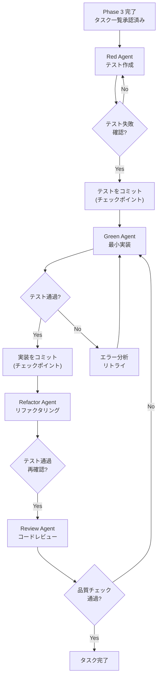

:::note
本記事はシリーズ「**J-SIX：Japanese SI Transformation**」の #3 です。シリーズ全体の概要は [#0 概要編](https://zenn.dev/seckeyjp/articles/j-six-00-overview) をご覧ください。
:::

## はじめに

J-SIX プロセスの中で、最も生産性に寄与するのが **Phase 4: TDD 実装** です。ここでは Claude Code（以下 CC）が自律的に TDD サイクルを回し、テスト作成・実装・リファクタリング・レビューまでを一気通貫で実行します。

「CC に自律実行させて大丈夫なのか？」という疑問は当然です。本記事では、なぜ TDD と組み合わせることで CC の自律実行が実用水準になるのかを、自律度の5段階モデルから解説し、ユーザー登録 API を題材にした具体的なワークスルーで「手を動かす」感覚をお伝えします。

## CC の自律実行、どこまで任せられるか

### 現実のデータ

まず、CC の自律実行能力をデータで確認します。

| 指標 | 数値 | 出典 |
|---|---|---|
| CC 初回自律実行成功率 | 約33% | Anthropic 社内報告[^anthropic-teams] |
| AI生成コードのイシュー率 | 人間の約1.7倍 | CodeRabbit 調査[^coderabbit] |
| セキュリティイシュー | 人間の最大2.74倍 | 同上[^coderabbit] |
| エラーハンドリングの抜け | 人間の約2倍 | 同上[^coderabbit] |

初回成功率33%という数値は、一見すると心もとなく映ります。しかしこれは「ガイダンスなしの自律実行」の数値です[^datacamp]。テストという明確な成功基準があり、リトライの仕組みがあれば、話は変わります。

CC は **「速いが雑な新人開発者」** に似た特性を持ちます（著者の解釈）。単純なタスクは高い成功率で完了しますが、複雑なタスクではミスが多い。ただし、テストによるフィードバックがあれば自己修正が可能です。

### 自律度の5段階モデル

CC にどこまで任せるかを判断するために、自動運転のレベル分類に着想を得た5段階モデルを定義しています[^autonomy-model]。

| Level | CC の動き | 人間の動き | 品質保証 |
|---|---|---|---|
| **L0: 手動** | 質問に回答 | 全て自分で実行 | 従来通り |
| **L1: CC支援** | コード補完・提案 | 提案を採否判断 | 人間のレビュー |
| **L2: CC主導** | コード生成・変更案作成 | 各変更を承認/却下 | 人間の逐次承認 |
| **L3: CC自律** | 自律的にコード生成・テスト実行・コミット | 結果を事後レビュー | 自動テスト + CC相互レビュー + 人間サンプリング |
| **L4: CC完全自律** | 全て自律実行 | 介入しない | 自動テスト + 自動品質チェックのみ |

### J-SIX の各 Phase と自律度

全ての Phase を同じ自律度で運用するわけではありません。**影響範囲が大きい判断ほど人間が行い、影響範囲が小さい実行ほど CC に任せる** のが基本原則です。

| Phase | 推奨自律度 | 根拠 |
|---|---|---|
| Phase 0: プロジェクト憲法策定 | L1 | CLAUDE.md は全ての基盤。人間が主導 |
| Phase 1: 要求の合意 | L1-L2 | 業務理解・顧客合意は人間の領域 |
| Phase 2: 技術設計 | L2 | アーキテクチャ判断は人間 |
| Phase 3: タスク分解 | L2 | 自律実行圏への最後のゲート |
| **Phase 4: TDD実装** | **L3-L4** | **TDD がガードレール** |
| Phase 5: 品質検証 | L2-L3 | 自動テスト + 人間サンプリング |
| Phase 6: ドキュメント生成 | L3 | CC自律生成 + 人間レビュー |

Phase 4 を **L3-L4 で運用する** ことが、J-SIX の生産性の源泉です。

## なぜ Phase 4 で L3-L4 が可能か — 3つのメカニズム

Phase 4 が高い自律度で運用できるのは、以下の3つのメカニズムが品質のガードレールとして機能するためです。

### メカニズム 1: TDD がガードレールとして機能する

テストが先に存在するため、CC には「テストを通す」という明確な成功基準があります。テストが通らない限りタスクは完了しません。Anthropic 社内でも TDD は CC と組み合わせる最も効果的なパターンとして活用されています[^anthropic-teams]。

### メカニズム 2: サブエージェント分離でコンテキスト汚染を防止

テスト作成者（Red Agent）と実装者（Green Agent）を CC のサブエージェントとして分離します。これにより、実装者がテストを改変して「通ったことにする」問題を防止できます[^alexop-tdd]。テストをコミットしてから実装にハンドオフすることで、追加の安全策となります[^anthropic-bp][^datacamp]。

### メカニズム 3: Writer/Reviewer パターンで自己バイアスを排除

コードを生成した CC とは別の CC インスタンスがレビューします。自分が書いたコードへのバイアスがないため、客観的なレビューが可能です[^anthropic-bp]。



## ワークスルー: ユーザー登録 API を TDD で実装する

ここからは、EC サイトの「ユーザー登録 API」を題材に、Phase 4 の TDD サイクルを具体的に追っていきます。

### 前提条件

- Phase 3 でタスクが承認済み
- CLAUDE.md が整備済み（コーディング規約、テスト方針、ADR ルール等）
- 技術スタック: TypeScript + Express + PostgreSQL + Jest

**タスク定義（Phase 3 の成果物）**:

```
タスク: USER-001 ユーザー登録API
受入条件:
  - POST /api/v1/users でユーザーを新規登録できる
  - email の重複チェックを行い、重複時は 409 を返す
  - パスワードは bcrypt でハッシュ化して保存
  - 成功時は 201 + ユーザー情報（パスワード除く）を返す
  - バリデーション: email 形式、パスワード8文字以上
依存: なし（並列実行可能）
```

### Step 1: CC にタスクを指示する

```
あなた:
  USER-001「ユーザー登録API」をTDDで実装してください。
  受入条件は以下の通りです。
  [受入条件を貼り付け]

  TDDの手順:
  1. まずテストを書いてください（Red Phase）
  2. テストが失敗することを確認してコミットしてください
  3. テストが通る最小の実装を書いてください（Green Phase）
  4. テストが通ることを確認してコミットしてください
  5. 必要ならリファクタリングしてください（Refactor Phase）
```

:::note
CLAUDE.md に TDD の手順を書いておけば、毎回この指示を繰り返す必要はありません。詳しくは [#4 CLAUDE.md 実践ガイド](https://zenn.dev/seckeyjp/articles/j-six-04-claude-md) で解説します。
:::

### Step 2: Red Phase — テスト作成

CC のサブエージェントがテストコードを生成します。この時点では実装が存在しないため、テストは必ず失敗します。

```typescript
// src/features/users/__tests__/register-user.test.ts

describe('POST /api/v1/users', () => {
  describe('正常系', () => {
    it('有効な入力でユーザーを登録し201を返す', async () => {
      const res = await request(app)
        .post('/api/v1/users')
        .send({
          email: 'test@example.com',
          password: 'password123',
          name: 'テスト太郎',
        });

      expect(res.status).toBe(201);
      expect(res.body).toHaveProperty('id');
      expect(res.body.email).toBe('test@example.com');
      expect(res.body).not.toHaveProperty('password');
    });
  });

  describe('バリデーション', () => {
    it('不正なemail形式で400を返す', async () => {
      const res = await request(app)
        .post('/api/v1/users')
        .send({ email: 'invalid', password: 'password123', name: '太郎' });

      expect(res.status).toBe(400);
    });

    it('8文字未満のパスワードで400を返す', async () => {
      const res = await request(app)
        .post('/api/v1/users')
        .send({ email: 'test@example.com', password: 'short', name: '太郎' });

      expect(res.status).toBe(400);
    });
  });

  describe('重複チェック', () => {
    it('既存emailで409を返す', async () => {
      await request(app)
        .post('/api/v1/users')
        .send({ email: 'dup@example.com', password: 'password123', name: '太郎' });

      const res = await request(app)
        .post('/api/v1/users')
        .send({ email: 'dup@example.com', password: 'password456', name: '次郎' });

      expect(res.status).toBe(409);
    });
  });

  describe('セキュリティ', () => {
    it('パスワードがハッシュ化されてDBに保存される', async () => {
      await request(app)
        .post('/api/v1/users')
        .send({ email: 'hash@example.com', password: 'password123', name: '太郎' });

      const user = await db.query(
        'SELECT password_hash FROM users WHERE email = $1',
        ['hash@example.com']
      );
      expect(user.rows[0].password_hash).not.toBe('password123');
    });
  });
});
```

CC がテストを実行し、失敗を確認してコミットします。

```
CC: テストを作成しました。実行して失敗を確認します。

$ npm test -- --testPathPattern=register-user

  FAIL  src/features/users/__tests__/register-user.test.ts
  ● POST /api/v1/users › 正常系 › 有効な入力でユーザーを登録し201を返す
    Cannot find module '../register-user.controller'

  Tests: 5 failed, 0 passed

テストが期待通り失敗しました。コミットします。

$ git add -A
$ git commit -m "test(users): ユーザー登録APIのテストを追加（Red Phase）"
```

ここでテストがコミットされることが重要です。このコミットが**チェックポイント**となり、次の Green Phase で CC がテストを改変した場合に diff で検出できます。

### Step 3: Green Phase — 最小実装

別のサブエージェントがテストを通す最小の実装を行います。

```
CC: テストを通す最小の実装を行います。

[CC がコントローラ、サービス、バリデーション等を生成]

テストを実行します。

$ npm test -- --testPathPattern=register-user

  PASS  src/features/users/__tests__/register-user.test.ts
  ✓ 有効な入力でユーザーを登録し201を返す (45ms)
  ✓ 不正なemail形式で400を返す (12ms)
  ✓ 8文字未満のパスワードで400を返す (8ms)
  ✓ 既存emailで409を返す (67ms)
  ✓ パスワードがハッシュ化されてDBに保存される (34ms)

  Tests: 5 passed

全テスト通過。コミットします。

$ git add -A
$ git commit -m "feat(users): ユーザー登録APIを実装（Green Phase）"
```

### Step 4: Refactor Phase — リファクタリング

さらに別のサブエージェントがリファクタリングを行います。テストが通り続けることを確認しながら改善します。

```
CC: リファクタリングの余地を確認します。

  - バリデーションロジックを共通ミドルウェアに抽出
  - エラーレスポンスのフォーマットを統一ヘルパーに移行
  - [リファクタリング実施]

テストを再実行して、リファクタリングが機能を壊していないことを確認します。

$ npm test -- --testPathPattern=register-user

  Tests: 5 passed

コミットします。

$ git add -A
$ git commit -m "refactor(users): バリデーションを共通ミドルウェアに抽出"
```

### Step 5: ADR の自動記録

CC が実装中に設計判断を行った場合、ADR（Architecture Decision Record）を自動的にドラフトします。

```
CC: パスワードのハッシュ化に bcrypt を使用する設計判断を行いました。
    ADR を作成します。
```

```markdown
# ADR-0005: パスワードハッシュに bcrypt を採用

## ステータス: 承認待ち

## コンテキスト
ユーザー登録APIでパスワードをハッシュ化して保存する必要がある。

## 判断
bcrypt を使用する。

## 検討した代替案

| 代替案 | 利点 | 欠点 | 却下理由 |
|---|---|---|---|
| argon2 | より新しいアルゴリズム | ライブラリ成熟度が低い | チームの経験不足 |
| scrypt | Node.js 標準 | チューニングが複雑 | bcrypt の方がシンプル |

## 結果
bcrypt は広く使われており、チーム内の知見も豊富。
パフォーマンス要件を満たすことを確認済み。
```

```
CC: 確認をお願いします。問題なければ承認してください。
```

人間は ADR の内容を確認・修正するだけで済みます。「なぜ bcrypt を選んだか」「なぜ argon2 ではないか」という設計判断の記録が、ほぼゼロコストで蓄積されていきます[^adr-auto]。

## エスカレーション — CC が人間に判断を仰ぐ場面

CC は自律実行中であっても、以下の条件では人間にエスカレーションします。これは CLAUDE.md や Hooks で事前に設定します。

| エスカレーション条件 | 理由 |
|---|---|
| Spec に記載のない要件が必要と判明 | 業務判断は人間の領域 |
| セキュリティに関わる判断 | リスク判断は人間が行うべき |
| 外部 IF 仕様の変更が必要 | 他システムへの影響は人間が判断 |
| テスト3回連続失敗 | 根本的な設計問題の可能性（著者推奨の閾値[^escalation]） |
| アーキテクチャ変更が必要 | 影響範囲が大きい |

### エスカレーションの実例: Spec 外の要件を発見した場合

```
CC: 実装中に確認事項があります。

  受入条件にはメールアドレスの確認（メール送信）について
  記載がありませんが、一般的なユーザー登録フローでは
  メールアドレスの確認ステップが必要です。

  以下のいずれかを選択してください:
  1. メール確認なしで登録完了（現在の受入条件通り）
  2. メール確認フローを追加（Spec の更新が必要）
  3. この判断を保留し、後続タスクで対応

  どちらにしますか？
```

CC は Spec に記載のない要件を勝手に実装しません。これが「判断は人間、実行は CC」という原則の実践です。

### エスカレーションの実例: テスト3回連続失敗

```
CC: ⚠️ エスカレーション: テストが3回連続で失敗しました。

  失敗しているテスト: 既存emailで409を返す

  試行1: unique constraint の catch が不完全
  試行2: PostgreSQL のエラーコード判定を修正したが別のテストが壊れた
  試行3: トランザクション分離レベルの問題の可能性

  根本的な設計判断が必要かもしれません。
  現在のDB設計（unique constraint vs アプリ層でのチェック）について
  方針を確認してください。
```

3回連続失敗は「CC の能力不足」ではなく「設計レベルの問題」であることが多いため、人間の判断を仰ぐのが適切です。

## 並列実行 — Agent Teams + git worktree

Phase 4 の生産性をさらに高めるのが**並列実行**です。依存関係のないタスクを複数の CC セッションで同時に実行します。

```
ターミナル配置（tmux / Agent Teams）:

┌─────────────────────┬─────────────────────┐
│ CC Session 1        │ CC Session 2        │
│ (USER-001)          │ (USER-002)          │
│ ユーザー登録API     │ ユーザー検索API     │
│                     │                     │
│ [TDD中...]          │ [TDD中...]          │
│ 🟢 Green Phase      │ 🔴 Red Phase        │
├─────────────────────┼─────────────────────┤
│ CC Session 3        │ メイン（監視）      │
│ (USER-003)          │                     │
│ ユーザー更新API     │ $ git log --oneline │
│                     │ 品質ダッシュボード   │
│ [待機: USER-001依存]│                     │
└─────────────────────┴─────────────────────┘
```

実現手段は以下の組み合わせです。

- **git worktree**: 各タスクが独立した作業ディレクトリを持つため、ブランチの競合を回避できる
- **Agent Teams**: 複数の CC インスタンスが共有タスクリストで協調する（2026年3月時点では実験的機能[^agent-teams]）
- **tmux / デスクトップアプリ**: 複数セッションの管理

並列実行時の自律度は、タスクの性質によって使い分けます。

| パターン | 推奨自律度 | 理由 |
|---|---|---|
| 独立タスクの並列（依存関係なし） | L4 | 相互影響がないため完全自律可能 |
| 依存タスクの逐次実行 | L3 | 先行タスクの結果を踏まえた判断が必要 |
| 共有リソースを操作するタスク | L2-L3 | 競合リスクがあるため人間の監督が必要 |

## 「初回成功率33%」への対処 — リトライ前提の設計

CC の初回成功率が約33%[^anthropic-teams]であることは、**リトライを前提としたプロセス設計**が必要であることを意味します。ここで重要なのが「Ralph Wiggum パターン」と呼ばれるアプローチです[^ralph-wiggum]。

### Ralph Wiggum パターン（成功基準定義型自律実行）

1. **成功基準を事前に定義する** — テスト通過 + 品質チェック通過
2. **CC に自律実行させる**
3. **失敗した場合、CC が自動的にエラーを分析してリトライ**
4. **成功するまで繰り返す**（上限回数あり）
5. **上限を超えたら人間にエスカレーション**

このパターンが機能するための前提条件は3つです。

- **成功基準が明確**であること（= テストが書かれていること）
- **チェックポイント**があり、いつでもロールバック可能であること
- **リトライ上限**が設定されていること

つまり、TDD とチェックポイントを組み合わせた Phase 4 の設計は、まさにこのパターンを実現するものです。

### コスト考慮

リトライはトークンを消費します。タスクの複雑さに応じたコスト最適化も必要です。

| パターン | 平均リトライ回数（著者推定） | コスト影響 |
|---|---|---|
| CRUD 実装 | 1-2回 | 低 |
| ビジネスロジック実装 | 2-4回 | 中 |
| 複雑なアルゴリズム | 3-6回 | 高 |
| 外部 IF 連携 | 3-5回 | 高 |

コスト最適化の方針としては、単純タスクには Sonnet（高速・低コスト）、複雑タスクには Opus（高精度・リトライ減でトータル安価）を使い分けることが有効です。

## Hook によるガードレールの実装

CC の自律実行を支えるもう一つの重要な要素が **Hooks** です。以下のような構成で、自律実行中の品質を自動的に担保します。

```
hooks/
├── pre-commit/
│   ├── coverage-check.sh        # カバレッジ閾値チェック
│   ├── lint-check.sh            # Lint チェック
│   ├── security-scan.sh         # セキュリティスキャン
│   └── forbidden-files.sh       # 変更禁止ファイルの検出
├── pre-tool-use/
│   ├── dangerous-command.sh     # 危険なコマンドの検出
│   └── production-guard.sh      # 本番環境操作の検出
├── post-tool-use/
│   └── adr-check.sh             # 設計判断の検出 → ADR 提案
└── stop/
    ├── quality-gate.sh           # Phase 完了時の品質ゲート判定
    └── retry-monitor.sh          # 連続失敗時のエスカレーション
```

Hooks は CC のネイティブ機能であり、外部ツールへの依存なしにガードレールを構築できます[^anthropic-autonomous]。

## 段階的に自律度を引き上げる

日本の SI 案件では、いきなり L3-L4 を適用することへの組織的・心理的抵抗が予想されます。段階的に自律度を引き上げるアプローチを推奨します。

**Step 1: L1-L2 で信頼を構築する（1-2ヶ月）**

CC がコードを生成し、人間が毎回レビュー・承認します。品質メトリクスを記録して CC 生成コードの品質を定量的に把握する期間です。

**Step 2: L3 へ移行する（2-3ヶ月）**

単純な CRUD 実装から CC の自律実行を開始します。前提として TDD フローが確立され、Hooks によるガードレールが設定済みであること。人間のレビューは事後サンプリングに移行します。

**Step 3: L4 へ移行する（3ヶ月以降）**

独立性の高いタスク（依存関係なし、影響範囲小）から完全自律に移行します。人間は品質ダッシュボードの監視と、異常検知時の介入に集中します。

## まとめ — Phase 4 を回すための3つのポイント

1. **TDD + サブエージェント分離 + Writer/Reviewer** の3つのメカニズムがあるから、CC の自律実行が実用水準になる
2. **エスカレーション条件を明確に定義** しておけば、CC は「判断すべきでない場面」を自動的に検出して人間に委ねる
3. **リトライ前提の設計**（Ralph Wiggum パターン）で、初回成功率33%でも生産性は確保できる

Phase 4 は「CC に丸投げする」フェーズではありません。テストという明確な成功基準、Hooks によるガードレール、エスカレーションによる人間の介入ポイントを設計した上で、CC の実行速度を最大限に活かすフェーズです。

まずは小さなタスク1つを TDD で CC に実装させるところから試してみてください。テストが通った瞬間の「これは使える」という感覚が、次のステップへのモチベーションになるはずです。

---

J-SIX の全ドキュメント・テンプレートは GitHub で公開しています。

https://github.com/SeckeyJP/j-six

## シリーズ記事

| # | タイトル | 状態 |
|---|---|---|
| #0 | [J-SIX 概論 — なぜ今、日本のSI開発プロセスを再設計するのか](https://zenn.dev/seckeyjp/articles/j-six-00-overview) | 公開済 |
| #1 | [V字モデルの前提崩壊と SDD の台頭](https://zenn.dev/seckeyjp/articles/j-six-01-sdd) | 公開済 |
| #2 | [3層ドキュメント戦略 — 設計書は「逆生成」の時代へ](https://zenn.dev/seckeyjp/articles/j-six-02-3layer-doc) | 公開済 |
| **#3** | **本記事（TDD × Claude Code）** | ✅ |
| #4 | [CLAUDE.md 実践ガイド — AI開発の「プロジェクト憲法」を書く](https://zenn.dev/seckeyjp/articles/j-six-04-claude-md) | 公開済 |
| #5 | [V字モデルからの段階的移行 — 既存案件を止めずに J-SIX へ](https://zenn.dev/seckeyjp/articles/j-six-05-migration) | 公開済 |

## 参考文献

[^anthropic-teams]: Anthropic. "How Anthropic teams use Claude Code" (2025.07). https://claude.com/blog/how-anthropic-teams-use-claude-code
[^coderabbit]: CodeRabbit. "State of AI vs Human Code Generation Report" (2025.12). https://www.coderabbit.ai/blog/state-of-ai-vs-human-code-generation-report
[^datacamp]: DataCamp. "Claude Code Best Practices" (2026.03). https://www.datacamp.com/tutorial/claude-code-best-practices
[^anthropic-bp]: Anthropic. "Best Practices for Claude Code". https://code.claude.com/docs/en/best-practices
[^alexop-tdd]: alexop.dev. "Forcing Claude Code to TDD: An Agentic Red-Green-Refactor Loop" (2025.11). https://alexop.dev/posts/custom-tdd-workflow-claude-code-vue/
[^ralph-wiggum]: JIN. "Claude Code's New Autonomous Execution: The Ralph Wiggum Pattern" (2026.02). https://jinlow.medium.com/claude-codes-new-autonomous-execution-the-ralph-wiggum-pattern-that-s-reshaping-ai-development-3cb9c13d169b
[^anthropic-autonomous]: Anthropic. "Enabling Claude Code to work more autonomously". https://www.anthropic.com/news/enabling-claude-code-to-work-more-autonomously
[^agent-teams]: ClaudeFast. "Claude Code Agent Teams: The Complete Guide 2026". https://claudefa.st/blog/guide/agents/agent-teams
[^adr-auto]: Adolfi.dev. "AI generated Architecture Decision Records" (2025.11). https://adolfi.dev/blog/ai-generated-adr/
[^autonomy-model]: 自律度5段階モデル（L0-L4）は SAE J3016（自動運転レベル分類）に着想を得た著者のオリジナル分類。
[^escalation]: エスカレーション条件の閾値は著者推奨。プロジェクト特性に応じて調整すべき。
