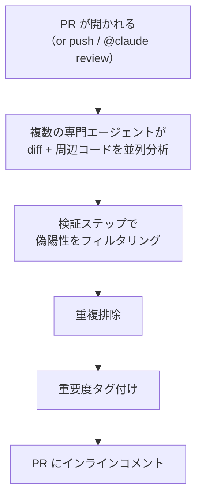
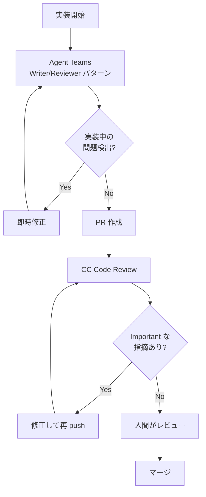
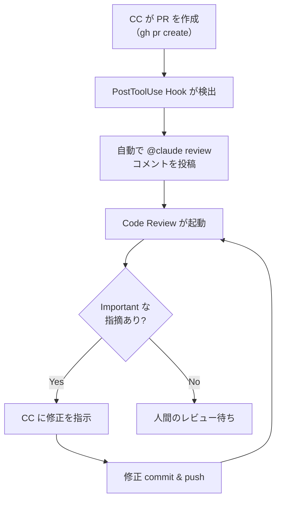

:::note
本記事はシリーズ「**J-SIX：Japanese SI Transformation**」の番外編です。シリーズ全体の概要は [#0 概要編](https://zenn.dev/seckeyjp/articles/j-six-00-overview)、TDD のアンチパターンは [TDD × AI の10のアンチパターン](https://zenn.dev/seckeyjp/articles/j-six-tdd-antipatterns) をご覧ください。
:::

## はじめに

AI が生成するコードのイシュー率は人間の約1.7倍、セキュリティイシューに限れば最大2.74倍[^coderabbit]。Claude Code（以下 CC）をはじめとする AI コーディングツールの普及により、コードの生成速度は飛躍的に向上しました。しかし速度の向上は、品質の向上を意味しません。

レビューの重要性は増すばかりですが、人間のレビューには構造的な限界があります。PR が大きくなるほどレビューの精度は下がり、1,000行を超える PR は「LGTM」で通されやすい——これは多くの開発者が経験的に知っていることです。

2026年3月、Anthropic は **CC Code Review** をリリースしました[^code-review]。複数の専門エージェントが PR を並列分析し、ロジックエラー、セキュリティ脆弱性、エッジケースの見落としを検出します。大規模 PR（1,000行以上）の84%で指摘が見つかり、平均7.5件の問題を検出するというデータもあります[^buildfastwithai]。

本記事では、CC Code Review のセットアップから REVIEW.md によるカスタマイズ、既存ワークフローとの統合まで実践的に解説します。

## 1. Code Review とは何か

CC Code Review は2026年3月にリリースされた、Team / Enterprise プラン向けの研究プレビュー機能です[^code-review]。Anthropic のインフラ上でマネージドサービスとして動作し、ユーザー側のインフラ構築は不要です。

### レビューの仕組み

レビューは以下のフローで進行します。



単一のエージェントではなく、**複数の専門エージェント**が並列で分析を行う点が特徴です[^newstack]。あるエージェントはロジックエラーに注目し、別のエージェントはセキュリティ脆弱性を探し、さらに別のエージェントがエッジケースを検証する——といった分業が行われます。その後、検証ステップで偽陽性がフィルタリングされ、重複する指摘が排除された上で、重要度が付与されます。

### 重要度レベル

検出された問題には3段階の重要度が付けられます[^code-review-docs]。

| マーカー | 重要度 | 意味 |
|---|---|---|
| 🔴 | Important | マージ前に修正すべきバグ・脆弱性 |
| 🟡 | Nit | 軽微な改善提案。修正推奨だがブロックしない |
| 🟣 | Pre-existing | この PR で導入されたものではない既存の問題 |

Pre-existing（🟣）が分離されている点は実用上重要です。レビューコメントで「これは既存のバグです」と明示されることで、PR 作成者が不必要な責任を感じることなく、技術的負債の発見にもつながります。

### PR をブロックしない

CC Code Review は **neutral conclusion**（中立的結論）で終了し、PR をブロックしません[^code-review-docs]。これは意図的な設計です。研究プレビューの段階で誤検出によるブロックが発生すると、開発フローに悪影響を与えるためです。ブロックが必要な場合の対処法はセクション6で解説します。

## 2. セットアップ

セットアップは3ステップで完了します。前提として、Team または Enterprise プランの契約と、GitHub リポジトリが必要です[^code-review-docs]。

### 手順

1. **Code Review を有効化**: `claude.ai/admin-settings/claude-code` で Code Review をオンにする
2. **Claude GitHub App をインストール**: Contents, Issues, Pull requests の権限を付与する
3. **レビュー対象リポジトリを選択**: 全リポジトリまたは特定リポジトリを指定する

### トリガー設定

レビューのトリガーは3種類から選択できます[^code-review-docs]。

| トリガー | 動作 | コスト目安 |
|---|---|---|
| Once after PR creation | PR 作成時に1回レビュー | 低 |
| After every push | push ごとに毎回レビュー | 高 |
| Manual | コメントで手動起動 | 最低 |

コスト管理の観点からは、**Manual モード** から始めることを推奨します。レビューコストは1回あたり $15-25（PR サイズに依存）であり[^buildfastwithai]、After every push を有効にすると、WIP の push でもレビューが走りコストが膨らみます。

### 手動トリガーの使い方

PR のコメント欄に以下のコマンドを入力します。

- `@claude review` — レビューを開始し、以降の push でも自動レビューを継続
- `@claude review once` — 1回限りのレビューを実行

チーム内で「レビュー依頼時に `@claude review once` を付ける」というルールを設けるだけで、既存のワークフローをほぼ変更せずに導入できます。

## 3. REVIEW.md でレビューをカスタマイズする

CC Code Review はデフォルトでも有用ですが、プロジェクト固有のルールを REVIEW.md で定義することで、検出精度が大きく向上します[^code-review-docs]。

### CLAUDE.md との違い

| | CLAUDE.md | REVIEW.md |
|---|---|---|
| 用途 | CC 全般のプロジェクトルール | レビュー専用のルール |
| 適用範囲 | コード生成、質問応答、レビューなど | Code Review のみ |
| 配置場所 | リポジトリルートまたはサブディレクトリ | リポジトリルート |

CLAUDE.md に書いたルールは CC のすべての操作に影響しますが、レビュー固有のルール（例: 「自動生成ファイルはスキップ」）は REVIEW.md に分離した方が管理しやすくなります。

### REVIEW.md の記述例

```markdown
# Code Review Guidelines

## Always check
- 新しい API エンドポイントに統合テストがあること
- DB マイグレーションが後方互換であること
- エラーメッセージが内部情報を漏らしていないこと
- パスワードやトークンがログに出力されていないこと

## Style
- 早期リターンを推奨（ネストした条件分岐より）
- 構造化ログを使用（f-string ログ禁止）

## Skip
- src/gen/ 配下の自動生成ファイル
- *.lock ファイルのフォーマット変更
```

`Always check` セクションで「必ず確認すべき項目」を、`Skip` セクションで「レビュー対象外」を明示します。これにより、自動生成ファイルへの不要な指摘を排除しつつ、プロジェクト固有のセキュリティルールを強制できます。

### J-SIX プロジェクトでの推奨 REVIEW.md

J-SIX シリーズで取り上げてきたプラクティスに基づく推奨設定です。

```markdown
# Code Review Guidelines — J-SIX Project

## Always check
- テストが実装より先にコミットされていること（TDD フロー）
- テストのアサーションが仕様書の期待値と一致すること
- 新しいアーキテクチャ判断に対応する ADR が作成されていること
- 認証・認可の変更にセキュリティレビューコメントがあること

## TDD antipatterns to detect
- テストと実装が同じ計算ロジックを重複していないか（トートロジカルテスト）
- カバレッジが高いが境界値テストが欠落していないか
- モックが過剰で実際の結合を検証していないか

## Style
- 早期リターンを推奨
- エラーハンドリングは具体的な型で（catch(e) の丸呑み禁止）

## Skip
- docs/adr/ 配下のフォーマットのみの変更
- 自動生成された型定義ファイル
```

[TDD × AI の10のアンチパターン](https://zenn.dev/seckeyjp/articles/j-six-tdd-antipatterns)で取り上げたパターン④（トートロジカルテスト）やパターン⑤（カバレッジ詐称）を REVIEW.md で検出ルールとして定義することで、CC が生成するテストの品質を構造的にチェックできます。

## 4. 実績データと ROI

CC Code Review の効果を示すデータを整理します。

### 検出実績

| PR サイズ | 指摘あり率 | 平均指摘数 |
|---|---|---|
| 大規模（1,000行以上） | 84% | 7.5件 |
| 小規模（50行未満） | 31% | 0.5件 |

大規模 PR での検出率84%は注目に値します[^buildfastwithai]。人間のレビューでは大きな PR ほど見落としが増える傾向がありますが、CC Code Review は PR サイズの影響を受けにくい構造です。

誤検出率は1%未満と報告されています[^buildfastwithai]。エンジニアがレビューコメントを確認し、「この指摘は間違っている」と判定した割合です。検証ステップによる偽陽性フィルタリングが効いている結果といえます。

### Anthropic 社内での効果

Anthropic 自身もこの機能を社内で使用しており、レビュー深度（reviewer depth）が **16%から54%に向上** したと報告しています[^code-review]。「レビュー深度」はレビューがコードの本質的な問題にどれだけ踏み込んでいるかの指標であり、スタイルやフォーマットの指摘ではなくロジックやセキュリティの問題検出に集中できるようになった結果です。

### ROI の考え方

1回のレビューコストは $15-25 です[^buildfastwithai]。これを「高い」と感じるかどうかは、比較対象によります。

- 本番環境でバグが発覚した場合の修正コスト（調査、修正、テスト、デプロイ、顧客対応）
- セキュリティインシデントの対応コスト
- 人間のシニアエンジニアがレビューに費やす時間の人件費

$20 のレビューで Important（🔴）の指摘が1件でも見つかれば、本番到達前の修正コストとの差額を考えるとROIは十分に合います。逆に、小規模 PR（50行未満）は指摘率が31%であり、毎回レビューを走らせるよりも Manual モードで必要に応じて実行する方がコスト効率は良いでしょう。

## 5. TDD アンチパターン記事との接続

[TDD × AI の10のアンチパターン](https://zenn.dev/seckeyjp/articles/j-six-tdd-antipatterns)では、パターン⑩として**自己レビューバイアス**を取り上げました。CC が書いたコードを同じ CC がレビューしても、生成時と同じバイアスがかかるため、問題を見逃しやすいという構造的な課題です。

CC Code Review はこの問題を**エージェント分離**で解決します。コードを書いた CC セッションとは完全に独立した、Anthropic インフラ上の別のエージェント群がレビューを行います。生成コンテキストに引きずられることがないため、バイアスのない検証が可能です。

### Agent Teams の Writer/Reviewer パターンとの比較

[Agent Teams 実践ガイド](https://zenn.dev/seckeyjp/articles/j-six-agent-teams)で紹介した Writer/Reviewer パターンとの違いを整理します。

| | Agent Teams Writer/Reviewer | Code Review |
|---|---|---|
| タイミング | 実装中（リアルタイム） | PR 作成後 |
| スコープ | 1タスク単位 | PR 全体（複数タスクを横断） |
| コスト | セッション内トークン消費 | $15-25/review |
| セットアップ | プロンプト設計が必要 | GitHub App インストールのみ |
| カスタマイズ | CLAUDE.md + プロンプト | REVIEW.md |

これらは競合するものではなく、**補完関係**にあります。



Agent Teams で実装中にリアルタイムレビューを行い、PR 作成後に Code Review で最終チェックをかける。この**二段構え**が、AI 生成コードの品質を最大化する構成です。

## 6. 既存ワークフローとの統合

CC Code Review は PR をブロックしない設計ですが、チームの要件によってはブロックが必要な場合もあります。ここでは既存ワークフローとの統合パターンを紹介します。

### CI でマージをブロックする

Code Review の結果は GitHub の check run として出力されます。この出力を CI で解析することで、Important な指摘がある場合にマージをブロックできます[^code-review-docs]。

```bash
# check run の結果から重要度を抽出
gh api repos/OWNER/REPO/check-runs/CHECK_RUN_ID \
  --jq '.output.text | split("bughunter-severity: ")[1] | split(" -->")[0] | fromjson'
```

出力例:

```json
{"normal": 2, "nit": 1, "pre_existing": 0}
```

`normal`（Important に相当）が0より大きい場合に CI を失敗させることで、マージブロックを実現できます。

### Hooks との組み合わせ

[CC Hooks 実践ガイド](https://zenn.dev/seckeyjp/articles/j-six-hooks-guide)で解説した Hooks を活用し、PR 作成を検出して自動的にレビューをトリガーする構成も可能です。PostToolUse フックで `gh pr create` の実行を検出し、自動で `@claude review` コメントを投稿するスクリプトを組み合わせます。



この構成により、Manual モードでもレビュー依頼の手間を省きつつ、コスト管理（After every push ではなく PR 作成時のみ）を両立できます。

### Scheduled Tasks との組み合わせ

大規模チームでは、日次で未レビュー PR を検出して一括レビューを実行するスケジュール運用も考えられます。CC の Scheduled Tasks 機能を使い、毎朝定時にオープンな PR を走査し、レビューが未実施のものに `@claude review once` を投稿するスクリプトを組むことで、レビュー漏れを防止できます。

## 7. 制限事項

CC Code Review を導入する前に知っておくべき制限事項を整理します。

**プラン制限**: Team / Enterprise プランのみ利用可能です。個人プラン（Pro, Max）では使用できません[^code-review-docs]。

**Zero Data Retention**: Zero Data Retention（ZDR）が有効な組織では使用できません[^code-review-docs]。レビューのためにコードを Anthropic インフラ上で処理する必要があるためです。

**対応プラットフォーム**: GitHub のみ対応しています。GitLab や Bitbucket を使用している場合は、GitHub Actions や GitLab CI/CD を介した代替手段を検討する必要があります[^code-review-docs]。

**所要時間**: 1レビューあたり平均20分程度かかります[^buildfastwithai]。即時フィードバックではないため、「push したらすぐ結果が欲しい」という期待には合いません。CI の一部として位置づけ、非同期で結果を待つ運用が適しています。

**コスト**: PR サイズに比例して $15-25 のコストが発生します[^buildfastwithai]。push ごとにレビューを走らせる設定では、high-traffic なリポジトリでコストが急増します。Manual モードでの運用開始を推奨します。

**ブロック不可**: 前述の通り、Code Review 単体では PR をブロックしません。ブロックが必要な場合は CI との連携が必要です。

## まとめ

AI が書くコードが増えている以上、AI がレビューする仕組みの導入は合理的な選択です。CC Code Review は、複数の専門エージェントによる並列分析、偽陽性フィルタリング、重要度タグ付けという仕組みで、大規模 PR の84%から問題を検出し、誤検出率は1%未満に抑えています[^buildfastwithai]。

導入にあたって推奨するステップは以下の通りです。

1. **まず Manual モード** + `@claude review once` で数件の PR を試す（低リスク、低コスト）
2. **REVIEW.md を整備**して、プロジェクト固有のルールを追加する
3. 効果を確認したら、**Once after PR creation** に切り替える
4. 必要に応じて **CI 連携**でマージブロックを設定する

[Agent Teams](https://zenn.dev/seckeyjp/articles/j-six-agent-teams) による実装中のリアルタイムレビューと、Code Review による PR 作成後の最終チェック。この二段構えが、AI 時代のコード品質を支える実践的な構成です。

すべての PR に使う必要はありません。まずは「大きな PR」や「セキュリティに関わる変更」に絞って試してみてください。$20 のレビューで1件のバグを本番到達前に止められれば、それだけで十分な投資対効果です。

---

J-SIX の全ドキュメント・テンプレートは GitHub で公開しています。

https://github.com/SeckeyJP/j-six

[^code-review]: Anthropic. "Code Review for Claude Code" (2026.03). https://claude.com/blog/code-review
[^code-review-docs]: Anthropic. "Code Review - Claude Code Docs". https://code.claude.com/docs/en/code-review
[^coderabbit]: CodeRabbit. "State of AI vs Human Code Generation Report" (2025.12). https://www.coderabbit.ai/blog/state-of-ai-vs-human-code-generation-report
[^newstack]: The New Stack. "Anthropic launches a multi-agent code review tool for Claude Code". https://thenewstack.io/anthropic-launches-a-multi-agent-code-review-tool-for-claude-code/
[^techcrunch]: TechCrunch. "Anthropic launches code review tool to check flood of AI-generated code" (2026.03). https://techcrunch.com/2026/03/09/anthropic-launches-code-review-tool-to-check-flood-of-ai-generated-code/
[^anthropic-teams]: Anthropic. "How Anthropic teams use Claude Code" (2025.07). https://claude.com/blog/how-anthropic-teams-use-claude-code
[^buildfastwithai]: BuildFastWithAI. "Is Claude Code Review Worth $15-25 Per PR?". https://www.buildfastwithai.com/blogs/claude-code-review-guide
