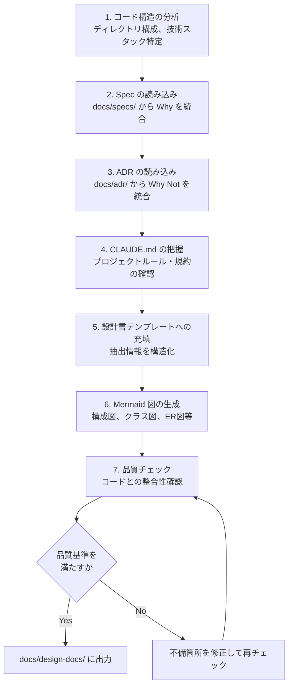
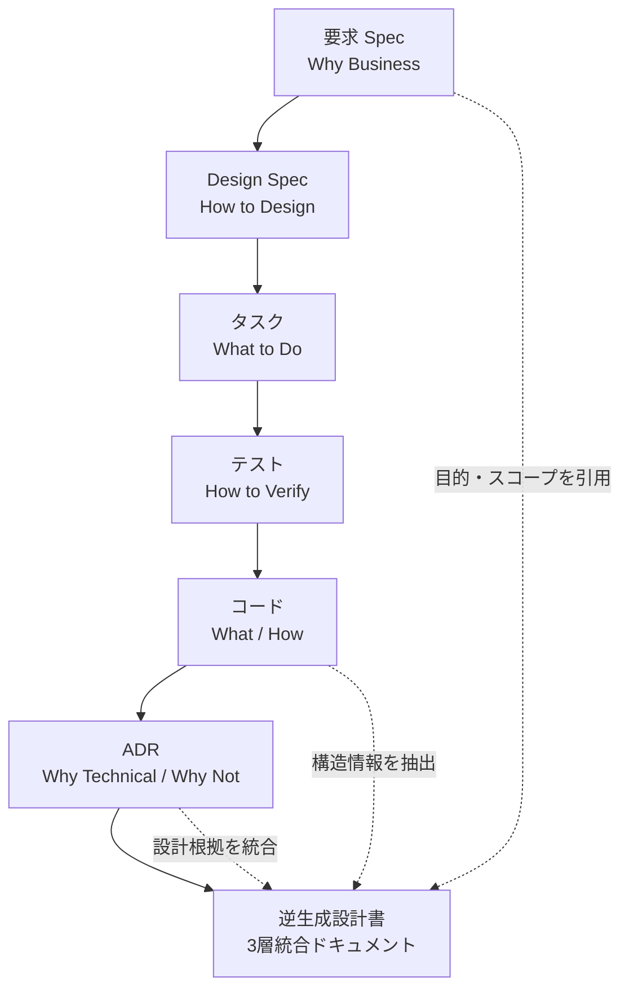
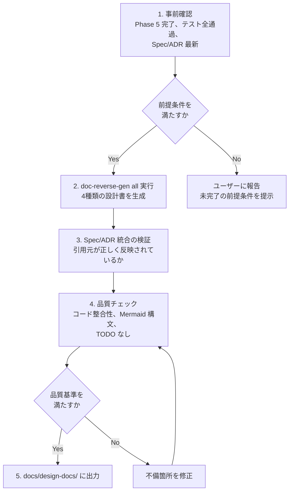

:::note
本記事は「**J-SIX：Japanese SI Transformation**」シリーズの番外編です。シリーズ全体の概要は[#0 概要編](https://zenn.dev/seckeyjp/articles/j-six-00-overview)をご覧ください。3層ドキュメント戦略の背景と理論は[#2 3層ドキュメント](https://zenn.dev/seckeyjp/articles/j-six-02-3layer-doc)で解説しています。
:::

## はじめに — 「逆生成」の実装編

[シリーズ #2](https://zenn.dev/seckeyjp/articles/j-six-02-3layer-doc) では、「設計書はなくならない。作り方が変わる」と提案しました。コードを Source of Truth として、設計書を逆生成するアプローチです。

本記事はその**実装編**です。J-SIX の Phase 6 では、コードから基本設計書・詳細設計書・IF設計書・DB設計書の4種類を自動生成します。J-SIX Plugin の `doc-reverse-gen` Skill を使って、具体的にどう生成するかを解説します。

#2 記事では「なぜ逆生成か」を論じました。本記事では「どう逆生成するか」に焦点を当てます。

## 1. なぜ「逆生成」なのか

従来のV字モデルでは、設計書を書いてから実装に入ります。しかし、実装が進むにつれて設計書とコードが乖離し、手戻りが発生するのは日常的な光景です。

```
従来: 設計書 → 実装 → 乖離発覚 → 手戻り → 設計書修正 → また乖離...
```

J-SIX ではこのフローを逆転させます。

```
J-SIX: Spec → TDD実装 → 品質検証 → 設計書の逆生成
```

コードが Source of Truth なので、設計書とコードの乖離は**原理的にゼロ**です。生成のたびに「今のコード」を正確に反映した設計書が得られます。

このアプローチは J-SIX 独自のものではありません。富士通は2025年にAIによる設計書リバースエンジニアリングサービスを発表し、手動比50%の効率化を報告しています[^fujitsu]。業界全体がこの方向に動き始めています。

ただし、[#2 で詳しく分析した通り](https://zenn.dev/seckeyjp/articles/j-six-02-3layer-doc)、コードからは「なぜそう設計したか（Why）」と「なぜ他の方法を採らなかったか（Why Not）」は復元できません。この限界を補うのが3層ドキュメント戦略であり、本記事で扱う `doc-reverse-gen` Skill は第3層（What/How）の生成を担当します。第1層（Spec）と第2層（ADR）の情報を統合して設計書に反映する仕組みも備えています。

## 2. 4種類の設計書

`doc-reverse-gen` Skill は、以下の4種類の設計書を生成します。それぞれの生成元と出力内容を説明します。

### 基本設計書（basic）

システム全体像を把握するための設計書です。

**生成元**:
- エントリポイント（main, index, app）
- ルーティング定義、ミドルウェア構成
- 設定ファイル（config, env.example）
- package.json / requirements.txt / go.mod 等
- Spec（目的・スコープの引用）
- ADR（設計判断の根拠）

**出力内容**:
- システム概要（Spec から引用）
- アーキテクチャ図（Mermaid でシステム構成図を自動生成）
- 主要コンポーネント一覧と責務
- 機能一覧（ルーティング・コントローラ・サービス層から抽出）
- データフロー（コードの呼び出し関係から生成）
- 非機能設計（Spec + 実装から）
- 設計判断の根拠（ADR から自動統合、各判断にADR番号を付記）

### 詳細設計書（detail）

モジュール/クラスレベルの仕様を記述する設計書です。

**生成元**:
- クラス定義、型定義（interface, type, struct）
- 関数シグネチャとJSDoc/docstring
- バリデーションロジック
- エラーハンドリング
- テストコード（仕様の補完情報として活用）

**出力内容**:
- モジュール概要と責務
- クラス/関数設計（パラメータ、戻り値、例外処理、処理フロー）
- クラス図、シーケンス図（Mermaid で自動生成）
- 状態遷移図（enum、状態管理コードがある場合）
- バリデーションルール一覧
- 該当モジュールの ADR

### IF設計書（if）

API と外部/内部インターフェースの仕様書です。

**生成元**:
- ルーティング定義 + コントローラ
- APIスキーマ定義（OpenAPI, Zod, Joi 等）
- HTTPクライアント呼び出し
- メッセージキュー Producer/Consumer
- gRPC / GraphQL スキーマ

**出力内容**:
- APIエンドポイント一覧表（メソッド、パス、概要、認証要否）
- 各エンドポイントのリクエスト/レスポンス仕様
- エラーレスポンス定義
- 外部連携インターフェース（連携先、プロトコル、データ形式）
- イベント/メッセージ仕様（該当する場合）
- 内部モジュール間インターフェース

### DB設計書（db）

データベースの構造と設計を記述する設計書です。

**生成元**:
- マイグレーションファイル
- ORMモデル定義（Prisma, TypeORM, SQLAlchemy, GORM 等）
- Repository / DAO 層
- スキーマ定義ファイル

**出力内容**:
- ER図（Mermaid で自動生成）
- テーブル定義（カラム名、型、制約、デフォルト値、説明）
- インデックス一覧
- 外部キー制約
- マイグレーション履歴
- データアクセスパターン（主要なクエリパターン、N+1対策、トランザクション境界）
- DB関連の ADR

## 3. 実践: doc-reverse-gen Skill を使う

### 前提条件

`doc-reverse-gen` を実行する前に、Phase 5（品質検証）が完了していることが前提です。テストが全て通り、Spec と ADR が最新の状態であることを確認してください。

### 実行コマンド

4種類すべてを一括生成する場合:

```
/doc-reverse-gen all
```

個別に生成する場合:

```
/doc-reverse-gen basic
/doc-reverse-gen detail
/doc-reverse-gen if
/doc-reverse-gen db
```

対象パスを指定して特定ディレクトリのみを解析することも可能です:

```
/doc-reverse-gen detail src/modules/auth
```

### 生成プロセス

`doc-reverse-gen` は以下の手順でコードから設計書を生成します。



### 解析対象の詳細

共通の解析ステップとして、まずプロジェクト全体の構造を把握します。

1. **ディレクトリ構成**: プロジェクトの全体像を把握
2. **技術スタック**: 言語、フレームワーク、DB、外部連携を特定
3. **Spec**: `docs/specs/` から要求 Spec と Design Spec を読み込み
4. **ADR**: `docs/adr/` から全ての ADR を読み込み
5. **CLAUDE.md**: プロジェクト固有のルール・規約を確認

この情報をもとに、各種別の設計書テンプレートに情報を充填していきます。

### 出力先と品質チェック

生成された設計書は `docs/design-docs/` ディレクトリに出力されます。

| 種別 | 出力ファイル |
|---|---|
| 基本設計書 | `docs/design-docs/basic-design.md` |
| 詳細設計書 | `docs/design-docs/detail-design-[モジュール名].md` |
| IF設計書 | `docs/design-docs/if-design.md` |
| DB設計書 | `docs/design-docs/db-design.md` |

生成後、以下の品質チェックを自動で実行します。

- [ ] コードに存在する機能が設計書に漏れなく記載されているか
- [ ] 設計書に記載された内容がコードと一致しているか
- [ ] Spec の要件が設計書でカバーされているか
- [ ] ADR の判断が適切なセクションに統合されているか
- [ ] Mermaid 図の構文が正しいか
- [ ] `[TODO]` や `[要確認]` マークが残っていないか（残っている場合はユーザーに報告）

**コードに存在しない機能を設計書に書かない**、**推測で補完せず不明点は `[要確認]` と明示する**というルールが徹底されています。これは「設計書が実態より立派に見える」という従来の問題を防ぐための設計です。

## 4. Spec と ADR の統合 — 3層が合流する瞬間

`doc-reverse-gen` の最大の特徴は、単にコードから構造情報を抽出するだけでなく、3層ドキュメントの情報を1つの設計書に統合する点です。

### 第1層（Spec）の統合

要求 Spec の内容は、設計書の「目的」「スコープ」「制約条件」セクションに引用されます。「なぜこのシステムを作るのか」という業務背景が設計書に組み込まれます。

```markdown
## 1. システム概要
- 目的（← Spec から引用）
- スコープ（← Spec から引用）

> 出典: docs/specs/requirement-spec.md#システム概要
```

### 第2層（ADR）の統合

ADR の内容は、設計書の「設計判断の根拠」セクションに自動統合されます。「なぜこの技術を選んだのか」「なぜ他の方法を採らなかったのか」が、該当する設計箇所に注記されます。

```markdown
## 6. 設計判断の根拠

> ADR-0003: セッション管理に Redis を採用
> - 理由: スケールアウト時のセッション共有が容易、TTL による自動失効
> - 却下案: PostgreSQL（性能要件を満たさない）、JWT（即時無効化が困難）
```

### 第3層（コード）の統合

コードから抽出された構造情報が設計書の本体を構成します。クラス構造、API定義、DBスキーマなど、「何をどう実装したか」が正確に反映されます。

### トレーサビリティの完成

3層の統合により、以下の完全な追跡チェーンが実現します。



J-SIX の `traceability` Skill を使えば、この追跡チェーンのカバレッジを数値で確認することもできます。要件 → Design Spec → タスク → テスト → 実装 → ADR → 設計書の各段階で、どの要件がカバーされているか、ギャップがどこにあるかをマトリクスとして可視化します。

## 5. Doc Generator Agent による自動化

`doc-reverse-gen` Skill を個別に呼び出すこともできますが、Phase 6 全体を自動化するための `doc-generator` Agent も用意されています。

### Agent の処理フロー



`doc-generator` Agent は以下のルールに従います。

1. **コードに存在しない機能を設計書に書かない**
2. **推測で補完せず、不明点は `[要確認]` と明示する**
3. **Spec・ADR からの引用は出典を明記する**

Agent Teams と組み合わせれば、4種類の設計書を並列に生成することも可能です。大規模プロジェクトでは、基本設計書・IF設計書・DB設計書を並列で生成し、詳細設計書はモジュール単位で並列化するといった構成が考えられます。

## 6. 従来フォーマットへの変換

日本のSI案件では、Markdown ではなく Excel や Word 形式での納品が求められることが多いのが現実です。`doc-reverse-gen` は Markdown で出力しますが、そこから従来フォーマットへの変換には複数の選択肢があります。

### 変換の選択肢

| 手段 | 特徴 | 適用場面 |
|---|---|---|
| **pandoc**（OSS） | Markdown → Word (.docx) の変換。テンプレート指定で書式統一が可能 | 定型フォーマットへの変換 |
| **MCP Server** | 外部ツール連携で Excel/Word を直接生成 | 複雑なレイアウトが必要な場合 |
| **Claude Code に直接生成させる** | 小規模な設計書をその場で整形 | 小規模プロジェクト |

pandoc を使う場合のコマンド例:

```bash
pandoc docs/design-docs/basic-design.md -o basic-design.docx --reference-doc=template.docx
```

ここで伝えたいのは、**「設計書がなくなる」のではなく「作り方が変わる」**ということです。従来と同じ Excel/Word 形式の設計書が出力されますが、その中身はコードから正確に生成されたものです。顧客にとっては見慣れたフォーマットで、しかもコードとの乖離がない設計書が届きます。

## 7. 注意事項

逆生成は強力なアプローチですが、限界と注意点があります。正直に示します。

**逆生成は「現在のコード」を反映する**。過去の設計意図や経緯は ADR に依存します。ADR が記録されていなければ、「なぜそうなっているか」は設計書に反映されません。ADR の運用を Phase 2 から継続的に行うことが前提です。

**大規模コードベースではコンテキスト管理が必要**。数万行を超えるプロジェクトでは、Claude Code のコンテキストウィンドウに収まりきらない場合があります。その場合は Subagent でモジュール単位に分割して生成し、最後に統合する方法が有効です。

**生成された設計書は人間がレビューする**。Phase 6 には品質ゲートがあり、生成された設計書を人間が確認・承認します。自動生成だからといってノーチェックで納品するわけではありません。

**顧客が事前設計書を求める場合**。契約上、実装前に設計書の提出が必要なケースもあります。この場合の段階的な対策は[#2 3層ドキュメント](https://zenn.dev/seckeyjp/articles/j-six-02-3layer-doc)で詳しく解説しています。短期的には Design Spec + プロトタイプを基本設計書相当として提出し、中期的には Spec + ADR の組み合わせを設計書の代替として合意していくアプローチです。

## まとめ

Phase 6 の設計書逆生成は、J-SIX における最大のパラダイムシフトです。

- **コードが Truth、設計書は自動生成**: 設計書とコードの乖離という長年の課題が原理的に解消される
- **3層ドキュメントが合流する**: Spec（Why）+ ADR（Why Not）+ コード（What/How）が1つの設計書に統合される
- **`doc-reverse-gen` Skill と `doc-generator` Agent で実装済み**: コマンド1つで4種類の設計書を生成できる
- **従来フォーマットにも対応**: Excel/Word への変換も可能。「設計書がなくなる」のではなく「作り方が変わる」

設計書文化を否定するのではなく、設計書をより正確に、より効率的に作る。それが Phase 6 の目指すところです。

テンプレートと Plugin は GitHub で公開しています。

https://github.com/SeckeyJP/j-six

Plugin の詳細はこちら:

https://github.com/SeckeyJP/j-six/tree/main/plugin

## 参考文献

[^fujitsu]: Fujitsu. "AI による設計書リバースエンジニアリングサービス" (2025.02). https://info.archives.global.fujitsu/global/about/resources/news/press-releases/2025/0204-01.html
[^anthropic-bp]: Anthropic. "Best Practices for Claude Code". https://code.claude.com/docs/en/best-practices
[^adr-official]: adr.github.io. "Architecture Decision Records". https://adr.github.io/
[^adr-ai]: Adolfi.dev. "AI generated Architecture Decision Records" (2025.11). https://adolfi.dev/blog/ai-generated-adr/
