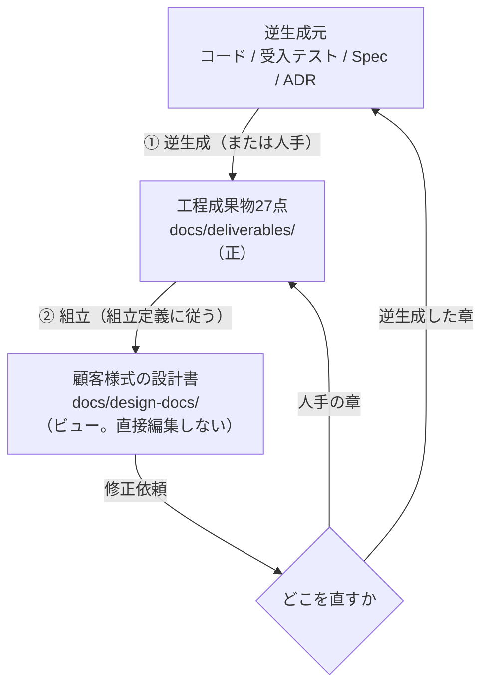
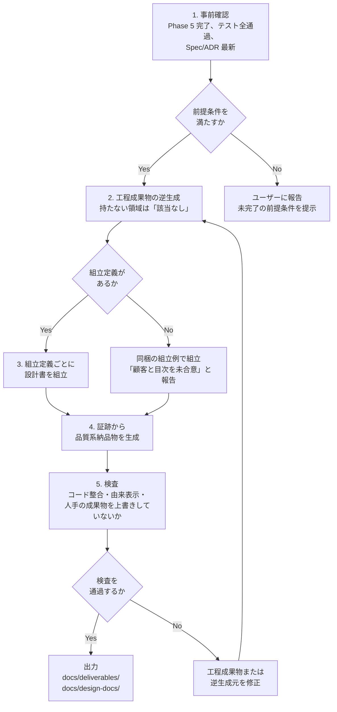

:::note
本記事は「**J-SIX：Japanese SI Transformation**」シリーズの番外編です。シリーズ全体の概要は[#0 概要編](https://qiita.com/SeckeyJP/items/e4726bbbbf4d7949ab0f)をご覧ください。3層ドキュメント戦略の背景と理論は[#2 3層ドキュメント](https://qiita.com/SeckeyJP/items/8f413ed405ae0398f94c)で解説しています。
:::

:::note
**2026-09-20 改訂**: J-SIX v2.1 で、設計書の逆生成を「基本設計書などを直接生成する」方式から「**IPA の工程成果物27点を逆生成し、顧客の目次に合わせて束ねる**」方式に再編しました。本記事はこれに合わせて全面的に書き直しています。初版の `/doc-reverse-gen basic` などのコマンドは、読み替えにより引き続き動作します。
:::

## はじめに — 「逆生成」の実装編

[シリーズ #2](https://qiita.com/SeckeyJP/items/8f413ed405ae0398f94c) では、「設計書はなくならない。作り方が変わる」と提案しました。コードを Source of Truth として、設計書を逆生成するアプローチです。

本記事はその**実装編**です。J-SIX Plugin の `doc-reverse-gen` Skill を使って、コードから設計書を具体的にどう作るかを解説します。

初版の本記事では、コードから「基本設計書・詳細設計書・IF設計書・DB設計書」の4種類を直接生成すると書きました。しかし IPA のガイドを踏まえて見直すと、この方式には無理がありました。**顧客ごとに設計書の目次が違う**からです。v2.1 では、設計書を「作る単位」と「提出する単位」に分けて考えるように改めました。

## 1. なぜ「逆生成」なのか

従来のV字モデルでは、設計書を書いてから実装に入ります。しかし、実装が進むにつれて設計書とコードが乖離し、手戻りが発生するのは日常的な光景です。

```
従来: 設計書 → 実装 → 乖離発覚 → 手戻り → 設計書修正 → また乖離...
```

J-SIX ではこのフローを逆転させます。

```
J-SIX: Spec → TDD実装 → 品質検証 → 設計書の逆生成
```

コードから起こした部分は、設計書とコードの乖離が**原理的にゼロ**です。生成のたびに「今のコード」を反映した設計書が得られます。

このアプローチは J-SIX 独自のものではありません。富士通は2025年にAIによる設計書リバースエンジニアリングサービスを発表し、手動比50%の効率化を報告しています[^fujitsu]。

ただし、[#2 で詳しく分析した通り](https://qiita.com/SeckeyJP/items/8f413ed405ae0398f94c)、コードからは「なぜそう設計したか（Why）」と「なぜ他の方法を採らなかったか（Why Not）」は復元できません。この限界を補うのが3層ドキュメント戦略です。`doc-reverse-gen` Skill は第3層（What/How）の生成を担当し、第1層（Spec）と第2層（ADR）の情報を引用元付きで取り込みます。

## 2. 「基本設計書」を直接作らない

### 工程成果物と設計書は1対1ではない

IPA の「機能要件の合意形成ガイド」は、外部設計工程の成果物を**工程成果物**という単位で整理しています。そのうえで、工程成果物と実際の設計書は1対1ではないと明記しています[^ipa-guide]。

> 例えば、画面編では、「工程成果物」として「画面レイアウト」、「画面入出力項目一覧」、「画面アクション明細」などを想定していますが、実際のプロジェクトでは、これらを合わせて１つの「ユーザインタフェース設計書」として作成する場合があります。
> — IPA「機能要件の合意形成ガイド」概要編 2.1

つまり「正しい基本設計書の目次」は存在しません。存在するのは、**顧客の目次と工程成果物の対応表**だけです。

そこで v2.1 では、設計書を2段階で作ります。


```mermaid
flowchart TB
    A["逆生成元<br>コード / 受入テスト / Spec / ADR"] -->|"① 逆生成（または人手）"| B["工程成果物27点<br>docs/deliverables/<br>（正）"]
    B -->|"② 組立（組立定義に従う）"| C["顧客様式の設計書<br>docs/design-docs/<br>（ビュー。直接編集しない）"]
    C -->|"修正依頼"| D{"どこを直すか"}
    D -->|"逆生成した章"| A
    D -->|"人手の章"| B
```

こうしておけば、顧客の様式が変わっても逆生成をやり直す必要はありません。組立定義を差し替えるだけです。また、設計書だけを直して工程成果物と食い違う、という事故も起きません。

### 工程成果物27点と「由来」

J-SIX は IPA ガイドの工程成果物27点をテンプレートとして用意しています。6つの領域に分かれます。

| 領域 | 点数 | 主な成果物 |
|---|---|---|
| システム振舞い | 4 | システム化業務一覧・業務フロー・業務説明・共通ルール |
| 画面 | 6 | 画面一覧・画面遷移・画面レイアウト・入出力項目・アクション明細・共通ルール |
| データモデル | 4 | ER図・エンティティ一覧・エンティティ定義・CRUD図 |
| 外部インタフェース | 4 | 外部システム関連図・IF一覧・IF項目説明・IF処理説明 |
| バッチ | 4 | バッチ処理一覧・処理フロー・処理定義・共通ルール |
| 帳票 | 5 | 帳票一覧・帳票概要・レイアウト・項目説明・編集定義 |

各テンプレートの冒頭には、その成果物を**何から作るか（由来）**を書いています。J-SIX の主張の核心はこの由来の内訳にあります。

| 由来 | 件数 | 設計書⇔コードの乖離リスク |
|---|---|---|
| コードから逆生成 | 18 | 原理的にゼロ |
| 受入テストから逆生成 | 1（システム化業務説明） | ゼロ（通っているテストが根拠） |
| コード＋Spec／ADR の併用 | 3 | 一部残る |
| Spec / CLAUDE.md（人手） | 5 | 残る |

**27点中19点は実物（コードと受入テスト）から起こせます。** 人手で書く必要があるのは、業務一覧・業務フロー・共通ルールのように「なぜ作るか」「どう運用するか」を記す5点だけです。

なお、27点すべてを作る必要はありません。API だけのシステムなら、画面・帳票・バッチの15点は該当しません。その場合も**章を消さずに「該当なし（理由）」と記録します**。空欄のままでは、抜けなのか対象外なのかを区別できないからです。

### 作る順序

人手で書く成果物が、逆生成する成果物の前提になります。

```
Phase 1-2  要求 Spec / Design Spec / ADR
    ↓
  業務一覧・業務フロー・共通ルール（人手。顧客との合意の対象）
    ↓
Phase 3-4  hold-out 受入テスト → TDD 実装
    ↓
  システム化業務説明（受入テストから逆生成）
    ↓
Phase 6  残りの成果物（コードから逆生成）→ 組立
```

## 3. 実践: doc-reverse-gen Skill を使う

### 前提条件

`doc-reverse-gen` を実行する前に、Phase 5（品質検証）が完了していることが前提です。テストが全て通り、Spec と ADR が最新の状態であることを確認してください。

### 実行コマンド

すべてを一括で生成する場合:

```
/doc-reverse-gen all
```

`all` は「工程成果物の逆生成 → 組立定義ごとの設計書の組立 → 品質・テスト系納品物の生成」を順に実行します。

個別に実行する場合は、領域・組立・品質系を指定します。

| 種別 | 生成物 | 出力先 |
|---|---|---|
| `behavior` | システム振舞い（4点） | `docs/deliverables/behavior/` |
| `screen` | 画面（6点） | `docs/deliverables/screen/` |
| `data` | データモデル（4点） | `docs/deliverables/data/` |
| `external-if` | 外部インタフェース（4点）。他システムに提供する API もここに含める | `docs/deliverables/external-if/` |
| `batch` | バッチ（4点） | `docs/deliverables/batch/` |
| `report` | 帳票（5点） | `docs/deliverables/report/` |
| `deliverables` | 上記6領域すべて | `docs/deliverables/` |
| `assemble <組立定義>` | 組立定義に従って束ねた設計書 | `docs/design-docs/` |
| `quality` | 品質・テスト系の納品物（証跡から変換） | `docs/design-docs/` |

```
/doc-reverse-gen data
/doc-reverse-gen assemble kihon-sekkei
/doc-reverse-gen external-if src/integrations
```

初版の種別は、次のように読み替えて受け付けます。

| 初版の種別 | 読み替え |
|---|---|
| `basic` | `deliverables` → `assemble kihon-sekkei` |
| `detail` | `assemble shousai-sekkei` |
| `if` | `external-if` |
| `db` | `data` |

### 由来ごとに「してよいこと」が違う

Skill は、成果物の由来によって扱いを変えます。

| 由来 | Skill の扱い |
|---|---|
| コードから逆生成 | 逆生成元のコードから機械的に写す。推測で補わない |
| 受入テストから逆生成 | fixture → 事前条件、操作列 → 基本シナリオ、アサーション → 事後条件、と写す。**通っているテストだけ**を根拠にする |
| コード＋Spec／ADR の併用 | コード由来の部分を逆生成し、Spec・ADR 由来の部分は引用元を明示して転記する |
| 人手 | **生成しない。** Phase 1-2 で人が書いたものがあるか、最新かを確認するだけ。無ければドラフトを作り、冒頭に「ドラフト（人手の確認が必要）」と書く |

人手で書く5点は、顧客と合意した内容そのものです。AI が「それらしく」書き直してしまえば、合意の記録として意味を失います。

### 出力ルール

- 各成果物の冒頭に**由来と逆生成元**（実際に読んだファイル・関数・定数）を書く
- ID（`SCR-nnn` / `EIF-nnn` / `REQ-nnn` / `PROP-nnn` など）はコード・テスト・Spec にあるものをそのまま使い、新たに採番しない
- 不明・未実装の箇所は `[要確認]` / `[TODO: 未実装]` で明示し、推測で補わない
- 図は Mermaid で描く

「設計書が実態より立派に見える」という従来の問題を防ぐためのルールです。

## 4. 組立 — 設計書は工程成果物の「ビュー」

### 組立定義

工程成果物を顧客の設計書に束ねるのが**組立定義**です。「顧客の章 → 構成要素 → 由来 → 事前提出の可否」の対応表で、J-SIX は基本設計書と詳細設計書の組立例を用意しています。基本設計書の組立例（抜粋）は次の通りです。

| 章 | 構成要素 | 由来 | 事前提出 |
|---|---|---|---|
| 1.1 目的・業務背景 | 要求 Spec 1 業務背景 | 人手 | ○ |
| 3.1 システム化業務一覧 | システム化業務一覧 | 人手 | ○ |
| 3.3 システム化業務説明 | システム化業務説明 | 受入テストから逆生成 | 代替: 要求 Spec の受入条件 |
| 4.3 画面レイアウト | 画面レイアウト | コードから逆生成 | 代替: 実動プロトタイプの画面 |
| 6.3 エンティティ定義 | エンティティ定義 | コードから逆生成 | × |

顧客に様式がある場合は、顧客の目次の章ごとに構成要素を対応付け直します。**目次の合意は、設計書の中身より先に取ります。** 組立定義はプロジェクトの `docs/design-docs/assembly-<設計書名>.md` に置き、Phase 2 の品質ゲートで顧客と合意します。

### 組立の原則

1. **設計書を直接編集しない。** 修正は工程成果物の側で行い、逆生成したものはさらにその逆生成元（コード・受入テスト・Spec）を直してから組み立て直す。設計書を直接直すと、「設計書とコードの乖離」をもう1段下に作り直すことになる
2. **章ごとに由来を表示する。** 顧客レビューで重点を置くべきは人手で書いた章であり、逆生成した章は「実装がこうなっている」という事実の記述である。由来が見えないと、レビュアーは全章を同じ重みで読むことになる
3. **ID を振り直さない。** ID はテスト名とコードに書かれたトレーサビリティのキーである。顧客に独自の採番がある場合は併記する
4. **同じ工程成果物を2冊に全文で入れない。** 基本設計書と詳細設計書の両方に入れたい場合は、一方にだけ置いてもう一方から参照する

### 顧客の目次に対応しない章

顧客の目次には、工程成果物のどれにも対応しない章が出てきます。これを3つに分類して扱います。

| 分類 | 例 | 扱い |
|---|---|---|
| (a) 27点の外に置き場所がある | システム構成、非機能、セキュリティ | Design Spec の節や ADR を構成要素にする |
| (b) J-SIX では作らない | 実装前に書く関数単位の処理記述 | 作らない理由と代替物を顧客と合意し、章に明記する |
| (c) 新たに人手で書く必要がある | 移行計画、運用手順 | 人手の成果物として追加し、由来を「人手」と表示する |

(c) が増えるほど、乖離リスクが残る章が増えます。(c) を足す前に、Spec か ADR に書くべき内容でないかを確認します。

## 5. 顧客が事前設計書を求める場合 — 提出の時期は2回ある

日本の SI では、実装前に設計書の提出を求められることが少なくありません。J-SIX では逆生成する成果物がコードから作られるため、**事前提出の時点では19点がまだ存在しません。** そこで、提出の時期を2回に分けて組立定義に書いておきます。

| 時期 | J-SIX の Phase | 出せるもの |
|---|---|---|
| 事前提出 | Phase 2 品質ゲート（設計レビュー） | 人手の5点、要求 Spec、Design Spec、ADR、**実動プロトタイプ** |
| 納品 | Phase 6 | 27点すべて（逆生成の19点を含む）、証跡パッケージ |

事前提出の合意をどう進めるか（合意成熟度・顧客の目次との対応・非機能要件）は、[工程成果物27点で合意を分解する記事](https://qiita.com/SeckeyJP/items/9ca2e51f16189d62a5f6)で詳しく扱っています。

事前提出では、逆生成する章に**代替物**を入れます。画面なら実動プロトタイプの画面キャプチャ、データなら Design Spec の ER 概要といった形です。その章には「本章は Phase 6 に実装から逆生成した版に差し替える」と明記します。

ここで重要なのは、**事前提出版の内容を納品版に手で書き写して延命させない**ことです。納品版は逆生成で作り直します。

合意の度合いも、IPA ガイドの合意成熟度（仕掛／充実／完成）で成果物ごとに判定します[^ipa-guide]。Phase 2 の時点では、人手の成果物は完成レベル、逆生成する成果物は代替物による充実レベルまでを求めます。逆生成した成果物は、Phase 6 の納品物レビューで顧客が確認した時点で完成レベルになります。

## 6. 品質・テスト系の納品物 — 証跡から変換する

テスト結果報告書・品質報告書・トレーサビリティマトリクスなどは、27点には含まれません。これらは `quality` 種別で、Phase 4 の品質ゲートがタスクごとに出力した**証跡パッケージ**から変換します。

| 従来の納品物 | 元データ |
|---|---|
| 単体テスト仕様書・テスト結果報告書 | 証跡のトレーサビリティ・テスト結果 |
| 品質報告書 | 証跡のカバレッジ・mutation score・スコープ検査 |
| セキュリティ診断結果 | 証跡のセキュリティ検査結果 |
| トレーサビリティマトリクス | 証跡のトレーサビリティ |
| レビュー記録 | AI の参考所見と人間の承認 |

納品直前に人手で書き起こすのではなく、実行時の実データを整形するので、コードとの乖離が起きません。変換では次の点を守ります。

- **数値は証跡から引用し、再計算・推定をしない**
- **証跡 / 参考所見 / 承認の3区分を混ぜない。** 決定論的に検証された事実と AI の所見が同じ重みで読まれないよう、AI の所見は別節にして「単独で品質判定の根拠にしない」と注記する
- **人間の承認が未記入なら「未承認」と明記する**
- commit SHA・ツールの版・実行日時を「検証条件」として添付する

## 7. Doc Generator Agent による自動化

`doc-reverse-gen` Skill を個別に呼び出すこともできますが、Phase 6 全体を自動化する `doc-generator` Agent も用意しています。


```mermaid
flowchart TB
    A["1. 事前確認<br>Phase 5 完了、テスト全通過、<br>Spec/ADR 最新"] --> B{"前提条件を<br>満たすか"}
    B -->|Yes| C["2. 工程成果物の逆生成<br>持たない領域は「該当なし」"]
    B -->|No| D["ユーザーに報告<br>未完了の前提条件を提示"]
    C --> E{"組立定義が<br>あるか"}
    E -->|Yes| F["3. 組立定義ごとに<br>設計書を組立"]
    E -->|No| G["同梱の組立例で組立<br>「顧客と目次を未合意」と報告"]
    F --> H["4. 証跡から<br>品質系納品物を生成"]
    G --> H
    H --> I["5. 検査<br>コード整合・由来表示・<br>人手の成果物を上書きしていないか"]
    I --> J{"検査を<br>通過するか"}
    J -->|Yes| K["出力<br>docs/deliverables/<br>docs/design-docs/"]
    J -->|No| L["工程成果物または<br>逆生成元を修正"]
    L --> C
```

組立定義が無い場合でも止まらずに同梱の組立例で組み立てますが、その場合は**顧客と目次を合意していない設計書である**ことを必ず報告します。

## 8. 実際に動かしてわかったこと

J-SIX のリポジトリには、逆生成の結果を確認できるサンプルが2つあります。

- **approval-workflow**（API のみの申請承認ワークフロー）: Plugin 経由で `/doc-reverse-gen all` をヘッドレス実行し、工程成果物12点・基本／詳細設計書・品質系納品物5点を生成しました（87ターン・19.1分・$14.65。モデルは Claude Opus 5）。画面・帳票・バッチの15点は「該当なし」と記録され、組立定義が無いことも冒頭に明記されました[^field-test]
- **monthly-billing**（月次請求書発行）: 画面・帳票・バッチ・外部 IF をすべて持つサンプルで、27点すべての記入済み実例があります[^monthly-billing]

動かしてみて、いくつかのことがわかりました。

**逆生成は乖離の「検出器」にもなる。** approval-workflow では、逆生成の過程で実装と Spec の食い違いが見つかりました。設計レビューの Skill がそれを重大な指摘として挙げ、Spec の改訂 → TDD での修正という流れで解消しています[^field-test]。

**テンプレートを読めないまま書かせてはいけない。** 権限が足りない実行環境で、Skill がテンプレートを読めないまま独自のファイル名・形式で成果物を書いてしまったことがありました。現在の Skill は、テンプレートを読めなければ逆生成せずに止めて報告します。

**品質ゲートで見つけた事項は、設計書側にも根拠として残す。** monthly-billing では、CSV の列数がヘッダと合わない行で日次取込全体が止まる不具合がありました。カバレッジ 98.8%・mutation score 92.3% でも検出できず、コードレビューで見つかったものです。修正と同時に、外部 IF 処理説明にもこの扱いを記載しています。

## 9. 従来フォーマットへの変換

日本のSI案件では、Excel や Word 形式での納品が求められることが多いのが現実です。組み立てた Markdown の設計書を変換して `docs/design-docs/export/` に出力します。

| 手段 | 特徴 | 適用場面 |
|---|---|---|
| **pandoc**（OSS） | Markdown → Word (.docx) の変換。テンプレート指定で書式統一が可能 | 定型フォーマットへの変換 |
| **MCP Server** | 外部ツール連携で Excel/Word を直接生成 | 複雑なレイアウトが必要な場合 |
| **Claude Code に直接生成させる** | 小規模な設計書をその場で整形 | 小規模プロジェクト |

```bash
pandoc docs/design-docs/kihon-sekkei.md -o docs/design-docs/export/kihon-sekkei.docx --reference-doc=template.docx
```

変換するときは、表の構造と**由来の表示を落とさない**ようにします。変換物も直接編集しません。修正は工程成果物（さらにその逆生成元）で行い、組み立て直してから再変換します。

## 10. 注意事項

逆生成は強力なアプローチですが、限界と注意点があります。

**人手の成果物には乖離リスクが残る。** 27点中19点は実物から起こせますが、人手で書く5点と、併用3点の Spec・ADR 由来の部分は、人が更新しなければ古くなります。「設計書の乖離がすべてなくなる」わけではありません。

**逆生成は「現在のコード」を反映する。** 過去の設計意図や経緯は ADR に依存します。ADR が記録されていなければ、「なぜそうなっているか」は設計書に反映されません。

**大規模コードベースではコンテキスト管理が必要。** 数万行を超えるプロジェクトでは、領域単位（`data`、`external-if` など）や対象パス単位に分けて逆生成し、最後に組み立てる方法が有効です。

**生成された設計書は人間がレビューする。** Phase 6 の品質ゲートで、生成された設計書を人間が確認・承認します。記入済み実例も顧客確認を経ていないため、J-SIX のリポジトリでは完成レベルとは扱っていません。

## まとめ

- **設計書を直接作らず、工程成果物を作ってから束ねる**: 顧客ごとに違う目次には組立定義で対応し、逆生成はやり直さない
- **由来が主張の核心**: 27点中19点はコードと受入テストから起こせる。人手で書くのは「なぜ作るか」「どう運用するか」の5点だけ
- **設計書はビュー**: 修正は工程成果物と逆生成元で行う。設計書を直接直すと、乖離を1段下に作り直すことになる
- **事前提出と納品の2回に分ける**: 事前提出は人手の成果物と代替物で行い、納品版は逆生成で作り直す
- **品質系納品物は証跡から変換する**: 証跡 / 参考所見 / 承認の3区分を保つ

設計書文化を否定するのではなく、設計書をより正確に、より効率的に作る。それが Phase 6 の目指すところです。

テンプレート・組立定義・記入済み実例は GitHub で公開しています。

https://github.com/SeckeyJP/j-six

工程成果物テンプレート（27点）と組立定義はこちら:

https://github.com/SeckeyJP/j-six/tree/main/templates/deliverables

## 参考文献

[^fujitsu]: Fujitsu. "AI による設計書リバースエンジニアリングサービス" (2025.02). https://info.archives.global.fujitsu/global/about/resources/news/press-releases/2025/0204-01.html
[^ipa-guide]: IPA.「機能要件の合意形成ガイド ver.1.0」(2010.03). https://www.ipa.go.jp/archive/files/000004517.pdf
[^field-test]: J-SIX. 「Plugin 実動検証 #1」. https://github.com/SeckeyJP/j-six/blob/main/docs/plugin-field-test-01.md
[^monthly-billing]: J-SIX. examples/monthly-billing（工程成果物27点の記入済み実例）. https://github.com/SeckeyJP/j-six/tree/main/examples/monthly-billing/docs/deliverables
