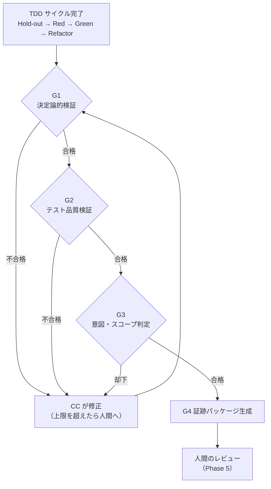

:::note
本記事はシリーズ「**J-SIX：Japanese SI Transformation**」の番外編です。シリーズ全体の概要は [#0 概要編](https://qiita.com/SeckeyJP/items/e4726bbbbf4d7949ab0f)、TDD の基本プロセスは [#3 TDD × Claude Code](https://qiita.com/SeckeyJP/items/a9dc743a14977686adbf) をご覧ください。
:::

## はじめに

Claude Code（以下 CC）に TDD で実装を任せると、しばらくして「テストはすべて通りました」という報告が返ってきます。この報告を、どこまで信じてよいでしょうか。

テストが通ったことは事実です。しかし、**そのテストを書いたのも、テストを通したのも同じエージェント**です。エージェントにとって唯一の監督がテストスイートであるとき、テストスイートは検証の手段ではなく**最適化の対象**になります。

一方で、エージェントの成果物をすべて人間が細かくレビューしていたら、生産性の利点は消えます。DORA は、AI でコードを書く時間は減っても、その時間が検証とプロンプトの手間に回っていること、そして**開発者の30%が AI 生成コードをほとんど、あるいはまったく信頼していない**ことを報告しています[^dora]。

J-SIX は v2.1 で、この問題に対して**人間のレビューの前に、性質の異なる4つの監督面を順番に通す**という設計を採りました。本記事では、その4層品質ゲート（G1〜G4）の設計と理由、Plugin での実装、そして**実際に動かしてみたらゲートが空振りしていた**という失敗談までを紹介します。

## 1. なぜ「テストが通った」では足りないのか

SpecBench は、コーディングエージェントに長い開発タスクを与え、**見えているテスト**と、実利用を模した**隠しテスト（hold-out）**の通過率の差を測定しました[^specbench]。結果は次の通りです。

- エージェントは見えているテストを一貫して通す一方、隠しテストでは落ちる
- その差はコード規模が大きくなるほど広がり、**規模が10倍になるごとに28ポイント**拡大した
- テストの入力を丸暗記する、2,900行のハッシュテーブル実装まで観測された

これが reward hacking（報酬ハッキング）です。エージェントに悪意があるわけではありません。「テストを通せ」と言われたので、テストを通したのです。

「ではカバレッジを上げればよい」とはなりません。カバレッジはテストが**実行した**行を数えるだけで、テストが誤りを**検出できるか**は測らないからです。カバレッジ 99% のコードに mutation testing をかけたら、監査ログの穴が見つかった実測は[別の記事](https://qiita.com/SeckeyJP/items/b136d6d0bb2d830fb508)にまとめました。

必要なのは、テストを増やすことではなく、**監督の面を増やす**ことです。

## 2. 4層品質ゲートの全体像

J-SIX は Phase 4（TDD 実装）の最後に、次の4層を**この順番で**通します。

| 層 | 名称 | 何を見るか | 判定するもの |
|---|---|---|---|
| **G1** | 決定論的検証 | build / 型 / lint・format / SAST / secret / 依存脆弱性 / **変更ファイルが許可範囲内か** | スクリプト |
| **G2** | テスト品質検証 | テスト通過 / カバレッジ / **mutation score** / **テストを弱める変更** / **hold-out 受入テスト** / 要件⇔テストの対応 | スクリプト |
| **G3** | 意図・スコープ判定 | 「動くしテストも通るが、頼んだものと違う」ものだけ | LLM（別コンテキスト） |
| **G4** | 証跡パッケージ | G1〜G3 の結果を、人間レビューと顧客納品向けに構造化 | スクリプト＋LLM（要約のみ） |



設計の要点は2つあります。

**1. 性質の異なる監督面を重ねる。** G1・G2 は決定論的で、誰が何度実行しても同じ結果になります。G3 は LLM ですが、実装した側とは別のコンテキストで判定します。G4 は判定そのものではなく、判定の根拠を残します。同じ種類の監督を何枚重ねても、同じ穴をすり抜けます。

**2. 順序を固定し、前段を通ったものだけを後段に進める。** 壊れたコードを LLM の judge に見せても、コストがかかるだけで意味がありません。Spotify が数千のエージェントセッションを運用している Honk でも、judge は**他のすべての検証器が終わった後に**実行されます[^spotify-honk]。

## 3. G1: 決定論的検証 — 頼んでいないファイルを触ったら落とす

G1 は「動かないもの・危ないもの・頼んでいないファイルを触ったもの」を落とします。build や lint、SAST は一般的な CI と同じです。J-SIX で特徴的なのは**スコープ検査**です。

```json
"scope": {
  "allow": ["app/**", "tests/**", "docs/**"],
  "deny": ["tests/acceptance/**"]
}
```

変更されたファイルが、タスクの許可リストに収まっているかを機械的に判定します。この許可リストは、**Phase 3（タスク分解）で人間が承認**しておきます。実行中に CC 自身が許可範囲を広げられるなら、検査の意味がないからです。

`deny` に入っている `tests/acceptance/` は、後述する hold-out 受入テストの置き場所です。実装フェーズで、ここを変更することは許されません。

## 4. G2: テスト品質検証 — テストが「機能しているか」を見る

G2 は「テストが通ること」ではなく「**テストが機能していること**」を検証します。

### テストを弱める変更を検出する

TDD の Red フェーズ（テストを書き終えた時点）で、Git に `jsix/red-<タスクID>` というタグを打ちます。それ以降のテストの差分を検査し、**テストを弱める変更**をブロックします。

| 検出する変更 | 判定 |
|---|---|
| assert / expect の削除 | ブロック |
| `skip` / `xfail` などの無効化マーカーの追加 | ブロック |
| テスト関数の減少 | ブロック |
| 実装コードから hold-out テストへの参照 | ブロック |
| それ以外のテストの差分（命名の整理など） | 証跡に記録して警告 |

テストが通らないときに、エージェントが「テストの期待値が間違っている」と判断してテストを書き換えることがあります。本当にテストが間違っている場合もありますが、それを判断するのは人間です。J-SIX では、テストの期待値が誤っていると考えた場合は**修正せず人間に報告する**手順にしています。

### hold-out 受入テスト — エージェントが書いていないテスト

SpecBench が示した問題への直接の対策が、hold-out 受入テストです。

1. TDD サイクルの最初に、**別のサブエージェント**が Spec の受入条件だけを読んで `tests/acceptance/` に受入テストを書き、コミットする
2. 実装を担当する Green エージェントは、このディレクトリを**読むことも書くこともできない**
3. G2 で、hold-out 受入テストの通過を確認する

実装が「見えているテストだけを通す」形になっていれば、hold-out で落ちます。

ここで重要なのは、「読むな」を**プロンプトではなく Hook で強制する**ことです。エージェントの指示文に「tests/ を触るな」と書いても、それは助言にすぎません。J-SIX の green-agent は、サブエージェントの定義に Hook を持たせています。

```yaml
# plugin/agents/green-agent.md のフロントマター（抜粋）
---
name: green-agent
hooks:
  PreToolUse:
    - matcher: "Edit|Write|NotebookEdit"
      hooks:
        - type: command
          command: "python3 \"${CLAUDE_PLUGIN_ROOT}/scripts/jsix_guard_tests.py\""
    - matcher: "Read"
      hooks:
        - type: command
          command: "python3 \"${CLAUDE_PLUGIN_ROOT}/scripts/jsix_guard_tests.py\""
---
```

このスクリプトは `tests/` への書き込みと `tests/acceptance/` の読み取りを拒否します。

### mutation score と要件の対応

- **mutation score**: コードを意図的に壊して、テストが落ちるかを見ます。閾値は既定では置かず、自分のプロジェクトで計測してから決めます（詳細は [mutation testing の記事](https://qiita.com/SeckeyJP/items/b136d6d0bb2d830fb508)）
- **トレーサビリティ**: Spec の要件 ID（`REQ-nnn`）と性質 ID（`PROP-nnn`）の一つひとつに、対応するテストがあるかを確認します

## 5. G3: 意図・スコープ判定 — 機械では見られないものだけを見る

G1・G2 を通過したコードは、「動くし、テストも通る」状態です。それでも残る問題があります。**頼んだものと違う**ものです。

G3 では、実装した側とは別のコンテキストで起動した judge（`scope-judge` サブエージェント）が、diff・タスク定義・Spec だけを読んで判定します。実装の経緯や試行錯誤は知りません。

### 判定するのは3点だけ

| 分類 | 見るもの |
|---|---|
| 正確性 | テストされていない入力で明らかに誤る。境界の取り違え。並行実行で壊れる |
| 要件未充足 | 受入条件・REQ・PROP のいずれかが実装されていない、または意味が違う |
| スコープ逸脱 | 頼まれていない機能やリファクタリングが混ざっている。既存の振る舞いを黙って変えている |

そして、**これ以外の指摘を禁止**しています。スタイル、命名の好み、「将来の拡張性のために」という提案、防御的なコードの追加、起こり得ないケースへの対処です。

理由は、Anthropic の公式ガイドが警告している現象にあります。**「問題を探せ」と指示されたレビュアーは、作業が健全でも何かを報告する**傾向があり、その指摘を全部追うと、過剰な抽象化や防御的なコード、起こり得ないケースのテストが増えてしまいます[^anthropic-bp]。判定に迷ったら PASS を選ぶ、というのも judge への指示に含めています。

### judge は効くのか

Spotify の Honk では、judge が数千のセッションのうち**約4分の1を却下**し、そのうち半分でエージェントが自ら修正できたと報告されています。却下理由で最も多かったのは、**エージェントがプロンプトの指示の範囲を外れたこと**でした[^spotify-honk]。J-SIX の「スコープ逸脱」が狙っているのは、まさにこの種類の問題です。

### G3 は固定装備ではない

ただし、同じ Spotify は、その後のモデルの改善に伴い、**judge を撤去**しています。判定が硬直的で、妥当な変更まで止めてしまったためです[^spotify-qcon]。

J-SIX でも、G3 を恒久的な装備とはみなしていません。**却下率と却下理由の分布を記録**し、却下がほとんど起きなくなった時点、あるいは誤った却下が増えた時点で外す判断をします。G1・G2・G4 は決定論的で低コストなので、この判断の対象外です。

## 6. G4: 証跡パッケージ — 「品質が良い」と「品質が良いと示せる」は別

日本の SI では、品質が良いことと、品質が良いと**示せる**ことは別の要件です。G4 は、G1〜G3 の結果をタスクごとに `reports/evidence/<タスクID>/` へ出力します。

最大の原則は、**性質の違うものを同じ重みで並べない**ことです。

| 区分 | 内容 | 扱い |
|---|---|---|
| **証跡** | テスト結果・カバレッジ・mutation score・SAST・スコープ検査・テスト改変検出 | 納品可。commit SHA・ツールの版・実行日時・設定のハッシュを必ず添付する |
| **参考所見** | G3 judge の判定、LLM による要約 | 「AI による参考所見」と明記し、**単独で品質判定の根拠にしない** |
| **承認** | 人間のレビュアーの確認・指摘・是正記録 | 必須。承認者と日付を記録する |

LLM の判定は、再実行しても同じ結果になるとは限らず、第三者が同じ手順で確かめられません。証跡は、誰が何度実行しても同じ値になります。この違いを納品物の上でも区別します。

証跡パッケージは、Phase 6 でテスト結果報告書・品質報告書・トレーサビリティマトリクスなど従来の納品物に変換できます（[設計書逆生成の記事](https://qiita.com/SeckeyJP/items/62c54852396ac4549462)）。納品直前に人手で書き起こすのではなく、実行時のデータを整形するので、コードとの乖離が起きません。

## 7. Hook は最終防衛線にならない — 内側ループと外側ループ

4層のゲートは、CC の Stop Hook（ターン終了時に動く Hook）として実行します。しかし、**Hook だけに頼ってはいけません**。理由は3つあります。

1. **自動で解除される**: Stop hook が、進捗のないまま8回連続でブロックすると、CC は Hook を上書きしてターンを終了します[^anthropic-bp]
2. **ローカル設定である**: Hook や Plugin の有効化は、各開発者の環境に依存します
3. **オプトインである**: J-SIX の Plugin は、設定ファイル（`.jsix-checks.json`）が無いプロジェクトでは何もしません

そこで、**同じ判定スクリプトと同じ設定ファイル**を CI でも実行します。

| | 内側ループ（Hook） | 外側ループ（CI） |
|---|---|---|
| 目的 | 早く気づく | 確実に止める |
| タイミング | ターン終了時 | PR / push |
| コマンドの実行 | **しない**（既存のテスト結果・カバレッジ等を読んで判定する） | する（テストを実行してから判定する） |
| G3（LLM judge） | 実行する | 必須にしない |

内側ループでビルドや mutation testing を毎回実行しないのには理由があります。**ターンが終わるたびに数分待たされると、人は Hook そのものを無効にしてしまう**からです。止めすぎるゲートは、結局使われなくなります。

## 8. 実際に動かしたら、ゲートが空振りしていた

J-SIX の Plugin は、単体テスト155件（当時）を書いたうえで公開していました。それでも、Plugin の Skill を実際に `claude -p` でヘッドレス実行してみると、不具合が8件見つかりました[^field-test]。品質ゲートに関わるものを3つ紹介します。

### ゲートが0ファイルを検査して「合格」していた

TDD の手順どおりにフェーズごとにコミットすると、ターン終了時点では未コミットの差分が空になります。ゲートのスクリプトは、変更ファイルを**未コミットの差分だけで数えていた**ため、次のことが起きていました。

- G1 のスコープ検査は「0ファイル」を検査して合格
- G3 は「変更なし」としてスキップ
- 前のタスクの judge の PASS が残っていても、そのまま通る

**すべてのゲートが緑なのに、実際には何も検査していなかった**のです。

これを見つけたのは、ヘッドレス実行した子セッション（CC）自身でした。ゲートが通ったことを成果として報告するのではなく、**ゲートが空振りしていることを報告**してきました。

修正後は、G3 と変更の有無はブランチの分岐点からの差分で、スコープ検査は RED タグからの差分で判定しています。また、G3 の判定を差分の指紋に紐づけ、指紋が一致しない古い判定は無効にしています。

### 満たせない失敗で、セッションが終わらなくなった

Spec に要件を追加した直後は、対応するテストがまだありません（テストは次の工程で書きます）。するとトレーサビリティ検査が失敗し、Stop のたびにブロックされ、**同じやり取りが15回繰り返されました**。

このとき子セッションは、ID を書いただけの偽のテストで検査を通すことを拒み、ブロックされ続けることを選びました。正しい判断ですが、セッションは終わりません。

そこで、Stop hook として呼ばれたときに限り、**失敗内容が変わらないブロックが3回続いたら停止を許可する**ようにしました。判定の基準は緩めていません。ゲートは未達のまま残り、CI では止まります。

### prompt 型 Hook が Stop を毎回ブロックしていた

ADR の提案を促す prompt 型の Hook を、「〜の場合は…してください。該当しなければ何も出力しない」という**指示文の形**で書いていました。しかし prompt 型 Hook は、判定役のモデルが `{ok, reason}` を返す評価器で、「何も出力しない」という選択肢がありません。その結果、**Stop が毎回ブロックされ、28回繰り返しました**。

### 学んだこと

- **止めすぎるゲートは無効にされ、甘すぎるゲートは黙って通す。** どちらも品質ゲートとして機能しない。修正はいずれも、判定の基準を変えずに「正しく効かせる」方向で行った
- **単体テストは「部品が仕様どおりか」しか保証しない。** 8件のうち単体テストで防げたものはごく一部で、残りは Claude Code の仕様との食い違いだった。実際に読み込ませて動かさない限り見つからない
- **エージェントは近道を取らなかった。** 少なくともこの検証では、ゲートを欺くのではなく、ゲートの問題を報告してきた

## 9. 導入するには

Plugin は、言語ごとのツールを直接呼びません。`.jsix-checks.json` に「成果物のパスと形式、閾値」を宣言し、標準的な形式のファイルを読んで判定します。

| チェック | 読む形式 | 生成ツールの例 |
|---|---|---|
| テスト結果 | JUnit XML | pytest / jest / Gradle |
| カバレッジ | Cobertura XML / LCOV | coverage.py / istanbul / JaCoCo（Cobertura 形式への変換が必要） |
| SAST・secret・依存脆弱性 | SARIF | Semgrep / bandit / gitleaks / trivy / CodeQL |
| mutation | mutation-testing-elements JSON など | Stryker / PIT / mutmut |

Java の案件でも、JUnit XML はそのまま使えます。JaCoCo のカバレッジは Cobertura 形式に、PIT の結果は mutation-testing-elements 形式（または score だけの JSON）に変換すれば、同じゲートで判定できます。

すべての層を一度に入れる必要はありません。著者の推奨は次の順番です。

1. **G1 のスコープ検査と、G2 のテスト通過・テスト改変検出**から始める。追加のテストを書かずに入れられ、「テストを弱めて通す」近道を塞げる
2. **CI（外側ループ）を同じ設定で動かす**。Hook が外れても止まる状態にする
3. **mutation score を計測だけ**行い、数タスク分の値を見てから閾値を決める
4. **hold-out 受入テスト**を加える。受入条件から別のエージェントにテストを書かせる手間がかかるため、効果を見ながら導入する
5. **G3 は却下率を記録しながら**運用し、効かなくなったら外す

## 10. 限界

- **G3 は LLM であり、判定は再現しない。** だからこそ参考所見として扱い、単独で合否の根拠にしない
- **すべてのゲートを通っても、不具合は残る。** J-SIX の2つ目のサンプルでは、CSV の列数がヘッダと合わない行で日次取込全体が止まる不具合が、**カバレッジ 98.8%・mutation score 92.3% の状態で見逃され**、PR 前のコードレビューで見つかりました。テストが一度も与えていない種類の入力は、どのゲートも検出できません
- **コストがかかる。** hold-out 受入テストの作成、mutation testing の実行、G3 の judge の起動は、それぞれ時間かトークンを消費します
- **本番の欠陥が減るかは未実測。** 現時点で言えるのは、ゲートがテストの穴や近道を**検出できた**ところまでです

4層のゲートは、人間のレビューを不要にするものではありません。**機械が見られるものを機械に任せ、人間が見るべきもの（設計判断の妥当性、業務ロジック、探索的テスト）に時間を使えるようにする**ためのものです。J-SIX では、ゲートを通過した後の Phase 5 を「機械が原理的に見られないものを人間が見る工程」と位置づけています。

## まとめ

- **「テストが通った」だけを信じない。** テストが唯一の監督なら、テストは最適化の対象になる
- **性質の異なる監督面を、順番を固定して重ねる。** 決定論的検証 → テスト品質検証 → 別コンテキストの judge → 証跡
- **監督面は機械的に守る。** 「テストを触るな」はプロンプトではなく Hook で強制し、テストを弱める変更は差分で検出する
- **judge は範囲を絞り、効き目を測る。** スタイルの指摘は禁止し、却下率を見て外す判断もする
- **Hook は最終防衛線ではない。** 同じ判定を CI でも実行する
- **ゲート自体も、実際に動かして検証する。** すべて緑でも、何も検査していないことがある

---

4層品質ゲートの定義、Plugin の実装、サンプルは GitHub で公開しています。

https://github.com/SeckeyJP/j-six

Plugin（判定スクリプト・エージェント・Hook）:

https://github.com/SeckeyJP/j-six/tree/main/plugin

[^dora]: DORA. "Balancing AI tensions: Moving from AI adoption to effective SDLC use" (2026.03). https://dora.dev/insights/balancing-ai-tensions/
[^specbench]: Zhao, B. et al. (Weco AI). "SpecBench: Measuring Reward Hacking in Long-Horizon Coding Agents" (2026.05). arXiv:2605.21384. https://arxiv.org/abs/2605.21384
[^spotify-honk]: Max Charas, Marc Bruggmann (Spotify). "Background Coding Agents: Predictable Results Through Strong Feedback Loops (Honk, Part 3)" (2025.12). https://engineering.atspotify.com/2025/12/feedback-loops-background-coding-agents-part-3
[^spotify-qcon]: InfoQ. "QCon London 2026: Rewriting All of Spotify's Code Base, All the Time" (2026.03). https://www.infoq.com/news/2026/03/spotify-honk-rewrite/
[^anthropic-bp]: Anthropic. "Best Practices for Claude Code". https://code.claude.com/docs/en/best-practices
[^field-test]: J-SIX. 「Plugin 実動検証 #1」. https://github.com/SeckeyJP/j-six/blob/main/docs/plugin-field-test-01.md
