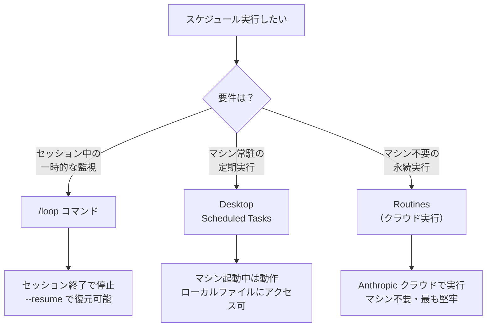

:::note
本記事はシリーズ「**J-SIX：Japanese SI Transformation**」の番外編です。シリーズ全体の概要は [#0 概要編](https://zenn.dev/seckeyjp/articles/j-six-00-overview)、Hooks による品質自動化は [Hooks 実践ガイド](https://zenn.dev/seckeyjp/articles/j-six-hooks-guide) をご覧ください。
:::

## はじめに

Claude Code（以下 CC）は対話的に使うだけのツールではありません。**Scheduled Tasks** を使えば、CC を定期実行して開発ワークフローを自動化できます。夜間のコードレビュー、日次の品質メトリクス収集、定期的な依存関係チェック——「寝ている間に品質が上がる」仕組みを CC のネイティブ機能だけで構築できます。

本記事では Scheduled Tasks の仕組みとセットアップから、実践的なユースケース4選まで解説します。

## 1. Scheduled Tasks とは何か

Scheduled Tasks は、CC を cron のように定期実行する仕組みです[^scheduled-tasks]。「このプロンプトを毎朝9時に実行して」「5分おきにデプロイ状況を確認して」といった指示を CC に与えると、指定したスケジュールで自律的にタスクを実行します。

CC には3つのスケジューリング方式があります。



| 方式 | 実行場所 | セッション依存 | ローカルファイル | 最小間隔 |
|---|---|---|---|---|
| `/loop` | ローカルマシン | あり（セッション中のみ） | アクセス可 | 1分 |
| Desktop Scheduled Tasks | ローカルマシン | なし | アクセス可 | 1分 |
| Routines（クラウド） | Anthropic クラウド | なし | 不可（fresh clone） | 1時間 |

これに加えて、**GitHub Actions の `schedule` トリガー**と CC を組み合わせる方法もあります。CI/CD パイプライン内で `claude -p "プロンプト"` を実行すれば、GitHub のインフラ上で CC を定期実行できます。

## 2. セットアップ

### /loop の使い方

`/loop` は最も手軽な方法です[^scheduled-tasks]。セッション内で以下のように実行します。

```text
/loop 5m check if the deployment finished and tell me what happened
```

インターバルには `s`（秒）、`m`（分）、`h`（時間）、`d`（日）の単位が使えます。cron の粒度は1分なので、秒指定は繰り上げられます。

インターバルを省略すると、CC が状況に応じて動的に間隔を調整します。ビルド中は短く、PR が静かになったら長く——という具合です。

```text
# 動的インターバル: CC が状況を見て間隔を調整
/loop check whether CI passed and address any review comments
```

プロンプトを省略した場合はビルトインのメンテナンスプロンプトが実行され、未完了の作業の続行、PR のレビューコメント対応、CI 失敗の修正などを自動で行います。

```text
# メンテナンスループ: 未完了作業の続行、PR対応、CI修正
/loop
```

独自のデフォルトプロンプトを定義したい場合は、`.claude/loop.md` にプロンプトを記述します[^scheduled-tasks]。

```markdown
# .claude/loop.md の例
Check the `release/next` PR. If CI is red, pull the failing job log,
diagnose, and push a minimal fix. If new review comments have arrived,
address each one and resolve the thread.
```

### CronCreate による直接スケジューリング

CC は内部的に `CronCreate` ツールを使ってスケジュールを管理しています。標準の5フィールド cron 式（`minute hour day-of-month month day-of-week`）を受け付けます[^scheduled-tasks]。

```text
# 自然言語でも指示できる
毎朝9時にコードベースの品質レポートを生成して
```

CC がこれを `0 9 * * *` に変換し、タスクを登録します。タスクの管理も自然言語で行えます。

```text
# タスク一覧の確認
what scheduled tasks do I have?

# タスクのキャンセル
cancel the quality report job
```

### headless モードでの実行

CC をシステムの cron や launchd から実行する場合は、headless モード（`-p` フラグ）を使います[^anthropic-bp]。

```bash
# システムの crontab に登録する例
0 9 * * 1-5 cd /path/to/project && claude -p "Run quality checks and post results to the team channel"
```

### GitHub Actions との組み合わせ

CI/CD 環境で CC を定期実行する場合は、GitHub Actions の `schedule` トリガーが使えます。

```yaml
name: Daily Quality Check
on:
  schedule:
    - cron: '0 0 * * 1-5'  # 平日 UTC 0時（JST 9時）
jobs:
  quality-check:
    runs-on: ubuntu-latest
    steps:
      - uses: actions/checkout@v4
      - name: Run CC quality check
        run: |
          npx @anthropic-ai/claude-code -p "
            Run the test suite, check code coverage,
            and create an issue if coverage dropped below 80%.
          "
        env:
          ANTHROPIC_API_KEY: ${{ secrets.ANTHROPIC_API_KEY }}
```

## 3. 実践ユースケース 4選

### ユースケース 1: 日次コード品質レポート

毎朝、コードベースの品質メトリクスを収集して Issue に投稿する仕組みです。J-SIX の Phase 5（品質検証）で定義されている自動品質チェック——テストカバレッジ計測、静的解析、Spec とコードの整合性検証——を定期実行に組み込めます[^anthropic-bp]。

**プロンプト例:**

```text
/loop 24h Run the following quality checks and post the results as a GitHub Issue:
1. Run the test suite and report coverage percentage
2. Run ESLint and count errors/warnings by category
3. Check for TODO/FIXME comments added in the last 24 hours
4. Compare the current architecture against docs/architecture.md
Title the issue "Daily Quality Report - {date}"
```

**出力イメージ:**

```markdown
## Daily Quality Report - 2026-03-29

### Test Coverage
- Overall: 87.3% (+0.2% from yesterday)
- New files: 3 files without tests (src/utils/parser.ts, ...)

### Static Analysis
- Errors: 0 (unchanged)
- Warnings: 12 (-3 from yesterday)

### Technical Debt
- New TODO/FIXME: 2 items added
  - src/api/handler.ts:42 — TODO: add retry logic
  - src/models/user.ts:88 — FIXME: validate email format

### Architecture Drift
- No drift detected
```

ポイントは、CC が単にツールを実行するだけでなく、結果を解釈して人間が判断しやすい形にまとめてくれることです。「カバレッジが下がった」「新しい技術的負債が増えた」といった変化を自然言語で報告するため、数値だけのレポートより格段に読みやすくなります。

### ユースケース 2: 依存関係の脆弱性チェック

依存パッケージの脆弱性を毎日チェックし、新しい脆弱性が見つかったら Issue を自動作成します。

**プロンプト例:**

```text
/loop 24h Run npm audit (or pip audit for Python projects).
Compare with yesterday's results in .audit-baseline.json.
If new vulnerabilities are found:
1. Create a GitHub Issue with severity, affected package, and recommended fix
2. If severity is "critical", add the "urgent" label
3. Update .audit-baseline.json with the current state
If no new vulnerabilities, log "No new vulnerabilities" and done.
```

この自動化の利点は「発見から対応開始までの時間短縮」です。手動で週次チェックしている場合、最悪1週間の遅延が生じます。日次自動チェックなら翌朝には Issue が立っている状態を作れます。

脆弱性対応は時間との勝負です。CVSS スコアが高い脆弱性の場合、攻撃コードの公開から実際の攻撃までの時間は短くなる傾向にあり、早期発見の仕組みは実務上の価値があります。

### ユースケース 3: 夜間の Agent Teams コードレビュー

日中に作成された PR を夜間に一括レビューする仕組みです。[Agent Teams](https://zenn.dev/seckeyjp/articles/j-six-agent-teams) と [Code Review](https://zenn.dev/seckeyjp/articles/j-six-code-review) の機能を組み合わせます。

**プロンプト例:**

```text
/loop 24h List all open PRs that were created or updated today.
For each PR:
1. Review the changes for:
   - Logic errors and edge cases
   - Security concerns (SQL injection, XSS, auth bypass)
   - Test coverage of new code
   - Consistency with existing code patterns
2. Post review comments on the PR
3. If critical issues are found, request changes
4. If the PR looks good, approve it
Summarize all reviews in a single comment on the team discussion thread.
```

このアプローチの注意点として、CC のコードレビューは人間のレビューを**補完**するものであり、**代替**ではありません。CC はパターンマッチ的な問題（未処理のエラー、セキュリティの典型的なミス）の検出に強い一方、ビジネスロジックの妥当性や設計意図の適切さの判断は人間が行うべきです[^anthropic-bp]。

夜間に CC レビューを走らせ、翌朝に人間が CC のコメントをトリアージして対応する——というワークフローが現実的です。

### ユースケース 4: ドキュメント鮮度チェック

CLAUDE.md、ADR、README が最新のコードと乖離していないか定期チェックします。J-SIX の3層ドキュメント戦略において、ドキュメントとコードの整合性を維持することは重要です。

**プロンプト例:**

```text
/loop 24h Check the following documents for staleness:
1. CLAUDE.md - Do the described conventions match actual code patterns?
2. docs/adr/ - Are there recent architectural changes without corresponding ADRs?
3. README.md - Do setup instructions still work? Are listed features current?
4. API docs - Do endpoint descriptions match the actual implementation?

For each drift detected:
- Describe what changed and what's now outdated
- Draft an update and create a PR with the fix
- Label the PR "docs-update"
```

ドキュメントの陳腐化は、放置するほど修正コストが上がります。毎日のチェックで小さな乖離のうちに対処すれば、「ドキュメントが信用できない」という状態を防げます。

特に CLAUDE.md の鮮度は CC の出力品質に直結します。Anthropic の社内調査でも、CLAUDE.md の充実度と CC の出力品質に相関があることが報告されています[^anthropic-teams]。

## 4. 注意事項

Scheduled Tasks を導入する際に押さえておくべきポイントがあります。

### コスト管理

定期実行はプロンプトごとにトークンを消費します。頻度とスコープを適切に設定しないと、予想外のコストが発生します。

- 「5分おきに全ファイルをスキャン」のような設定は避ける
- まずは日次（24h）から始め、必要に応じて頻度を上げる
- プロンプトのスコープを絞る（「全テスト実行」ではなく「変更ファイルに関連するテストのみ」）

### セッション依存性

`/loop` はセッションスコープです[^scheduled-tasks]。セッションを終了するとタスクも停止します。`--resume` または `--continue` で再開すれば、7日以内のタスクは復元されますが、これは手動操作が必要です。

永続的なスケジューリングが必要な場合は、以下を検討してください。

- **Desktop Scheduled Tasks**: マシン起動中は動作。ローカルファイルへのアクセスが必要な場合に適切
- **Routines**: Anthropic クラウドで実行。マシンの起動状態に依存しない最も堅牢な方式
- **GitHub Actions**: CI/CD 環境での実行。チームで共有しやすい

### 権限設定

headless モードで CC を実行する場合、権限設定に注意してください。`--dangerously-skip-permissions` は名前の通り危険です。代わりに、必要な権限のみを `.claude/settings.json` の allowlist で許可する方が安全です[^anthropic-bp]。

### 出力の管理

定期実行の結果をどこに記録するかを事前に設計してください。

- **GitHub Issue**: 品質レポートやバグ報告。チームで共有しやすい
- **PR コメント**: コードレビュー結果。レビューのワークフローに自然に組み込める
- **ログファイル**: デバッグ用の詳細ログ。ローカル実行時に有用
- **Slack/Teams**: 即座に通知が必要な場合。Webhook 経由で連携

## まとめ

CC の価値は対話的なコード生成だけではありません。Scheduled Tasks を活用すれば、品質チェック、脆弱性検出、コードレビュー、ドキュメント管理を自動化し、「寝ている間に品質が上がる」仕組みを構築できます。

導入のステップとしては以下を推奨します。

1. **まず `/loop` で試す**: セッション内で効果を確認する。コストとプロンプトの精度を検証
2. **効果が確認できたら永続化**: Desktop Scheduled Tasks や Routines に移行
3. **GitHub Actions と組み合わせる**: チーム全体のワークフローに組み込む

重要なのは、自動化の範囲を適切に設定することです。すべてを自動化しようとするとコストが膨らみ、結果の精度も下がります。「人間が毎回同じことを確認している」作業から始めるのが、最も効果的な導入パスです。

---

本記事で紹介した設定例やプロンプトテンプレートは、[J-SIX リポジトリ](https://github.com/SeckeyJP/j-six)で公開しています。

[^scheduled-tasks]: Anthropic. "Run prompts on a schedule - Claude Code Docs". https://code.claude.com/docs/en/scheduled-tasks
[^anthropic-bp]: Anthropic. "Best Practices for Claude Code". https://code.claude.com/docs/en/best-practices
[^anthropic-teams]: Anthropic. "How Anthropic teams use Claude Code". https://claude.com/blog/how-anthropic-teams-use-claude-code
[^mindstudio-loop]: MindStudio. "What Is the Claude Code /loop Command?". https://www.mindstudio.ai/blog/what-is-claude-code-loop-command-recurring-tasks
