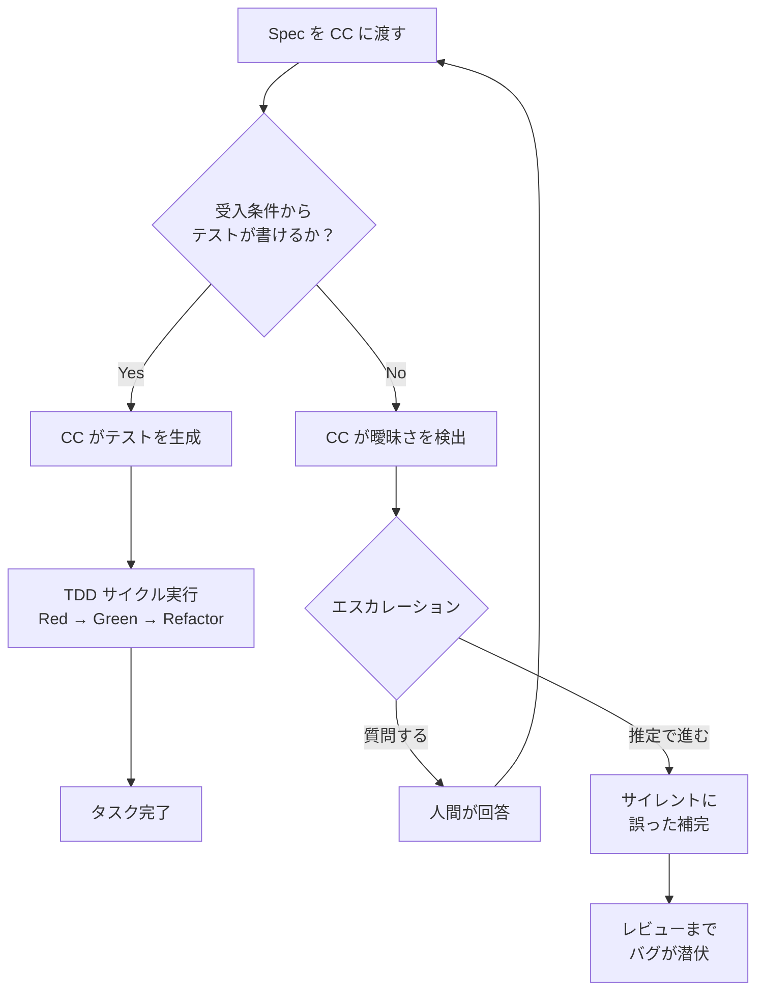

:::note
本記事はシリーズ「**J-SIX：Japanese SI Transformation**」の番外編です。[#0 概要編](https://zenn.dev/seckeyjp/articles/j-six-00-overview)で全体像を把握し、[SDD 実践入門](https://zenn.dev/seckeyjp/articles/j-six-sdd-hands-on)でハンズオンを体験した上でお読みください。
:::

## はじめに

Claude Code（以下 CC）の初回自律実行成功率は約 33%[^anthropic-teams]。3 回に 2 回は失敗する。この数字だけ見ると「使い物にならない」と思うかもしれない。しかし、失敗の多くは CC の能力不足ではなく、**Spec が曖昧だから**起きている。

人間の開発者は曖昧な仕様を「常識」で補完する。「パスワードを適切に保存する」と書かれていれば、bcrypt か argon2 を選ぶだろう。しかし CC は訓練データの分布で補完する。それはあなたのプロジェクトの意図と一致するとは限らない。

本記事では「AI が実装できる Spec」と「AI が迷う Spec」の違いを、8 つのビフォア/アフターで具体的に示す。PM・SE として Spec を書く立場の方、CC に実装を任せたい方に向けて、「どう書けば CC が迷わず動けるか」を解説する。

---

## 1. なぜ AI には「良い Spec」が必要か

人間の開発者とCCでは、曖昧な仕様に対する補完メカニズムが根本的に異なる。

**人間の開発者**: 曖昧な仕様 → 経験と常識で補完 → だいたい正しい。「ユーザー登録」と書かれていれば、メールアドレスの一意性チェックやパスワードのハッシュ化は「当然やるもの」として実装する。

**CC**: 曖昧な仕様 → 訓練データの最頻パターンで補完 → プロジェクト固有の意図とズレる。CC は「一般的にはこうする」を選ぶが、あなたのプロジェクトの制約（既存 DB との整合性、社内セキュリティポリシー、業界固有の規制）は知らない。

この差が引き起こす問題は 2 つある。

1. **エスカレーション連発**: CC が判断できず、何度も質問してくる。人間が逐一回答する羽目になり、自律実行のメリットが消える
2. **サイレントな誤実装**: CC が「これでいいだろう」と判断して実装を進めるが、プロジェクトの意図とズレている。テストが通ってしまうとレビューまで気づかない

では、Spec の品質をどう判定するか。基準はシンプルだ。

> **「受入条件からテストケースが書けるか？」**

テストケースが書けない受入条件は、CC にとっても人間にとっても曖昧だ。この基準を頭に置きながら、次章のビフォア/アフターを読み進めてほしい。

---

## 2. ダメな Spec vs 良い Spec — 8 つのビフォア/アフター

以下、実際のプロジェクトでありがちなパターンを 8 つ取り上げる。各パターンで「ダメな書き方 → CC の反応 → 良い書き方 → なぜ良いか」を示す。

### 2-1. 曖昧な動詞（「適切に処理する」）

**❌ ダメな例**

> パスワードを適切に保存する

**CC の反応**: bcrypt? SHA-256? argon2? 訓練データの最頻パターンで決定する。ADR（Architecture Decision Record）は記録されず、なぜその方式を選んだか追跡できない。

**✅ 良い例**

> パスワードは bcrypt でハッシュ化して保存（ADR-0005 参照）

**なぜ良いか**: 技術選択が明示され、ADR で理由も記録される。CC は「bcrypt を使え」という明確な指示に従うだけでよい。レビュアーも ADR を見れば判断の背景がわかる。

---

### 2-2. スコープ外の未定義（沈黙 = 曖昧）

**❌ ダメな例**

> （Spec にメール認証の記載がない）

**CC の反応**: 「メール認証は必要ですか？」とエスカレーション。一般的なユーザー登録フローではメール確認が必要なため、CC は毎回確認してくる[^anthropic-bp]。

**✅ 良い例**

> **対象外**: メールアドレス確認フロー（後続フェーズで対応）

**なぜ良いか**: CC は沈黙を「不要」と解釈しない。明示的に「やらない」と書くことで、CC はメール認証に触れずに実装を進められる。J-SIX の Requirement Spec テンプレートにはセクション 2.2「対象外の明示」が設けられているのは、まさにこの理由だ。

---

### 2-3. 数値のない非機能要件（「速くする」）

**❌ ダメな例**

> API は速く応答すること

**CC の反応**: 最適化なし。「速く」に対応するテストが書けないため、CC は特段のパフォーマンス対策を行わない。

**✅ 良い例**

> API レスポンスタイム 200ms 以内（根拠: UX ガイドライン）

**なぜ良いか**: 数値があればパフォーマンステストを自動生成できる。「200ms 以内」は `expect(responseTime).toBeLessThan(200)` というアサーションに直接変換できる。根拠があれば、閾値の妥当性をレビューできる。

---

### 2-4. 複数関心事の混合（1 タスクに詰め込み）

**❌ ダメな例**

> ユーザーを登録でき、ログインでき、プロフィールを更新できる

**CC の反応**: 巨大な 1 タスクとして実行。コンテキストウィンドウを圧迫し、途中で失敗した場合のリトライコストが大きい。並列実行もできない。

**✅ 良い例**

> - USER-001: ユーザー登録 API（依存: なし）
> - USER-002: ログイン API（依存: USER-001）
> - USER-003: プロフィール更新 API（依存: USER-001）

**なぜ良いか**: 各タスクが独立し、並列実行・部分リトライが可能になる。USER-001 と USER-002 は依存関係がなければ同時に実行できる。USER-003 が失敗しても USER-001 の成果は保持される。

---

### 2-5. Design Spec の過剰詳細（V 字の習慣）

**❌ ダメな例**

> Design Spec に DDL 全文、OpenAPI 全定義、画面仕様の全要素を記載

**CC の反応**: Spec と実装の乖離が即座に発生する。CC が Spec に合わせるべきか実装に合わせるべきか判断できず、中途半端な整合性の実装が生まれる。

**✅ 良い例**

> 設計意図と主要構造のみ記述。詳細は Phase 6 で逆生成

**なぜ良いか**: これは J-SIX の核心的な原則だ[^cgi-sdd]。Design Spec は意図的に不完全にする。主要テーブルの関係性や API のエンドポイント一覧は記述するが、DDL の全カラム定義や OpenAPI の全スキーマは書かない。CC が実装したコードから逆生成する方が、実装と乖離しない。

---

### 2-6. 観察可能でない受入条件（shall 語）

**❌ ダメな例**

> システムはメールアドレスの一意性を保証しなければならない

**CC の反応**: 「一意性を保証」のテストをどう書けばよいか迷う。重複時に 409 を返すのか 422 を返すのか。エラーメッセージのフォーマットは。DB 制約で実現するのかアプリ層で実現するのか。

**✅ 良い例**

> email の重複チェックを行い、重複時は 409 を返す

**なぜ良いか**: HTTP ステータスコード 409 が観察可能なアサーションになる。CC は `expect(res.status).toBe(409)` というテストを即座に書ける。「一意性を保証する」という抽象的な表現から「409 を返す」という具体的な振る舞いに変換するのが、Spec を書く人間の仕事だ。

---

### 2-7. 制約の根拠なし

**❌ ダメな例**

> 既存の PostgreSQL インスタンスを使用（理由なし）

**CC の反応**: 実装中に「このデータ構造なら MongoDB の方が適切では？」と提案してくる。制約に根拠がないと、CC はそれを「暫定的な選択」と解釈し、代替案を提示する。

**✅ 良い例**

> | 制約 | 根拠 |
> |---|---|
> | 既存 PostgreSQL インスタンスを使用 | 既存システムとのデータ統合要件（移行コスト回避）|

**なぜ良いか**: 根拠が明示されていれば、CC は制約を「提案」ではなく「制約」として尊重する。「移行コスト回避」という理由があれば、CC は PostgreSQL の範囲内で最適な設計を追求する。

---

### 2-8. 散文形式の Spec（人間向け文章）

**❌ ダメな例**

> ユーザー登録機能では、まずメールアドレスの形式をチェックし、次にパスワードが 8 文字以上であることを確認する。メールアドレスが既に登録されている場合はエラーとする。登録が成功した場合は、ユーザー情報を返すが、パスワードは含めないようにする。

**CC の反応**: 長い文脈から要件を抽出する際に、エッジケースを見落とすリスクが高まる。「エラーとする」の具体的なレスポンスは？「ユーザー情報を返す」のステータスコードは？

**✅ 良い例**

> | # | 受入条件 | 正常/異常 |
> |---|---|---|
> | AC-001 | POST /api/v1/users でユーザーを新規登録できる（201） | 正常 |
> | AC-002 | email の重複チェックを行い、重複時は 409 を返す | 異常 |
> | AC-003 | パスワードは bcrypt でハッシュ化して保存 | 正常 |
> | AC-004 | 成功時は 201 + ユーザー情報（パスワード除く）を返す | 正常 |
> | AC-005 | バリデーション: email 形式、パスワード 8 文字以上（400） | 異常 |

**なぜ良いか**: CC がテーブルの各行を独立したテストケースに変換できる。1 行 1 概念で書かれているため、見落としが起きにくい。UC-001、BR-001、API-001 のように ID を振ることで、トレーサビリティも確保できる。

---

## 3. テンプレートの力 — なぜ構造が品質を強制するか

前章の 8 パターンを見て「気をつけよう」と思っても、プロジェクトが進むにつれて元に戻ってしまう。人間の注意力に頼るのは限界がある。だからこそ、**テンプレートで構造的に品質を強制する**ことが重要だ。

J-SIX の Requirement Spec テンプレートには、4 つの設計原則が埋め込まれている。

### 原則 1: 対象外セクション（2.2）

テンプレートにセクション 2.2「対象外の明示」が存在する。空欄のままレビューに出すと「ここ、書いてないですよね？」と指摘される。構造が「やらないことを書け」と強制する。前章 2-2 のパターンを防ぐ仕組みだ。

### 原則 2: ビジネスルールの ID 採番（BR-001）

ビジネスルールテーブルに `#` 列がある。BR-001、BR-002 と採番することで、タスク定義や受入条件から「BR-001 に基づく」と参照できる。散文の中に埋もれたルールは参照できない。前章 2-8 のパターンを防ぐ。

### 原則 3: 非機能要件の「根拠」列

非機能要件テーブルに「根拠」列がある。「200ms 以内」と書くだけでなく「UX ガイドライン準拠」と根拠を書かせる。数値だけでなく、なぜその数値なのかを記録する。前章 2-3 のパターンを防ぐ。

### 原則 4: 前提条件の「崩れた場合の影響」列

前提条件テーブルに「前提が崩れた場合の影響」列がある。「PostgreSQL を使用」が前提なら、「崩れた場合: 全 DB 設計のやり直し」と書く。リスクを可視化し、制約の根拠を補強する。前章 2-7 のパターンを防ぐ。

テンプレートは GitHub で公開している。自社プロジェクトに合わせてカスタマイズして使ってほしい。

https://github.com/SeckeyJP/j-six/tree/main/templates/spec

---

## 4. 良い Spec の実例 — USER-001

理論だけでは掴みにくいので、具体例を示す。以下は J-SIX のワークスルーで使用している USER-001（ユーザー登録 API）のタスク定義だ。

```
タスク: USER-001 ユーザー登録API
受入条件:
  - POST /api/v1/users でユーザーを新規登録できる
  - email の重複チェックを行い、重複時は 409 を返す
  - パスワードは bcrypt でハッシュ化して保存
  - 成功時は 201 + ユーザー情報（パスワード除く）を返す
  - バリデーション: email 形式、パスワード8文字以上
依存: なし（並列実行可能）
```

この 5 つの受入条件は、そのまま 5 つのテストケースに 1:1 でマッピングできる。

| 受入条件 | テストケース | アサーション |
|---|---|---|
| 新規登録できる | 有効な入力でユーザーを登録し 201 を返す | `status === 201`, `body.id` が存在 |
| email 重複時は 409 | 既存 email で 409 を返す | `status === 409` |
| bcrypt でハッシュ化 | パスワードがハッシュ化されて DB に保存される | `password_hash !== 'password123'` |
| 201 + ユーザー情報 | レスポンスにパスワードが含まれない | `body` に `password` キーなし |
| バリデーション | 不正な email / 短いパスワードで 400 | `status === 400` |

注目してほしいのは最後の行「**依存: なし**」だ。たった一行だが、この記述が CC に「このタスクは他のタスクの完了を待たずに実行してよい」と伝える。並列実行の可否を CC が判断するための情報であり、省略すると CC は依存関係を推定しようとしてエスカレーションする。

これが「AI が実装できる Spec」のゴールドスタンダードだ。受入条件からテストケースが書け、スコープが明確で、依存関係が定義されている。

---

## 5. Spec が曖昧だと何が起きるか — エスカレーション事例

CC の自律実行中にエスカレーション（CC が人間に判断を仰ぐこと）が発生するのは、必ずしも悪いことではない。セキュリティに関わる判断や Spec に記載のない要件を発見した場合のエスカレーションは、むしろ正しい動作だ。問題は「Spec が曖昧であるために発生する**想定外の**エスカレーション」だ。

### 事例 1: メール認証の Spec 欠落

Spec にメール認証の記載がない場合、CC は以下のようにエスカレーションする。

> 受入条件にはメールアドレスの確認（メール送信）について記載がありませんが、一般的なユーザー登録フローではメールアドレスの確認ステップが必要です。
> 1. メール確認なしで登録完了（現在の受入条件通り）
> 2. メール確認フローを追加（Spec の更新が必要）
> 3. この判断を保留し、後続タスクで対応

これは CC の正しい動作だ。しかし、Spec の「対象外」セクションに「メール確認フロー（後続フェーズで対応）」と一行書いてあれば、このエスカレーションは発生しない。1 行の記述で 1 回のやりとりを節約できる。タスクが 50 個あれば、こうした小さな省略の積み重ねが大きなロスになる。

### 事例 2: DB 一意性制約の設計未決定

email の一意性を DB の UNIQUE 制約で実現するか、アプリケーション層でチェックするかが Design Spec に記載されていない場合、CC は実装を進めるが、テストが 3 回連続で失敗することがある。

> テストが 3 回連続で失敗しました。
> 失敗しているテスト: 既存 email で 409 を返す
> 試行 1: unique constraint の catch が不完全
> 試行 2: PostgreSQL のエラーコード判定を修正したが別のテストが壊れた
> 試行 3: トランザクション分離レベルの問題の可能性
> 根本的な設計判断が必要かもしれません。

テスト 3 回連続失敗は J-SIX のエスカレーション条件の一つだ。Design Spec に「email の一意性は DB の UNIQUE 制約 + アプリ層での事前チェック」と記述があれば、CC は迷わず実装できた。

### エスカレーションは Spec 品質の指標

エスカレーションの発生パターンを観察すると、Spec の弱点が見える。「エスカレーション 0 件」を目指すのではなく、**「想定外のエスカレーションをゼロに」**するのが目標だ。セキュリティ判断や Spec 外の要件発見によるエスカレーションは正常。Spec の曖昧さに起因するエスカレーションは改善対象だ。

---

## 6. Spec 品質と CC の動作の関係

Spec の品質が CC の動作にどう影響するかを図で整理する。



良い Spec は右側のパス（テスト生成 → TDD → 完了）を直進する。曖昧な Spec は左側のパスに逸れ、エスカレーションによる遅延か、サイレントな誤実装を引き起こす。

---

## 7. チェックリスト — Spec をレビューするときの 7 項目

Spec を CC に渡す前に、以下のチェックリストで品質を確認しよう。

| # | チェック項目 | 対応するパターン |
|---|---|---|
| 1 | 全ての受入条件からテストケースが書けるか | 2-1, 2-6 |
| 2 | 対象外が明示されているか | 2-2 |
| 3 | 非機能要件に数値があるか | 2-3 |
| 4 | 各タスクが単一関心事か | 2-4 |
| 5 | 制約に根拠があるか | 2-7 |
| 6 | 受入条件が観察可能な振る舞いで書かれているか | 2-6 |
| 7 | 構造化テーブルで記述されているか | 2-8 |

全項目にチェックが入れば、その Spec は「AI が実装できる Spec」の最低ラインを満たしている。もちろん、これだけで完璧とは言わない。しかし、少なくとも「曖昧さに起因するエスカレーション」は大幅に減るはずだ。

---

## まとめ

Spec の品質は CC の出力品質に直結する。曖昧な Spec を渡せば、CC は訓練データの分布で補完する。それはあなたのプロジェクトの意図と一致するとは限らない。

判定基準はシンプルだ。**「受入条件からテストケースが書けるか？」**。書けるなら CC は自律的に TDD を実行できる。書けないなら、その Spec は人間にとっても曖昧であり、CC 以前の問題として改善が必要だ。

本記事で示した 8 つのパターンとチェックリストは、CC のためだけのものではない。「テストが書ける Spec」は人間の開発者にとっても良い Spec だ。CC の導入を機に Spec の品質を見直すことで、プロジェクト全体の品質が向上する。それが J-SIX の目指す姿でもある。

テンプレートとプロセスの詳細は GitHub リポジトリで公開している。

https://github.com/SeckeyJP/j-six

---

**J-SIX シリーズ**
- [#0 概要編](https://zenn.dev/seckeyjp/articles/j-six-00-overview)
- [#1 SDD](https://zenn.dev/seckeyjp/articles/j-six-01-sdd)
- [#3 TDD × CC](https://zenn.dev/seckeyjp/articles/j-six-03-tdd-cc)
- [SDD 実践入門](https://zenn.dev/seckeyjp/articles/j-six-sdd-hands-on)
- [TDD アンチパターン](https://zenn.dev/seckeyjp/articles/j-six-tdd-antipatterns)

[^anthropic-teams]: Anthropic. "How Anthropic teams use Claude Code" (2025.07). https://claude.com/blog/how-anthropic-teams-use-claude-code — Anthropic RL Engineering チームの報告で、CC の初回自律実行成功率が約 33% と報告されている。
[^anthropic-bp]: Anthropic. "Best Practices for Claude Code". https://code.claude.com/docs/en/best-practices
[^cgi-sdd]: CGI. "Spec-driven development" (2026.03). https://www.cgi.com/en/blog/artificial-intelligence/spec-driven-development
